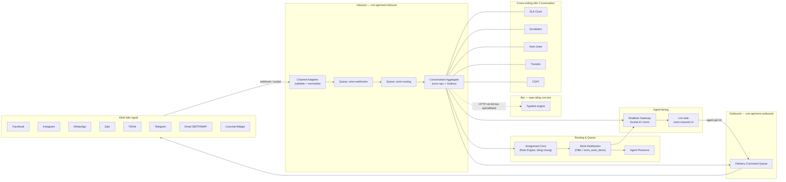
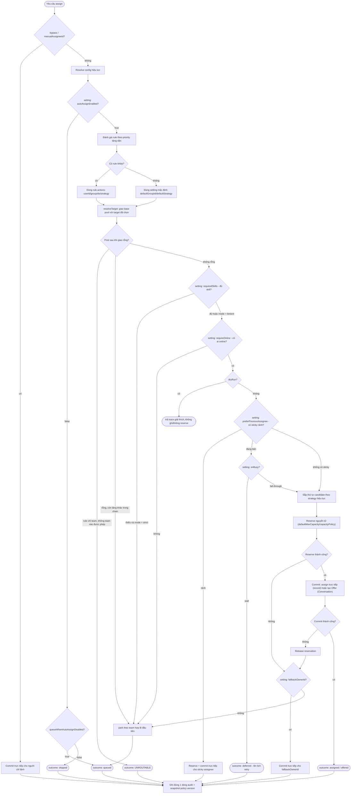
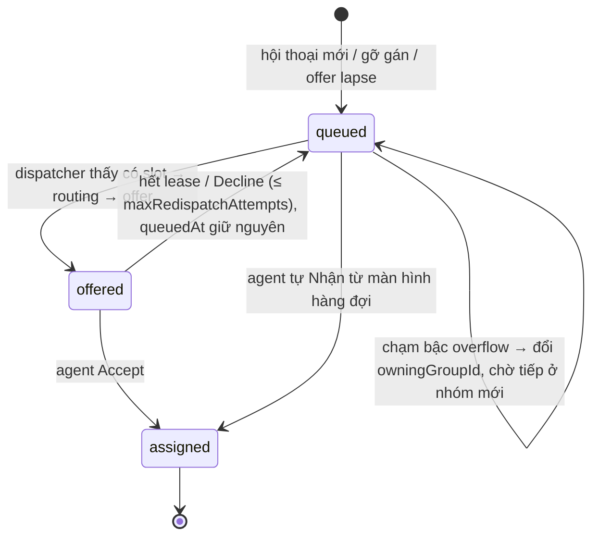

# SRS — Module Omnichat (As-Built)

> **Ngày lập:** 2026-08-21 · **Tác giả:** tổng hợp bằng agent đọc trực tiếp source code, do toan.nguyen@antbuddy.com yêu cầu.
> **Phương pháp:** mọi yêu cầu (REQ) dưới đây được suy ra từ việc đọc trực tiếp source code tại thời điểm lập tài liệu (`crm-api/src/omni-inbound`, `crm-api/src/omni-outbound`, `crm-api/src/channels`, `crm-api/src/assignment`, `crm-api/src/sla-policies`, `crm-api/src/escalation-policies`, `crm-api/src/inboxes`, `crm-api/src/templates`, `crm-api/src/reports`, `crm-web/src/features/omni-channel`, `livechat-widget/src`) và từ các tài liệu module đã có (đọc code trước đó, liệt kê ở mục 1.4. Tài liệu tham chiếu). Đây là tài liệu **as-built** — mô tả hệ thống ĐANG hoạt động thế nào, không phải đề xuất thay đổi. Không có nhận định đúng/sai; khoảng trống/nợ kỹ thuật được nêu tách riêng ở Phụ lục A dưới dạng sự kiện, không phải khuyến nghị.
> **Vì sao tài liệu này tồn tại:** module omnichat đã được triển khai trước khi có SRS. Tài liệu này lấp khoảng trống đó bằng cách tài liệu hoá lại yêu cầu chức năng từ chính hành vi đã implement, để làm baseline cho việc bảo trì, review, và ra quyết định thay đổi sau này.

## Mục lục

1. [Giới thiệu](#1-giới-thiệu)
2. [Tổng quan hệ thống](#2-tổng-quan-hệ-thống)
3. [Yêu cầu chức năng](#3-yêu-cầu-chức-năng)
   - 3.1 [Kết nối & vòng đời kênh (CHN)](#31-kết-nối--vòng-đời-kênh-chn)
   - 3.2 [Tiếp nhận tin nhắn đến (ING)](#32-tiếp-nhận-tin-nhắn-đến-ing)
   - 3.3 [Vòng đời hội thoại (CONV)](#33-vòng-đời-hội-thoại-conv)
   - 3.4 [Định tuyến & phân công hội thoại (ROU)](#34-định-tuyến--phân-công-hội-thoại-rou)
   - 3.5 [Work Distribution / Queue / Offer (WD)](#35-work-distribution--queue--offer-wd)
   - 3.6 [Agent Presence & Workforce (PRES)](#36-agent-presence--workforce-pres)
   - 3.7 [Chuyển tiếp hội thoại — Transfer (TRF)](#37-chuyển-tiếp-hội-thoại--transfer-trf)
   - 3.8 [SLA (SLA)](#38-sla-sla)
   - 3.9 [Escalation Policies (ESC)](#39-escalation-policies-esc)
   - 3.10 [Auto-close (ACL)](#310-auto-close-acl)
   - 3.11 [Bot handoff & xử lý bot (BOT)](#311-bot-handoff--xử-lý-bot-bot)
   - 3.12 [Gửi tin nhắn đi — Outbound (OUT)](#312-gửi-tin-nhắn-đi--outbound-out)
   - 3.13 [Realtime Gateway & Socket (RT)](#313-realtime-gateway--socket-rt)
   - 3.14 [CSAT (CSAT)](#314-csat-csat)
   - 3.15 [Notes, Reactions, Delivery Receipts, Activity (NOTE/REACT/DLR/ACT)](#315-notes-reactions-delivery-receipts-activity-notereactdlract)
   - 3.16 [Message Search (SRCH)](#316-message-search-srch)
   - 3.17 [Metrics & Reporting Projection (MET)](#317-metrics--reporting-projection-met)
   - 3.18 [Inboxes / Inbox Policy (INBOX)](#318-inboxes--inbox-policy-inbox)
   - 3.19 [Canned Responses / Templates (TPL)](#319-canned-responses--templates-tpl)
   - 3.20 [Reports Omni (REP)](#320-reports-omni-rep)
   - 3.21 [Reports Agent liên quan Omnichat (REP-AGENT)](#321-reports-agent-liên-quan-omnichat-rep-agent)
   - 3.22 [Giao diện Agent Web (WEB)](#322-giao-diện-agent-web-web)
   - 3.23 [Livechat Widget (WID)](#323-livechat-widget-wid)
4. [Yêu cầu phi chức năng (tổng hợp xuyên phân hệ)](#4-yêu-cầu-phi-chức-năng-tổng-hợp-xuyên-phân-hệ)
5. [Ràng buộc & giả định](#5-ràng-buộc--giả-định)
6. [Phụ lục A — Khoảng trống & nợ kỹ thuật đã biết](#phụ-lục-a--khoảng-trống--nợ-kỹ-thuật-đã-biết)
7. [Phụ lục B — Chỉ mục file nguồn theo phân hệ](#phụ-lục-b--chỉ-mục-file-nguồn-theo-phân-hệ)

---

## 1. Giới thiệu

### 1.1 Mục đích

Tài liệu hoá lại, dưới dạng SRS, các yêu cầu chức năng và phi chức năng mà module Omnichat của CRM ĐÃ triển khai — dùng làm baseline tham chiếu khi review, bảo trì, hoặc mở rộng module. Mỗi yêu cầu (REQ) trích dẫn `file:line` để truy vết ngược về code.

### 1.2 Phạm vi

Toàn bộ chuỗi omnichat, khớp đúng phạm vi mà `OMNI_CHANNEL_BUSINESS_AUDIT_2026-08-06.md` đã quét:

- **Backend** (`crm-api/src`): `omni-inbound/**` (tiếp nhận, hội thoại, routing/assignment tích hợp cho Conversation, work-distribution, presence, transfer, SLA port, auto-close, bot handoff, realtime gateway, CSAT, notes/reactions/search/metrics), `omni-outbound/**` (gửi tin), `channels/**` (kết nối/OAuth kênh), `assignment/**` (engine dùng chung), `sla-policies/**`, `escalation-policies/**`, `inboxes/**`, `templates/**` (canned reply), `reports/omni/**`, `reports/agent/**` (phần liên quan).
- **Frontend** (`crm-web/src/features/omni-channel`): giao diện agent xử lý hội thoại.
- **Livechat Widget** (`livechat-widget/src`): widget chat nhúng website khách hàng.

**Ngoài phạm vi tài liệu này:** engine bot thực tế (repo `crm-bot`, Typebot fork) — chỉ ranh giới tích hợp CRM↔crm-bot được mô tả (mục 3.11); campaign/broadcast engine (được cả 2 audit xác nhận chưa tồn tại, xem Phụ lục A); các module CRM khác (Lead/Contact/Account/Ticket/Task/Deal) trừ khi chúng dùng chung engine Assignment với Conversation.

### 1.3 Định nghĩa & thuật ngữ

| Thuật ngữ | Ý nghĩa |
|---|---|
| **Conversation** | Một hội thoại giữa 1 khách hàng và tenant, gắn với 1 channel + 1 thread. Đơn vị trung tâm của toàn module. |
| **Channel** | Một kết nối kênh giao tiếp cụ thể (1 Facebook Page, 1 số WhatsApp, 1 địa chỉ email...), thuộc đúng 1 tenant. |
| **Inbox** | Nhóm định tuyến logic gộp nhiều channel + nhóm/agent được phép xử lý, có thể pin routing rule/SLA policy/bot policy riêng. |
| **Work Item / Offer** | Đơn vị chờ xử lý của 1 conversation trong hàng đợi (`omni_work_items`); Offer là 1 lời mời cụ thể gửi tới 1 agent, có lease hết hạn. |
| **Reply Window** | Khoảng thời gian (tính từ tin nhắn cuối của khách) mà agent còn được phép gửi tin tự do trên 1 kênh (ví dụ 24h của Meta/WhatsApp). |
| **SLA Clock** | 1 đồng hồ đo thời gian cho 1 metric cụ thể (first_response/next_response/resolution) của 1 hội thoại, có thể running/paused/met/breached. |
| **Escalation** | Hành động tự động (thông báo/leo cấp/reassign) kích hoạt khi SLA breach, theo Escalation Policy. |
| **Auto-close** | Cơ chế tự động đóng hội thoại sau một khoảng bất hoạt, có cảnh báo trước khi đóng. |
| **Sticky assignee** | Agent đã từng xử lý hội thoại/khách hàng này trước đó, được ưu tiên gán lại nếu còn rảnh. |
| **Shadow Contact** | Contact tạm được CRM tự tạo khi chưa nhận diện được danh tính CRM thật của người gửi. |
| **Presence (intentStatus/connectionStatus/routingStatus)** | 3 trục trạng thái agent: agent tự chọn / hạ tầng socket / dẫn xuất từ capacity. |
| **Outbox pattern** | Ghi domain event vào bảng trung gian trước khi publish, để không mất event khi publish lỗi. |
| **Capacity / Capacity Weight** | Ngân sách tải việc của 1 agent; mỗi loại kênh/tương tác có trọng số tiêu tốn capacity khác nhau. |
| **Work Distribution** | Lớp Offer/Queue riêng cho Conversation, chạy song song với engine Assignment dùng chung. |

### 1.4 Tài liệu tham chiếu

Nguồn đã đọc code trước đó, dùng làm input cho tài liệu này:

- `docs/assignment-module.md` — engine Assignment/Routing dùng chung + tích hợp Conversation + Work Distribution.
- `docs/presence.md`, `docs/agent-presence-workforce-spec.md` — Agent Presence & Workforce.
- `docs/omni-queue-plan.md` — thiết kế Work Distribution/Queue.
- `docs/02-channels.md` — Channels module (kết nối/OAuth).
- `docs/audit/OMNI_CHANNEL_ARCHITECTURE_AUDIT_2026-07-30.md`, `OMNI_CHANNEL_BUSINESS_AUDIT_2026-08-06.md`, `OMNI_CHANNEL_REMEDIATION_2026-08-06.md`, `OMNI_COMMUNICATION_AUDIT_2026-07-31.md` — dùng cho Phụ lục A.
- Source code trực tiếp cho các phân hệ chưa có tài liệu trước đó (inbound ingestion, conversation lifecycle, transfer/SLA/escalation/auto-close, bot handoff, outbound, realtime gateway, CSAT/notes/search/metrics, inboxes/templates/reports, frontend web, livechat widget).

---

## 2. Tổng quan hệ thống

### 2.1 Actors

| Actor | Vai trò |
|---|---|
| **Khách hàng (Contact / Visitor)** | Người nhắn tin qua 1 trong 8 kênh hỗ trợ; danh tính có thể ở dạng shadow contact cho tới khi được liên kết/merge vào contact CRM thật. |
| **Agent** | Nhân viên xử lý hội thoại: nhận/nhận offer, trả lời, chuyển tiếp, ghi chú, đóng hội thoại. |
| **Supervisor / Quản lý** | Giám sát hàng đợi, nhận escalation, xem báo cáo, có thể transfer/reassign vượt quyền agent thường. |
| **Bot (crm-bot)** | Hệ thống ngoài (Typebot fork) xử lý hội thoại tự động trước khi handoff cho người, tích hợp qua HTTP nội bộ. |
| **Hệ thống / Automation** | Các cron/listener tự động: SLA breach, escalation, auto-close, work distribution dispatcher, reconciliation. |
| **Admin cấu hình** | Cấu hình channel, routing rule, SLA policy, escalation policy, auto-close policy, inbox, template. |

### 2.2 Kiến trúc tổng thể



Lớp cấu hình/phân tích (Inboxes, Templates/Canned-reply, Reports Omni, Reports Agent) đọc/ghi trên cùng dữ liệu Conversation/Message nhưng không nằm trên hot-path realtime — xem mục 3.18–3.21.

### 2.3 Danh sách kênh hỗ trợ

| Kênh | Inbound (webhook) | Outbound | Reply Window | Ghi chú |
|---|---|---|---|---|
| Facebook | ✅ HMAC-SHA256 | ✅ | 24h | Messenger Platform |
| Instagram | ✅ HMAC-SHA256 | ✅ | 24h | Messenger Platform, hỗ trợ story mention/share |
| WhatsApp | ✅ HMAC-SHA256 | ✅ | 24h (bypass qua template) | Business API |
| Zalo | ✅ MAC (JSON canonical) | ✅ | 24h | Media URL hết hạn ~30 phút |
| TikTok | ✅ HMAC-SHA256 | ✅ | 24h | Direct message |
| Telegram | ✅ | Có (giới hạn, xem Phụ lục A) | 0 (không giới hạn) | |
| Email | IMAP polling | SMTP | 0 (không giới hạn) | Có chữ ký, CID inline image |
| Livechat (widget) | Socket.IO (không HTTP webhook) | Socket.IO | 0 (không giới hạn) | Xem mục 3.23 |

---

## 3. Yêu cầu chức năng

### 3.1 Kết nối & vòng đời kênh (CHN)

**Tóm tắt kiến trúc.** `ChannelsModule` (`crm-api/src/channels/`) quản lý kết nối kênh theo tenant cho Facebook, Instagram, WhatsApp (qua Meta Graph API / WhatsApp Business API) và Email (SMTP/IMAP). Mỗi channel thuộc đúng một tenant và có vòng đời Pending/Connected/Disconnected/Error. Kết nối Facebook/Instagram/WhatsApp đi qua luồng OAuth chuẩn của Meta với state CSRF lưu tạm trong Redis; access token không bao giờ trả về frontend. Các service phụ trợ (health check định kỳ, cảnh báo, connection pool SMTP) vận hành song song với vòng đời kết nối.

**Data model — `Channel`**

| Field | Ý nghĩa |
|---|---|
| `id`, `tenantId` | Định danh channel và tenant sở hữu |
| `type` | `facebook \| instagram \| whatsapp \| email` |
| `account` | Page ID, số điện thoại, hoặc địa chỉ email |
| `status` | `Pending \| Connected \| Disconnected \| Error` |
| `credentials.accessToken/refreshToken` | Mã hoá at rest |
| `config.autoReplyMessage` | Tin nhắn tự động trả lời |
| `config.defaultRoutingRuleId` | Rule định tuyến mặc định của channel |
| `config.webhookStatus`, `config.tokenExpiry`, `config.avatarUrl` | Trạng thái webhook, hạn token, avatar hiển thị |

**Vòng đời (nguyên bản từ `docs/02-channels.md`)**

```
Pending ──► Connected ──► Disconnected
   │                           ▲
   └── Error ──────────────────┘
```

**Yêu cầu chức năng**

- REQ-CHN-01: Hệ thống PHẢI hỗ trợ kết nối kênh Facebook Page, Instagram Business, WhatsApp Business, và Email (SMTP/IMAP) trong `ChannelsModule`. (`02-channels.md:10-14`)
- REQ-CHN-02: Channel PHẢI thuộc đúng một tenant tại một thời điểm; một tài khoản kênh KHÔNG được kết nối đồng thời cho 2 tenant. (`02-channels.md:16,147`)
- REQ-CHN-03: Channel PHẢI có vòng đời 4 trạng thái Pending/Connected/Disconnected/Error như sơ đồ trên. (`02-channels.md:18-24`)
- REQ-CHN-04: Với Facebook/Instagram/WhatsApp, hệ thống PHẢI thực hiện OAuth qua Meta Graph API: sinh CSRF state lưu Redis (TTL 10 phút) → đổi code lấy short-lived token → đổi tiếp long-lived token → lấy danh sách Page/IG account khả dụng → lưu tạm kết quả vào Redis để người dùng chọn. (`02-channels.md:26-53,58-61,146`)
- REQ-CHN-05: `GET /channels/meta/oauth-result/:resultId` PHẢI trả danh sách channel khả dụng mà KHÔNG kèm access token. (`02-channels.md:60,104,145`)
- REQ-CHN-06: `POST /channels/meta/connect` PHẢI subscribe webhook cho từng channel được chọn trước khi lưu DB. (`02-channels.md:49-52,61,105`)
- REQ-CHN-07: Hệ thống CÓ THỂ tạo channel thủ công qua `ChannelsService.create()`, có xử lý token Meta tuỳ chọn. (`02-channels.md:62,94`)
- REQ-CHN-08: `disconnect(id)` PHẢI unsubscribe webhook Meta và chuyển channel sang `Disconnected`; `delete(id)` PHẢI disconnect trước rồi mới xoá bản ghi. (`02-channels.md:63-64,97`)
- REQ-CHN-09: `ChannelHealthCheckService` PHẢI chạy health check định kỳ cho mọi channel active; `ChannelAlertService` PHẢI gửi cảnh báo khi channel offline hoặc token hết hạn. (`02-channels.md:69-73`)
- REQ-CHN-10: Với channel Email, hệ thống PHẢI nhận inbound qua IMAP polling, định tuyến email vào ticket phù hợp hoặc tạo hội thoại mới, và theo dõi mở/click qua pixel tracking. (`02-channels.md:83-86`)
- REQ-CHN-11: Hệ thống PHẢI cung cấp cấu hình theo từng channel (auto-reply, business hours, routing rule mặc định) qua `GET/PUT /channels/:id/config`. (`02-channels.md:66,107-111`)
- REQ-CHN-12: Với channel email, hệ thống PHẢI cung cấp cấu hình SMTP/IMAP riêng qua `GET/PUT /channels/:id/email/settings`, dùng connection pool (`TransportPoolService`). (`02-channels.md:75,113-117`)
- REQ-CHN-13: `openerOrigin` dùng trong `postMessage` của popup OAuth PHẢI được kiểm tra hợp lệ theo domain cho phép trước khi sử dụng. (`02-channels.md:148`)
- REQ-CHN-14: Credentials (`accessToken`, `refreshToken`) PHẢI được mã hoá at rest. (`02-channels.md:129-131`)

---

### 3.2 Tiếp nhận tin nhắn đến (ING)

**Tóm tắt kiến trúc.** Mỗi provider (Facebook, Instagram, WhatsApp, Zalo, TikTok, Livechat) có một `ChannelAdapter` implement chung interface (`adapters/channel-adapter.interface.ts:17-181`) với 4 trách nhiệm cốt lõi: `validateWebhook` (xác thực HMAC/MAC), `normalize` (webhook thô → `OmniPayload[]`), `normalizeReaction`, `normalizeDeliveryReceipts`. `InboundController` (`controllers/inbound.controller.ts`) là cổng HTTP duy nhất, tách batch của provider thành từng event, xác thực chữ ký, lọc replay-attack rồi đẩy vào BullMQ `omni-webhooks` — không đọc DB trên hot path. `WebhookProcessor` resolve tenant/channel, chống trùng bằng Redis claim, gọi `InboundProcessorService` để chuẩn hoá payload qua adapter và đẩy tiếp vào queue `omni-routing`. `OmniRoutingProcessor` chống trùng lần hai (theo `messageDedupId`) rồi emit event `omni.message.received`, được `ConversationService` lắng nghe để định danh người gửi, tạo/tìm hội thoại, và cuối cùng enqueue lệnh `CUSTOMER_MESSAGE` vào aggregate queue (`conv-ops`) — nơi việc ghi Message thực sự xảy ra (mô tả ở mục 3.3). Media (ảnh/file/audio) được lưu ngay với URL gốc của provider, việc tải & cache lên S3 diễn ra bất đồng bộ qua `MediaCacheProcessor` để không chặn luồng inbound.

**Webhook nhận & xác thực**

- REQ-ING-01: Hệ thống PHẢI cung cấp endpoint `GET /omni/webhook/:channelType` để xác thực challenge (`hub.mode`/`hub.verify_token`/`hub.challenge`) dùng chung cho Facebook/WhatsApp, so khớp với `OMNI_VERIFY_TOKEN` (`controllers/inbound.controller.ts:99-127`).
- REQ-ING-02: Hệ thống PHẢI từ chối (400) mọi webhook có `channelType` không thuộc danh sách `SUPPORTED_CHANNELS` trước khi đưa vào queue (`controllers/inbound.controller.ts:146-148`, `domain/channel-capabilities.ts:83-89`).
- REQ-ING-03: Hệ thống PHẢI giới hạn kích thước payload webhook (mặc định 2MB, cấu hình qua `OMNI_WEBHOOK_MAX_PAYLOAD_BYTES`) và trả 413 nếu vượt (`controllers/inbound.controller.ts:154-162,399-408`).
- REQ-ING-04: Hệ thống PHẢI xác thực chữ ký webhook bằng HMAC-SHA256 trên `rawBody` trước khi enqueue, cho Facebook/Instagram/WhatsApp qua header `X-Hub-Signature-256` với secret theo thứ tự: secret riêng của channel → `FACEBOOK_APP_SECRET`/`META_APP_SECRET` (`adapters/facebook.adapter.ts:184-226`, `adapters/instagram.adapter.ts:159-200`, `adapters/whatsapp.adapter.ts:234-274`).
- REQ-ING-05: Hệ thống PHẢI xác thực Zalo bằng trường `mac` (HMAC-SHA256 trên JSON đã canonical-hoá theo key sort) với secret riêng OA hoặc `ZALO_OA_SECRET_KEY`/`ZALO_WEBHOOK_SECRET`, và PHẢI phân loại kết quả thành `valid/invalid/missing_mac/not_configured` để phân biệt lỗi cấu hình với tấn công giả mạo (`adapters/zalo.adapter.ts:164-245`).
- REQ-ING-06: Hệ thống PHẢI xác thực TikTok bằng header `X-TikTok-Signature` (HMAC-SHA256 trên rawBody) và PHẢI từ chối (fail-closed) khi thiếu `rawBody` (`adapters/tiktok.adapter.ts:96-151`).
- REQ-ING-07: Hệ thống PHẢI resolve secret ký theo channel cụ thể chỉ khi batch webhook chỉ chứa đúng một `accountId`; nếu batch gồm nhiều account thì dùng secret cấp env (`controllers/inbound.controller.ts:220-254`).
- REQ-ING-08: Hệ thống PHẢI từ chối event có timestamp cũ hơn cửa sổ chống replay (mặc định 6 giờ, cấu hình `OMNI_WEBHOOK_REPLAY_WINDOW_MS`) để chặn việc phát lại request đã ký hợp lệ (`controllers/inbound.controller.ts:35-40,257-299`).
- REQ-ING-09: Livechat KHÔNG dùng webhook HTTP; xác thực diễn ra qua WebSocket ở `LivechatGateway`, và `LivechatAdapter.validateWebhook()` luôn trả `true` (`adapters/livechat.adapter.ts:131-134`).

**Tách batch & định danh account/tenant**

- REQ-ING-10: Hệ thống PHẢI tách một batch webhook của provider thành nhiều event độc lập, mỗi event giữ đúng `accountId` riêng của nó (không lấy account của entry đầu batch), để tránh gán sai tenant/channel cho message (`controllers/inbound.controller.ts:301-337`).
- REQ-ING-11: Với Zalo, `accountId` (OA id) PHẢI được đọc theo `oa_id` → (nếu là `oa_send_*`: `sender.id`, ngược lại `recipient.id`) (`controllers/inbound.controller.ts:363-369`, tương tự tại `queue/webhook-processor.ts:168-175`).
- REQ-ING-12: Với TikTok, `accountId` PHẢI là `to_user.open_id` (tài khoản doanh nghiệp nhận tin), fallback `client_key` cho app một-tài-khoản (`controllers/inbound.controller.ts:347-351`).
- REQ-ING-13: Hệ thống PHẢI sinh `jobId` xác định (deterministic hash của `channelType:accountId:providerMessageId`) khi enqueue vào `omni-webhooks` để một redelivery của provider hợp nhất vào cùng job (`controllers/inbound.controller.ts:379-397`).

**Chuẩn hoá payload theo từng channel**

- REQ-ING-14: Facebook Messenger — hệ thống PHẢI bỏ qua (không tạo message) các event `delivery`, `read`, `reaction`, `referral`, `policy-enforcement`, và message có `is_echo=true` (echo tin do CRM gửi) (`adapters/facebook.adapter.ts:104-122`). Loại tin nhắn được suy ra từ `attachments[0].type` (image/video/audio/file/template), mặc định `text` (`adapters/facebook.adapter.ts:228-249`).
- REQ-ING-15: Instagram — cùng cấu trúc Messenger Platform, PHẢI bỏ qua event không có `message`, event `is_echo`, và `is_deleted` (`adapters/instagram.adapter.ts:87-113`). PHẢI đánh dấu `isStoryMention`/`isShare` trong metadata cho story mention/share/reel (`adapters/instagram.adapter.ts:139-140,406-413`).
- REQ-ING-16: WhatsApp — hệ thống PHẢI xử lý `messages[]` là mảng (một webhook có thể chứa nhiều message), lọc bỏ `type === 'reaction'` (được xử lý riêng), và xử lý riêng event `message_template_status_update` để cập nhật trạng thái phê duyệt template (không tạo OmniPayload) (`adapters/whatsapp.adapter.ts:112-160,118-146`).
- REQ-ING-17: WhatsApp là channel duy nhất mà `senderId` (msg.from) chính là số điện thoại khách hàng (E.164-like); `metadata.phone_number_id`/`display_phone_number` là số của DOANH NGHIỆP, không phải khách (`domain/omni-payload.ts:13-28,37-47`).
- REQ-ING-18: Zalo — hệ thống PHẢI chỉ xử lý event có `event_name` bắt đầu bằng `user_send` (bỏ qua `oa_send_*` vì đó là echo của tin CRM đã gửi) (`adapters/zalo.adapter.ts:116-120`). Media URL Zalo hết hạn ~30 phút, PHẢI được cache lại qua `MediaProxyService` (`adapters/zalo.adapter.ts:81-83`).
- REQ-ING-19: TikTok — hệ thống PHẢI đọc envelope `event.message` (direct_message), map `message_type` sang `MessageType`, và trích media URL từ các trường `image_url/video_url/audio_url/file_url/sticker_url` (`adapters/tiktok.adapter.ts:53-85,232-242`).
- REQ-ING-20: Livechat — hệ thống PHẢI nhận payload qua 2 dạng: text (`visitorId`+`text`) hoặc media đã upload trước (`visitorId`+`fileId`, do `VisitorUploadService` tải lên S3 trước); `externalMessageId` cho tin text PHẢI dựa trên `clientMessageId` của widget (theo phạm vi visitor) để một lần gửi lại từ widget không tạo tin trùng (`adapters/livechat.adapter.ts:40-129`).
- REQ-ING-21: Hệ thống PHẢI cho phép mỗi adapter khai báo `enrichProfile` (Facebook/Instagram gọi Graph API `name,picture` — token qua header, không qua query param, để không lộ trong log CDN) (`adapters/facebook.adapter.ts:47-89`, `adapters/instagram.adapter.ts:343-372`).
- REQ-ING-22: Hệ thống PHẢI redact token/secret khỏi mọi log lỗi trả về từ Graph API/WhatsApp/Instagram trước khi log (`adapters/facebook.adapter.ts:336-347`, tương tự ở whatsapp/instagram adapter).

**Reaction & delivery receipt**

- REQ-ING-23: Hệ thống PHẢI chuẩn hoá reaction từ mọi channel về `OmniReactionPayload` thống nhất gồm `emoji`, `action: 'react'|'unreact'`, `externalMessageId` (`domain/omni-reaction-payload.ts:1-42`). WhatsApp coi emoji rỗng là unreact; Facebook/Instagram dùng field `action` của provider (`adapters/whatsapp.adapter.ts:596-615`, `adapters/facebook.adapter.ts:269-288`).
- REQ-ING-24: Hệ thống PHẢI chuẩn hoá delivery receipt (Facebook: watermark theo `delivery.mids[]`; WhatsApp: `statuses[]` với map `delivered/read/failed`) và emit `omni.delivery.receipts_received` (`adapters/facebook.adapter.ts:162-174`, `adapters/whatsapp.adapter.ts:26-30,208-224`, `processors/inbound-processor.service.ts:137-146`).

**Idempotency / Dedup**

- REQ-ING-25: Hệ thống PHẢI tính `messageDedupId` ưu tiên `externalMessageId` của provider; nếu rỗng, PHẢI dùng fingerprint SHA-256 (`synthetic:<hash>`) từ tenant+channel+sender+timestamp+content+mediaUrl để tránh mọi tin nhắn không-id trong một tenant bị coi là một tin duy nhất (`domain/message-dedup-id.ts:13-33`).
- REQ-ING-26: Hệ thống PHẢI chống trùng ở 3 lớp độc lập: (a) `WebhookProcessor` claim theo `processed:webhook:<channel>:<account>:<providerMsgId>` (`queue/webhook-processor.ts:51-70,199-212`), (b) `OmniRoutingProcessor` claim theo `omni:dedup:<tenant>:<messageDedupId>` (`queue/omni-routing.processor.ts:41-55`), (c) unique index `platformMessageId` khi ghi Message (upsert atomic, không update-then-read) (`repositories/message.repository.ts:55-87`).
- REQ-ING-27: Claim idempotency PHẢI theo mô hình "claim rồi commit" (lease tạm), không "mark ngay" — một worker chết giữa xử lý sẽ để lease hết hạn và retry được xử lý lại, không bị coi là trùng vĩnh viễn (`queue/webhook-processor.ts:57-59`, `queue/omni-routing.processor.ts:43-49`).
- REQ-ING-28: `InboundController` PHẢI xây `jobId` xác định cho queue `omni-routing` từ `(tenantId, channelType, channelAccount, externalMessageId)` để một redelivery collapse vào đúng job (`processors/inbound-processor.service.ts:231-244`).

**Hàng đợi & DLQ**

- REQ-ING-29: Webhook đã xác thực PHẢI được enqueue vào BullMQ queue `omni-webhooks` (`OMNI_WEBHOOK_QUEUE`), sau đó message đã chuẩn hoá được enqueue vào `omni-routing` (`OMNI_ROUTING_QUEUE`) (`queue/omni-queue.constants.ts:1-3`).
- REQ-ING-30: Khi channel không còn tồn tại (`NotFoundException`), hệ thống PHẢI: log lỗi, tăng counter `crm_omni_webhooks_dropped_total{reason=channel_not_found}`, giải phóng claim idempotency, và gửi job vào DLQ để không mất âm thầm tin nhắn khách hàng (`queue/webhook-processor.ts:97-105`).
- REQ-ING-31: Lỗi trùng khoá Mongo (E11000 — message đã được ghi) PHẢI được coi là hoàn tất, không retry (`queue/webhook-processor.ts:106-113`).
- REQ-ING-32: Với các lỗi khác, job PHẢI được throw lại để BullMQ tự động retry (3 lần, backoff exponential theo comment tại đầu file) (`queue/webhook-processor.ts:25-30,114-118`).
- REQ-ING-33: Livechat (không có redelivery từ provider) PHẢI retry enqueue tối đa 3 lần (backoff 200ms×attempt); nếu vẫn thất bại, PHẢI tăng counter `crm_omni_messages_dropped_total{channel=livechat}` và emit `livechat.message.rejected` để widget báo khách hàng gửi lại (`processors/inbound-processor.service.ts:18-24,161-214`).
- REQ-ING-34: `MediaCacheProcessor` PHẢI retry tối đa theo `job.opts.attempts` (mặc định 3); ở lần cuối thất bại PHẢI emit `omni.message.media_cache_failed` (`queue/media-cache.processor.ts:107-129`).

**Nhận diện danh tính & shadow contact**

- REQ-ING-35: Hệ thống PHẢI resolve identity (contact+conversation) qua cache Redis trước (`omni:identity:<tenant>:<channel>:<pageId>:<senderId>`, TTL 24h), fallback DB, và ghi lại cache khi tìm được conversation (`services/identity.service.ts:27-131`).
- REQ-ING-36: Hệ thống PHẢI serialize việc tạo shadow contact theo `(tenantId, channelType, senderId)` bằng Redis lock (TTL 10s) để hai webhook đến gần nhau của một người gửi mới không tạo ra hai contact khác nhau (`services/shadow-contact.service.ts:58-86`).
- REQ-ING-37: Thứ tự khớp danh tính khi tạo/tìm contact PHẢI là: (0) khớp chính xác `omniIdentities` trên contact, (0b) khớp bảng `contact_identities` (loại trừ contact đã xoá mềm), (1) với channel `email`, khớp theo email, (2) auto-merge theo phone/email đã chuẩn hoá (bắt buộc với WhatsApp vì senderId=phone, tuỳ chọn với channel khác qua setting `autoMergeShadowContact`), (3) tạo shadow contact mới (`services/shadow-contact.service.ts:92-157`).
- REQ-ING-38: Khi nhiều contact trùng khớp auto-merge, hệ thống PHẢI ưu tiên: khớp email > khớp phone trên contact thật > khớp phone trên shadow contact, và PHẢI log cảnh báo khi có nhiều hơn 1 candidate (`services/shadow-contact.service.ts:263-279,463-491`).
- REQ-ING-39: Với channel WhatsApp, số điện thoại của khách (là `senderId`) PHẢI được lưu vào field `phones` của contact (không chỉ dưới dạng omni-identity), nếu không contact đó không thể được tìm lại bằng tra cứu theo số điện thoại (`services/shadow-contact.service.ts:330-343`).
- REQ-ING-40: Agent PHẢI có thể liên kết hội thoại với contact có sẵn (`linkToContact`) hoặc tạo contact mới từ thông tin hội thoại (`createAndLinkContact`), và cả hai PHẢI mang theo channel-identity của khách sang contact đích để tin nhắn tiếp theo không tạo shadow contact mới (`services/conversation-identity.service.ts:42-129,137-154`).
- REQ-ING-41: Hệ thống PHẢI phát hiện cross-tenant mapping (identity cache trỏ tới conversation của tenant khác) và từ chối request với `BadRequestException` (`services/conversation.service.ts:236-240`).

**Media proxy**

- REQ-ING-42: Hệ thống PHẢI lưu message ngay với URL gốc của provider, sau đó enqueue job cache media bất đồng bộ (`OMNI_MEDIA_CACHE_QUEUE`) — không chặn luồng inbound để chờ tải file (`queue/media-cache.processor.ts:24-58`, `aggregate/conversation-ops.processor.ts:337-347`).
- REQ-ING-43: `MediaProxyService.cacheMedia` PHẢI: kiểm tra hạn mức lưu trữ tenant, tải file từ provider (WhatsApp cần đổi `mediaId`→URL qua Graph API trước), phát hiện MIME từ magic bytes, nén ảnh, tạo thumbnail, upload S3 theo path `<tenantId>/omni-media/...`, upsert file record idempotent theo `messageId`, và trả về URL presigned; nếu bất kỳ bước thất bại PHẢI fallback trả về URL gốc (`services/media-proxy.service.ts:99-196`).
- REQ-ING-44: Hệ thống PHẢI chặn SSRF khi tải media — chỉ cho phép HTTPS và whitelist domain CDN của provider (fbcdn.net, whatsapp.net, zalo.me/zadn.vn/zdn.vn, cdninstagram.com...) (`services/media-proxy.service.ts:443-484`).
- REQ-ING-45: `MediaProxyController` PHẢI yêu cầu quyền `view:omni_channel` và PHẢI xác thực storage key có tiền tố đúng `tenantId` của người gọi trước khi redirect/stream, để chặn truy cập media cross-tenant (`controllers/media-proxy.controller.ts:47-65,71-121`).
- REQ-ING-46: Khi cache media thất bại quá hạn mức tenant, hệ thống PHẢI trả về URL gốc (không cache) và log cảnh báo mà không làm gián đoạn việc lưu message (`services/media-proxy.service.ts:112-114,199-215`).

**Bot & business-hours (side-effect ngay sau inbound)**

- REQ-ING-47: Hệ thống PHẢI chỉ enqueue xử lý bot cho tin nhắn từ khách hàng (`senderType === 'customer'`) thuộc các loại `text/image/video/audio/file/document/sticker`, hoặc có `metadata.replyId` (nút bấm tương tác) (`services/inbound-orchestration.service.ts:534-561`).
- REQ-ING-48: Bot có 2 lớp cờ bật/tắt: cấp channel (master switch, cấu hình `botMode: bot_first|bot_only|disabled`) và cấp hội thoại (`conversation.bot.enabled`, mặc định `true`); nếu channel tắt, bot không chạy dù cấu hình hội thoại thế nào (`services/inbound-orchestration.service.ts:458-467,479-532`).
- REQ-ING-49: Ngoài giờ làm việc, nếu chưa có ai (agent/offer) xử lý hội thoại, hệ thống PHẢI (tuỳ cấu hình) gửi auto-reply OOO và/hoặc chuyển trạng thái hội thoại sang `pending` (`services/inbound-orchestration.service.ts:621-691`). Nếu đã có agent được gán hoặc có work-offer đang mở, KHÔNG gửi OOO (`aggregate/conversation-ops.processor.ts:368-377`).

---

### 3.3 Vòng đời hội thoại (CONV)

**Tóm tắt kiến trúc.** `ConversationService.handleInboundMessage` (lắng nghe `omni.message.received`) chạy trong Redis lock theo `(tenant, channel, sender)`, resolve identity, tìm/tạo/mở-lại conversation (đọc, không viết message), rồi enqueue **command** `CUSTOMER_MESSAGE` vào `ConversationCommandService` — đây là cổng ghi DUY NHẤT cho mọi thay đổi hội thoại (Command pattern). `ConversationOpsProcessor` xử lý command theo hàng đợi `conv-ops`, tuần tự hoá theo từng `conversationId` bằng Redis lock (`conv-ops-lock:<id>`), đảm bảo idempotency qua bảng `processed_operations` (theo `operationId`), rồi ghi Message/Conversation và publish domain event qua **Outbox pattern**: event được ghi vào Mongo (`outbox_events`, status `pending`) trước, publish qua EventEmitter2 ngay trong cùng transaction logic, rồi đánh dấu `published`; nếu publish lỗi, event ở lại `pending` và `OutboxPublisherService` (cron 5s, cluster-singleton qua lock) quét lại và publish lại với tenant-context được khôi phục. Trạng thái hội thoại (`ConversationStatus`) là một state machine tường minh với bảng transition hợp lệ; mọi transition PHẢI đi qua `assertConversationStatusTransition`. Các mối quan tâm phụ (lock chỉnh sửa của agent, tầm nhìn realtime theo audience, ẩn hội thoại đang chờ hàng đợi, liên kết Deal/Ticket) được tách thành service riêng, không đi qua aggregate lock.

**Bảng state machine — `ConversationStatus`**

Định nghĩa tại `domain/conversation-status.ts:3-23,116-127`.

| Từ trạng thái | Có thể chuyển sang |
|---|---|
| `open` | `pending`, `pending_close`, `resolved`, `closed` |
| `pending` | `open`, `pending_close`, `resolved`, `closed` |
| `pending_close` (đang chờ đóng — grace period, vẫn là trạng thái ACTIVE để tin nhắn muộn của khách vẫn bám vào cùng session) | `open`, `pending`, `resolved`, `closed` |
| `resolved` | `open` (reopen), `closed` |
| `closed` (terminal — không có transition ra) | *(không có)* |

- `ACTIVE_CONVERSATION_STATUSES = [open, pending, pending_close]` — dùng làm `partialFilterExpression` cho unique index `unique_active_session` (chỉ 1 session active/thread) (`domain/conversation-status.ts:42-52,84-91`).
- `TERMINAL_CONVERSATION_STATUSES = [resolved, closed]`.
- Mọi transition (REST `PATCH /omni/conversations/:id/status`, WS, hoặc queue `CHANGE_STATUS`) đều đi qua cùng `assertConversationStatusTransition`, ném `InvalidConversationStatusTransitionError` (422) nếu vi phạm (`domain/conversation-status.ts:145-173`; xác thực lại ở `controllers/omni.controller.ts:1626-1634` và `aggregate/conversation-ops.processor.ts:1100-1105`).

**Reopen / New-session logic**

- REQ-CONV-01: Khi hội thoại hiện có ở trạng thái `closed`, tin nhắn khách mới PHẢI tạo một **session mới** (không reopen); provider-thread và contact được giữ nguyên qua `previousConversationId` (`services/conversation.service.ts:283-294,586-589`).
- REQ-CONV-02: Khi hội thoại ở trạng thái `resolved`, việc reopen hay tạo session mới PHẢI theo `autoClosePolicy.reopenMode` (tra theo `autoClosePolicyId` đã lưu trên conversation, không tái resolve chính sách hiện hành) — `reopen` (trong `reopenWindowMinutes`) hoặc `new_conversation` (`services/conversation.service.ts:257-357`).
- REQ-CONV-03: Khi reopen, hệ thống PHẢI: đặt lại status `open`, xoá các field resolve (`resolvedByAgentId/resolvedAt/resolveReason/resolveNote/resolveSource`), reset bot session (`bot.sessionId/bot.flowId=null, bot.status='active'`), tăng `reopenCount` (`repositories/conversation.repository.ts:1627-1652`), và emit `omni.conversation.reopened` + `omni.conversation.status_changed` (`services/conversation.service.ts:359-379`).
- REQ-CONV-04: Sau reopen, nếu hội thoại chưa có agent, hệ thống PHẢI trigger auto-assignment (`reopen_no_agent`); nếu đã có agent, PHẢI kiểm tra agent đó còn kết nối (`connectionStatus !== 'DISCONNECTED'`) trước khi tự động re-assign (`services/inbound-orchestration.service.ts:293-336`, `services/conversation.service.ts:381-402`).
- REQ-CONV-05: Khi tạo session mới do race condition (2 webhook đồng thời tạo conversation cho cùng external thread), lỗi trùng khoá E11000 từ `unique_active_session` PHẢI được bắt và conversation của người thắng race PHẢI được dùng lại (không mất tin nhắn của người thua) (`services/conversation.service.ts:511-548`).

**Aggregate command / Outbox durability**

- REQ-CONV-06: Mọi mutation trên conversation PHẢI đi qua `ConversationCommandService` (cổng ghi duy nhất) dưới dạng command có `operationId` (ULID) và `sourceId` (dedup key) (`aggregate/conversation-command.types.ts:19-41`, `aggregate/conversation-command.service.ts:35-49`).
- REQ-CONV-07: `ConversationOpsProcessor` PHẢI xử lý command trong Redis lock theo `conv-ops-lock:<conversationId>` để tuần tự hoá mọi thay đổi trên một hội thoại, tránh race giữa CUSTOMER_MESSAGE/BOT_REPLY/ASSIGN_AGENT/CHANGE_STATUS/UPDATE_BOT_STATE (`aggregate/conversation-ops.processor.ts:139-170`).
- REQ-CONV-08: Hệ thống PHẢI đảm bảo idempotency ở tầng aggregate qua bảng `processed_operations` khoá theo `operationId`: nếu đã `completedAt`, bỏ qua; nếu tồn tại nhưng chưa hoàn tất (worker chết giữa xử lý), tiếp tục xử lý lại với cùng `sequence` đã cấp trước đó (`aggregate/conversation-ops.processor.ts:1206-1253`).
- REQ-CONV-09: Sau `CONV_OPS_MAX_ATTEMPTS` lần thất bại, command PHẢI được đưa vào DLQ kèm lỗi/stack/số lần thử, và emit `conv-ops.dlq.entered` (`aggregate/conversation-ops.processor.ts:151-169`).
- REQ-CONV-10: Domain event publish theo mọi thay đổi PHẢI theo Outbox pattern: ghi record `outbox_events` (status `pending`) TRƯỚC khi publish; publish qua `emitAsync` (đợi mọi listener async hoàn tất); chỉ đánh dấu `published` khi mọi listener thành công; lỗi publish PHẢI để lại `pending` cho `OutboxPublisherService` retry (không được đánh dấu published khi có lỗi) (`aggregate/conversation-ops.processor.ts:1261-1297`).
- REQ-CONV-11: `OutboxPublisherService` PHẢI quét event `pending` mỗi 5 giây, chỉ chạy trên một instance (cluster-singleton qua lock), claim từng event trước khi publish (tránh publish trùng bởi nhiều replica), khôi phục tenant-context (CLS) trước khi emit, và đánh dấu `failed` vĩnh viễn sau `MAX_OUTBOX_RETRIES=10` lần (`aggregate/outbox-publisher.service.ts:16-24,45-93,113-164`).
- REQ-CONV-12: Số thứ tự message trong hội thoại (`sequence`) PHẢI được cấp atomic qua `$inc` trên field `nextSequence` của conversation (`getNextSequence`), dùng để chống ghi đè preview bởi tin nhắn đến muộn/trễ (`repositories/conversation.repository.ts:2034-2041`, dùng tại `aggregate/conversation-ops.processor.ts:229-268`).
- REQ-CONV-13: Ghi message inbound PHẢI là một phép `findOneAndUpdate` atomic với `$setOnInsert` (upsert), không phải đọc-rồi-ghi, để hai lần xử lý đồng thời cùng `externalMessageId` không cùng nghĩ mình đã insert (`repositories/message.repository.ts:55-87`).
- REQ-CONV-14: Cập nhật preview hội thoại (`lastMessage`, `lastMessageAt`, `lastMessageType`,...) PHẢI chỉ áp dụng khi `sequence` mới ≥ `lastMessageSequence` hiện có (dùng aggregation pipeline update), để tin nhắn bị trễ/retry không làm lùi lại preview của hội thoại; counters (`messageCount`, `unreadCount`) luôn được cộng dồn vô điều kiện (`repositories/conversation.repository.ts:2196-2242`).

**Bot lifecycle state machine (`ConversationBotState.status`)**

Định nghĩa tại `bot/bot-state-machine.ts:10-32` (chi tiết đầy đủ ở mục 3.11).

| Từ | Event | Đến |
|---|---|---|
| `active` | `callback_active` | `active` |
| `active` | `callback_handoff` | `handoff` |
| `active` | `callback_ended` | `ended` |
| `active` | `agent_disable` | `ended` |
| `handoff` | `agent_enable` | `active` |
| `handoff` | `agent_disable` | `ended` |
| `ended` | `agent_enable` | `active` |
| `ended` | `agent_disable` | `ended` |

**Bảng entity chính**

**OmniConversation** (`domain/omni-conversation.ts:62-169`)

| Field | Ý nghĩa |
|---|---|
| `channelId/channelType/channelAccount/externalConversationId` | Định danh thread trên provider |
| `contactId`, `customer{externalId,name,avatarUrl,email,phone}` | Liên kết CRM Contact + thông tin khách từ provider |
| `assignedAgentId/assignedGroupId`, `claimedBy/claimedAt` | Sở hữu hiện tại; `claimedBy` dùng phát hiện collision khi claim |
| `status` | State machine (bảng trên) |
| `bot?: ConversationBotState` | Trạng thái bot (enabled, provider, flowId, sessionId, status, handoff*) |
| `lastMessage/lastMessageAt/unreadCount` | Hiển thị danh sách hội thoại |
| `reopenCount/previousConversationId` | Theo dõi lịch sử reopen/tạo session mới |
| `resolvedByAgentId/resolvedAt/resolveReason/resolveNote/resolveSource` | Metadata khi resolve/close |
| `firstRespondedAt/firstResponderId/queuedAt/assignedAt/totalQueuedMs` | Timeline phục vụ SLA (FRT, wait time) |
| `slaDueAt/slaDueMetric/slaBreached/slaBreachedAt/escalationLevel` | Read-model từ SLA clock engine |
| `snoozeUntil` | Tạm hoãn (status→pending) |
| `autoCloseDueAt/autoCloseOverride` | Deadline & override của auto-close engine, hiển thị đếm ngược cho agent |

**OmniMessage** (`domain/omni-message.ts:21-43`)

| Field | Ý nghĩa |
|---|---|
| `conversationId, senderId, senderType (customer/agent/system/bot)` | Ai gửi |
| `direction (inbound/outbound/internal)`, `source` | Chiều & nguồn tin |
| `messageType, content, mediaUrl, mediaProxyUrl` | Nội dung & media (URL gốc vs URL đã cache) |
| `status (sending/sent/delivered/read/failed)` | Trạng thái gửi/nhận |
| `externalMessageId, idempotencyKey, clientMessageId` | Khoá chống trùng theo các nguồn khác nhau |
| `providerTimestamp` | Mốc thời gian gốc từ provider — khoá sắp xếp chuẩn, không lệ thuộc thời điểm xử lý |

**Danh sách event domain quan trọng (`domain/omni-events.ts`)**

| Event | Khi emit | Ai lắng nghe (chính) |
|---|---|---|
| `omni.message.received` | Sau khi `OmniRoutingProcessor` claim dedup thành công (`omni-events.ts:26`) | `ConversationService.handleInboundMessage` (`services/conversation.service.ts:99`) |
| `omni.message.persisted` | Sau khi ghi Message thành công trong `handleCustomerMessage` (qua outbox) (`omni-events.ts:28`) | Listeners phân tích/metrics, realtime gateway |
| `omni.conversation.outbound_recorded` | Agent/bot ghi tin nhắn vào hội thoại (không phải delivery signal) (`omni-events.ts:31-43`) | Auto-close engine (đo hoạt động agent) |
| `omni.conversation.created` | Tạo conversation mới (`services/conversation.service.ts:657-664`) | Realtime broadcast, activity trail |
| `omni.conversation.reopened` | Reopen hoặc tạo session mới có `previousConversationId` (`services/conversation.service.ts:359-367,648-656`) | `ConversationLifecycleService`, activity trail |
| `omni.conversation.status_changed` | Mọi thay đổi status qua `handleChangeStatus` (outbox) (`aggregate/conversation-ops.processor.ts:1121-1138`) | `ConversationLifecycleService.handleStatusChanged` (invalidate identity cache, auto-close finish) (`services/conversation-lifecycle.service.ts:73-97`) |
| `omni.conversation.assigned` | Gán agent thành công (`services/inbound-orchestration.service.ts:280-291`) | Realtime, `ConversationAudienceService.onAssignmentChanged`, audit |
| `omni.conversation.queued` | Không có agent khả dụng, hội thoại vào hàng chờ (`omni-events.ts:85-86,395-415`) | Queue metrics, auto-reply chờ hàng đợi |
| `omni.conversation.reply_auto_assign` | Agent trả lời hội thoại chưa được gán | `InboundOrchestrationService.handleReplyAutoAssign` (`services/inbound-orchestration.service.ts:713-742`) |
| `omni.bot.handoff` | Bot chuyển giao cho người (`omni-events.ts:126`) | `InboundOrchestrationService.handleBotHandoff` (`services/inbound-orchestration.service.ts:751-768`) |
| `omni.bot.ended` | Bot session kết thúc không handoff (`omni-events.ts:127-133`) | `InboundOrchestrationService.handleBotEnded` (`services/inbound-orchestration.service.ts:780-816`) |
| `omni.conversation.lock_acquired/lock_released/takeover` | Agent giữ/nhả/giành quyền soạn tin (`services/conversation-lock.service.ts:84,124,149,205`) | Realtime UI |
| `omni.contact.auto_merged` | Shadow contact tự động merge vào contact có sẵn (`services/shadow-contact.service.ts:292-299`) | Activity trail |
| `livechat.message.rejected` | Tin nhắn livechat không enqueue được sau 3 lần retry (`omni-events.ts:216`) | Widget (báo lỗi gửi lại) |

**Ghi chú bổ sung**

- Conversation lock (soạn tin) là cơ chế Redis riêng (TTL 120s, `services/conversation-lock.service.ts`), KHÔNG liên quan đến `conv-ops-lock` của aggregate.
- Tầm nhìn realtime theo audience (`ConversationAudienceService`) áp cùng quy tắc phân quyền như REST: lọc theo `channelIds`, `ownerIds`, cờ `canViewQueued`, và redact `customer.phone/email` nếu không có quyền `unmask` (`services/conversation-audience.service.ts:236-265,317-342`).
- `QueuedVisibilityService`/`QueuedVisibilityInterceptor` resolve một lần mỗi request cờ "ẩn hội thoại đang chờ hàng đợi" vào CLS, được `ConversationRepository` đọc lại cho mọi truy vấn danh sách/detail/tin nhắn (`services/queued-visibility.service.ts:52-90`, `interceptors/queued-visibility.interceptor.ts:35-42`).
- `ConversionService.linkMessages` cho phép liên kết message cụ thể sang Deal/Ticket (`$addToSet`, không tạo Deal/Ticket) (`services/conversion.service.ts:36-78`).

---

### 3.4 Định tuyến & phân công hội thoại (ROU)

**Tóm tắt kiến trúc.** Có một engine assignment dùng chung (`crm-api/src/assignment/**`) cho mọi `objectType` kể cả `Conversation`; Omnichat không có engine rule riêng mà cắm 3 port (candidate/load/commit) qua `ConversationAssignmentAdapter`. Cấu hình hiệu lực cho một lượt phân công là kết quả gộp 4 lớp theo thứ tự ghi đè: seed mặc định → tenant settings → override theo channel → override runtime. Rule được đánh giá tuyến tính theo `priority` tăng dần, dùng 15 operator và `matchType all/any` (không hỗ trợ nhóm điều kiện lồng nhau); sau khi rule chọn target, hệ thống reserve capacity nguyên tử (Lua) theo 1 trong 4 strategy trước khi commit. Với Conversation, commit thông thường tạo ra một Offer chứ không gán thẳng.

**Data model chính**

| Entity/Field | Ý nghĩa |
|---|---|
| `AssignmentRule.objectType` | `Lead\|Contact\|Account\|Ticket\|Task\|Deal\|Conversation` |
| `.matchType` | `all` (mọi điều kiện) / `any` (một điều kiện) |
| `.conditions[]` | `{field, operator, value}` |
| `.actions.userId` | Gán cứng 1 người, bỏ qua strategy nếu có |
| `.actions.groupIds[]` | Chuỗi escalation nhóm có thứ tự |
| `.actions.strategy` | `round-robin\|least-busy\|capacity-based\|manual\|null` |
| `.actions.requiredSkills[]` | Kỹ năng bắt buộc |
| `.priority`, `.enabled` | Thứ tự đánh giá, bật/tắt rule |
| `AssignmentSettings.autoAssignEnabled/defaultStrategy/defaultMaxCapacity/requireOnline/preferPreviousAssignee/previousAssigneeTimeoutHours` | Cấu hình theo tenant/objectType |

**Diagram — pipeline quyết định `AssignmentCoreService.assign()`** (nguyên bản, `assignment-module.md:129-169`)



**Yêu cầu chức năng**

- REQ-ROU-01: Hệ thống PHẢI dùng một engine assignment chung (`AssignmentCoreService`) cho mọi objectType bao gồm Conversation; Omnichat KHÔNG có engine rule riêng. (`assignment-module.md:28`)
- REQ-ROU-02: Rule PHẢI có cấu trúc `matchType/conditions/actions{userId,groupIds,strategy,requiredSkills}/priority/enabled`; nếu có `userId` PHẢI gán cứng bỏ qua strategy; `groupIds` PHẢI là chuỗi escalation nhóm theo thứ tự. (`assignment-module.md:62-79`)
- REQ-ROU-03: Hệ thống PHẢI hỗ trợ đúng 15 operator điều kiện; với operator phủ định trên field dạng list, mọi phần tử PHẢI thoả (`every`) mới match, operator khẳng định chỉ cần một phần tử (`some`). (`assignment-module.md:81,83`)
- REQ-ROU-04: Field điều kiện riêng cho Conversation PHẢI gồm `channel, channel_id, customer_name, content, segment, language`; field dùng chung mọi objectType gồm `business_hours, org_unit, tag, time`. Rule 0 điều kiện PHẢI là catch-all; hệ thống KHÔNG hỗ trợ nhóm điều kiện lồng nhau. (`assignment-module.md:82,84`)
- REQ-ROU-05: Cấu hình hiệu lực cho một lượt assign PHẢI gộp đúng thứ tự 4 lớp: seed mặc định → tenant settings (`assignment_settings`) → override theo channel (`channel.config.routing`, chỉ Conversation) → override runtime theo request. (`assignment-module.md:91-106`)
- REQ-ROU-06: Seed mặc định cho Conversation PHẢI là `autoAssignEnabled=true, defaultStrategy=round-robin, defaultMaxCapacity=10, requireOnline=true, stickyFallbackStrategy=least-busy, previousAssigneeTimeoutHours=72, previousAssigneeWaitMinutes=3`. (`assignment-module.md:108-121`)
- REQ-ROU-07: Khi pool ứng viên sau khi giao (intersect) rỗng, hệ thống KHÔNG ĐƯỢC nới lỏng ngược pool — phải vào nhánh park/queued/UNROUTABLE. (`assignment-module.md:173`)
- REQ-ROU-08: Hệ thống PHẢI hỗ trợ 4 strategy: `round-robin` (first-eligible, xoay vòng, chặn capacity), `least-busy` (tải thấp nhất, KHÔNG chặn capacity), `capacity-based` (chặn capacity + sắp theo tải), `manual` (chỉ park). (`assignment-module.md:181-188`)
- REQ-ROU-09: Reservation ứng viên PHẢI nguyên tử bằng Lua; với Conversation PHẢI dùng chung presence hash của `AgentPresenceService` (không ZSET riêng) và PHẢI kiểm tra heartbeat còn sống trước khi reserve. (`assignment-module.md:192-194`)
- REQ-ROU-10: Candidate pool cho Conversation PHẢI giao pool hỗ trợ kênh (`ChannelSupportService.resolveEligibleAgents`) với agent online (trừ khi `requireOnline=false`); nếu đọc presence lỗi, hệ thống PHẢI fail-closed (pool rỗng, vào hàng chờ). Tải (load) PHẢI tính bằng `activeCapacityUnits` nếu có, ngược lại `activeConversations`. (`assignment-module.md:202-203`)
- REQ-ROU-11: Commit cho Conversation PHẢI dùng `assignIfUnassigned()` (CAS); `reassign()` dùng CAS cho transfer; `park()` chỉ set `assignedGroupId`; `assignedAgentId` và `assignedGroupId` PHẢI ghi cùng một lần update. (`assignment-module.md:204`)
- REQ-ROU-12: Điểm kích hoạt auto-assignment cho Conversation PHẢI duy nhất qua `InboundOrchestrationService.triggerAutoAssignment()`, gọi từ: tin nhắn inbound mới, agent mất kết nối khi đang gán, bot handoff, bot kết thúc không handoff, offer hết hạn cần re-dispatch; PHẢI tắt hoàn toàn nếu `channel.config.autoAssignmentEnabled === false`. (`assignment-module.md:206`)
- REQ-ROU-13: Hệ thống PHẢI hỗ trợ sticky/preferred assignee qua cache Redis theo `contactId` (ưu tiên) hoặc `senderId`, TTL = `previousAssigneeTimeoutHours`, fallback query Mongo khi cache miss. (`assignment-module.md:208`)
- REQ-ROU-14: Auto-route Conversation PHẢI commit qua Offer (`createOfferFromReservation`, outcome=`offered`), không gán thẳng; chỉ nhánh reassign do agent offline mới commit trực tiếp (outcome=`assigned`). (`assignment-module.md:210`)
- REQ-ROU-15: Hệ thống PHẢI cung cấp API quản trị rule dùng chung mọi objectType tại `/v1/assignment/*` (settings, rules CRUD+reorder, skills, dry-run, queue CRM record, audit). Dry-run PHẢI chạy đúng pipeline production nhưng KHÔNG reserve/ghi/audit. (`assignment-module.md:252-269,274`)
- REQ-ROU-16: Rule KHÔNG có field kênh riêng trong schema; override theo kênh PHẢI đến từ `channel.config.routing`; rule vẫn CÓ THỂ điều kiện theo `channel`/`channel_id`. (`assignment-module.md:276`)
- REQ-ROU-17: Transfer thủ công (cold/chuyển team) PHẢI commit ngay qua `ConversationCommandService.executeAssignAgent` bằng CAS trực tiếp, KHÔNG qua `AssignmentCoreService.assign()`/rule/strategy; transfer "warm"/consult PHẢI có vòng đời request→accept/reject/cancel/complete, hết hạn 5 phút (request)/30 phút (consult). (`assignment-module.md:282`)
- REQ-ROU-18: Khi SLA breach, `EscalationProcessor` PHẢI thực thi action `reassign` bằng `ConversationCommandService.enqueueAssignAgent()` — gán cứng trực tiếp, KHÔNG qua rule evaluation. (`assignment-module.md:284`)
- REQ-ROU-19: Mỗi quyết định assign PHẢI ghi đúng 1 dòng audit vào `assignment_audit_logs` (TTL 90 ngày) và gắn `versionId` trỏ snapshot SHA-256 của `{config, rules}` tại thời điểm quyết định. (`assignment-module.md:295,299`)
- REQ-ROU-20: Route mutating trên conversation PHẢI qua `@UseAcl('edit'|'reply'|'assign','omni_channel')`; `ChannelSupportService` PHẢI là điểm kiểm soát duy nhất cho `assertAgentEligible`/`assertGroupEligible`. `AssignmentModule` PHẢI là module Global, adapter Conversation đăng ký muộn lúc runtime, và `AssignmentStartupValidator` PHẢI crash app nếu thiếu adapter cho objectType đã khai báo. (`assignment-module.md:310-311,318-321`)

---

### 3.5 Work Distribution / Queue / Offer (WD)

**Tóm tắt kiến trúc.** Riêng cho `Conversation`, một lớp Work Distribution/Offer chạy song song trên engine chung (`durableQueue=false`), dùng 2 collection sự thật `omni_work_items`/`omni_work_offers` (collection thứ ba `omni_queue_entries` là bảng bóng đã bị gỡ khỏi mã). Vòng đời: `queued → offered (lease 30s) → assigned → active → wrap_up → completed`, redispatch tối đa 3 lần khi offer hết hạn/decline. Cấu hình vận hành hàng đợi (`omni_queue`) tách bạch với cấu hình routing (`assignment_settings`), merge phân tầng hệ thống→tenant→inbox.

**Data model chính — `omni_work_items`**

| Field | Ý nghĩa |
|---|---|
| `status` | `queued\|offered\|assigned\|active\|wrap_up\|completed` |
| `priority` | Điểm ưu tiên gốc do routing tính (`urgent/critical=100, high=75, normal=50, low=25`) |
| `effectivePriority` | Ưu tiên sau cộng aging — cột dùng để sort |
| `slaDueAt`, `owningGroupId` | Hạn chót, nhóm sở hữu để phục vụ overflow/escalation |
| `queuedAt` | Mốc bắt đầu lượt chờ hiện tại (không reset khi offer hết hạn) |
| `nextDispatchAt` | Mốc sớm nhất dispatcher được thử lại (cooldown theo tenant) |
| `escalationLevel/escalatedAt` | Bậc leo thang đã bắn |
| `redispatchAttempts`, `missedByAgentIds` | Số lần re-offer, danh sách người vừa từ chối (xoá mỗi vòng) |
| `capacityWeight` | Trọng số capacity theo loại kênh |
| `omni_work_offers.*` | 1 dòng/lần mời, có lease hết hạn |

**Diagram — vòng đời work item** (nguyên bản, `omni-queue-plan.md:389-399`)



**Yêu cầu chức năng**

- REQ-WD-01: Với `objectType=Conversation`, `AssignableTypeRegistry` PHẢI đánh dấu `durableQueue=false`; Conversation KHÔNG dùng hàng đợi bền chung `assignment_queue_items` mà dùng collection riêng `omni_work_items`/`omni_work_offers`. (`assignment-module.md:216`, `omni-queue-plan.md:87-91`)
- REQ-WD-02: `createOfferFromReservation()` KHÔNG ĐƯỢC reserve capacity lần hai (core đã reserve); nếu tạo offer thất bại PHẢI trả `false` để core rollback reservation. (`assignment-module.md:231`)
- REQ-WD-03: Accept offer PHẢI kiểm tra offer chưa hết hạn, chuyển work item sang `assigned`, và thực hiện thêm một CAS trên conversation (`onlyIfUnassigned:true`); thua CAS PHẢI rollback toàn bộ (huỷ offer, trả work item về `queued`, nhả capacity). (`assignment-module.md:232`)
- REQ-WD-04: Decline offer PHẢI nhả capacity và gọi `requestRedispatch()`. Cron hết hạn (10 giây) PHẢI tăng `redispatchAttempts`, tối đa 3 lần; hết lượt thì vòng offer hiện tại đóng lại (không phải bỏ mặc chờ chọn tay). (`assignment-module.md:233-234`)
- REQ-WD-05: Vòng offer mới do `QueueDispatcher` mở (cron 10 giây) PHẢI dùng cùng lệnh CAS đọc rồi xoá `missedByAgentIds`, để không mời lại người vừa bỏ lỡ trong vòng đó nhưng không tích luỹ loại trừ qua nhiều vòng. (`assignment-module.md:235`, `omni-queue-plan.md:126-127`)
- REQ-WD-06: Cron reconciliation (mỗi phút) PHẢI tự sửa hội thoại trong 24h gần nhất bị thiếu work item. (`assignment-module.md:236`)
- REQ-WD-07: Capacity policy PHẢI có trọng số mặc định theo loại kênh: Voice/Phone/Video = 5 (ACW 60s), Email = 2 (ACW 30s), Chat (livechat/whatsapp/facebook/instagram/telegram/zalo/tiktok) = 1 (ACW 30s); override theo tenant (`omni_capacity`) và theo inbox (`inbox.capacityPolicy`), merge tenant→inbox. (`assignment-module.md:238-246`)
- REQ-WD-08: API agent PHẢI phân biệt `POST /omni/work-offers/:id/accept|decline` (qua lease/offer) với `PATCH /omni/conversations/:id/assign` (gán tay trực tiếp, không qua lease). (`assignment-module.md:248`)
- REQ-WD-09: `omni_work_items` PHẢI là nguồn sự thật duy nhất cho "ai đang chờ"; `conversations.queuedAt` CHỈ là projection, KHÔNG được dùng để ra quyết định routing. (`omni-queue-plan.md:120,141`)
- REQ-WD-10: Ordering (`priority/slaDueAt/owningGroupId`) PHẢI được `queueOrdering()` của core tính và ghi lên work item tại mọi nhánh `queued` qua `CommitPort.park(scope, groupId, ordering)`, kể cả khi `groupId=null`. (`omni-queue-plan.md:423-435`)
- REQ-WD-11: `queuedAt` trên work item PHẢI chỉ đặt lại khi một agent thật sự từng sở hữu hội thoại rồi trả về hàng đợi (gỡ gán/transfer về nhóm); offer hết hạn hoặc decline KHÔNG ĐƯỢC đặt lại `queuedAt`. `escalationLevel`/`escalatedAt` PHẢI reset về 0 đúng những chỗ `queuedAt` được đặt lại. (`omni-queue-plan.md:439-441`)
- REQ-WD-12: `conversations.queuedAt` (projection) PHẢI được ghi có điều kiện qua `ConversationRepository.markQueued()` (chỉ khi `assignedAgentId=null` và `queuedAt=null`, không bao giờ restamp), gọi từ `park()` và `returnToQueue()` khi hội thoại chưa từng gán. (`omni-queue-plan.md:56`)
- REQ-WD-13: Collection `omni_queue_entries` PHẢI bị gỡ khỏi mọi đường đọc/ghi trong service (dispatcher không đọc nó); dữ liệu hàng đợi chỉ còn ở `omni_work_items`. (`omni-queue-plan.md:60-76,187-204`)
- REQ-WD-14: Hệ thống PHẢI hỗ trợ 3 chế độ phân phối cấu hình theo tenant (`omni_queue.distribution.mode`): `auto` (assign thẳng qua `assignFromReservation`, không popup), `offer` (mặc định, có popup accept/decline), `manual` (chỉ park, dispatcher bỏ qua tenant đó). (`omni-queue-plan.md:401-417`)
- REQ-WD-15: Cron escalation (60 giây) PHẢI so `queuedAt` của work item `queued/offered` với các bậc cấu hình `omni_queue.escalation.levels`, tăng `escalationLevel`, cộng `priority`/`effectivePriority` theo `priorityBoost` nếu bậc có `raise_priority`, ghi outbox event, và thông báo `notifyUserIds`/trưởng nhóm. Mỗi bậc PHẢI chỉ bắn đúng một lần (`eventId = queue:{workItemId}:sla:{level}`). (`omni-queue-plan.md:449-460`)
- REQ-WD-16: Khi chạm bậc escalation có action `overflow` (và `overflow.enabled`), hệ thống PHẢI CAS đổi `owningGroupId` sang nhóm đích, xoá `missedByAgentIds`, reset `lastDispatchAt=null`; mặc định `keepRequiredSkills=true`. (`omni-queue-plan.md:472-481`)
- REQ-WD-17: Dispatcher/escalation/aging PHẢI quét theo từng tenant riêng biệt (không sort chung một danh sách toàn cục); `cooldownSeconds`, `maxPerTick`, `maxRedispatchAttempts` PHẢI là setting theo tenant (override theo inbox) với biên hợp lệ ép ở tầng ghi. (`omni-queue-plan.md:513-543`)
- REQ-WD-18: Agent CÓ THỂ tự nhận việc từ hàng đợi qua `POST /omni/queue-items/:id/claim` (yêu cầu `pull.enabled`, kiểm tra audience/nhóm, từ chối item đang `offered` với 409, reserve capacity rồi CAS assign) và `POST /omni/queue-items/claim-next` (server chọn theo `order` của tenant). (`omni-queue-plan.md:561-570,603-604`)
- REQ-WD-19: Khi `omni_queue.visibility.hideQueuedUntilClaimed=true` (mặc định bật), hội thoại đang `queued`/`offered` PHẢI bị ẩn nội dung khỏi agent thường cho tới khi được nhận, trừ: phạm vi dữ liệu không giới hạn, quyền `omni_reports:view`, hoặc agent đang giữ offer mở cho đúng hội thoại đó. (`omni-queue-plan.md:572-590`)
- REQ-WD-20: `GET /omni/queue-items` và `GET /omni/queues` PHẢI luôn cho cùng tập hợp "đang chờ" = `status ∈ {queued, offered}` (bất biến B13). (`omni-queue-plan.md:602,612`)
- REQ-WD-21: Khi `omni_queue.businessHours.queueOutsideBusinessHours=false` và đang ngoài giờ làm việc, hệ thống PHẢI đi nhánh OOO có sẵn (không tạo work item chờ); khi trong giờ, thông báo hàng đợi (`announce.*`) và OOO KHÔNG ĐƯỢC gửi trùng cho cùng hội thoại (`announce.suppressOutsideBusinessHours=true` mặc định). (`omni-queue-plan.md:443-447`)

---

### 3.6 Agent Presence & Workforce (PRES)

**Tóm tắt kiến trúc.** Module presence hiện có nằm trong `omni-inbound` (không phải phần chưa xây): domain model 3 trục `intentStatus × connectionStatus × routingStatus`, service Redis với reserve/release nguyên tử bằng Lua, gateway Socket.IO namespace `/omni` có heartbeat/grace period, audit log mỗi lần đổi `intentStatus` (TTL 90 ngày), báo cáo work-time theo ngày, và status bar dropdown trên web. Routing engine dùng presence này để tính eligibility nguyên tử cùng lúc với capacity.

> **Ghi chú phạm vi:** mô hình 4 trục mở rộng (`PresenceStatus` gồm AWAY/BREAK/MEETING/TRAINING, `RoutingStatus` tách bạch công tắc nhận việc khỏi capacity, `WorkStatus` riêng, segment-based reporting cắt theo ngày, dashboard realtime, ranking, alert engine) được mô tả trong `presence.md` và ở mục 1–8 của `agent-presence-workforce-spec.md` là **thiết kế mục tiêu / kế hoạch triển khai (Phase 0–8)**; chính tài liệu nguồn xác nhận qua bảng Gap Analysis (G1–G7) rằng các phần này **chưa có trong code hiện tại** — nên không được liệt kê thành REQ as-built ở đây. Giao diện web (mục 3.22) đã triển khai 5 trạng thái intent (AVAILABLE/AWAY/BREAK/MEETING/TRAINING + OFFLINE do hệ thống đặt) — rộng hơn 4 giá trị `available/busy/away/offline` mà `agent-presence-workforce-spec.md` mô tả cho as-built; đây là điểm cần đối chiếu lại khi tài liệu presence gốc được cập nhật.

**Data model chính (as-built)**

| Field | Ý nghĩa |
|---|---|
| `intentStatus` | Trạng thái agent tự chọn |
| `connectionStatus` | `connected \| disconnected` — hạ tầng socket |
| `routingStatus` | `accept \| full` — dẫn xuất từ capacity, KHÔNG phải công tắc riêng |
| `currentLoad` / `maxLoad` | Số hội thoại đang xử lý / ngưỡng capacity |
| `AgentStatusAuditLog` | 1 dòng/lần đổi `intentStatus`, TTL 90 ngày |

**Điều kiện eligibility nguyên tử** (`agent-presence-workforce-spec.md:30-33`):

```ts
isEligibleForRouting = intentStatus === 'available'
                    && connectionStatus === 'connected'
                    && routingStatus === 'accept';   // 'accept' = còn capacity
```

**Yêu cầu chức năng**

- REQ-PRES-01: Hệ thống PHẢI biểu diễn trạng thái agent bằng 3 trục: `intentStatus`, `connectionStatus (connected/disconnected)`, `routingStatus (accept/full)`. (`agent-presence-workforce-spec.md:19,30-33`)
- REQ-PRES-02: Agent chỉ đủ điều kiện nhận hội thoại mới khi VÀ CHỈ KHI `intentStatus==='available' && connectionStatus==='connected' && routingStatus==='accept'`, kiểm tra nguyên tử trong Lua script. (`agent-presence-workforce-spec.md:29-33`)
- REQ-PRES-03: `AgentPresenceService` PHẢI lưu trạng thái presence trong Redis và thực hiện reserve/release capacity bằng Lua script nguyên tử. (`agent-presence-workforce-spec.md:21`)
- REQ-PRES-04: `AgentPresenceGateway` (Socket.IO, namespace `/omni`) PHẢI quản lý heartbeat và grace period khi agent mất kết nối trước khi coi là offline. (`agent-presence-workforce-spec.md:21`)
- REQ-PRES-05: Mỗi lần đổi `intentStatus` PHẢI được ghi vào `agent-status-audit-log`, TTL 90 ngày. (`agent-presence-workforce-spec.md:22`)
- REQ-PRES-06: Hệ thống PHẢI cung cấp báo cáo tổng hợp thời gian làm việc theo ngày (`getWorkTimeSummary`) và một trang báo cáo work-time trên web. (`agent-presence-workforce-spec.md:23-24`)
- REQ-PRES-07: Status bar trên web PHẢI cho phép agent chọn trạng thái qua dropdown. (`agent-presence-workforce-spec.md:25`)
- REQ-PRES-08: Routing engine cho Conversation PHẢI dùng cùng presence này để tính eligibility, hỗ trợ strategy `round-robin/least-busy/capacity-based/sticky` bằng Lua atomic. (`agent-presence-workforce-spec.md:26`)
- REQ-PRES-09: CRM assignment engine (ticket/deal/task) hiện tại chỉ kiểm tra capacity khi assign, KHÔNG kiểm tra presence agent. (`agent-presence-workforce-spec.md:45`)
- REQ-PRES-10: Capacity là cổng định lượng độc lập: khi `currentLoad >= maxLoad`, agent KHÔNG được route thêm việc mới, mà KHÔNG làm thay đổi `intentStatus`/`routingStatus`. (`presence.md:182-197`)

---

### 3.7 Chuyển tiếp hội thoại — Transfer (TRF)

**Tóm tắt kiến trúc.** `ConversationTransferService` là service trung tâm, thao tác trên collection `omni_conversation_transfers` (schema `ConversationTransferSchemaClass`). Một transfer có 3 loại (`cold`, `warm`, `consult`), vòng đời trạng thái `requested → accepted/rejected/cancelled/expired → completed`, và đích có thể là 1 agent cụ thể hoặc 1 nhóm/đội (team transfer luôn là `cold`). Service tính lại `capacityWeight` bằng đúng công thức routing dùng để việc chuyển tiếp không làm sai lệch tải hệ thống, và định tuyến hành động chuyển quyền sở hữu qua `ConversationCommandService.executeAssignAgent` để đồng bộ audit log và capacity. Một cron mỗi phút tự hết hạn transfer quá hạn (dưới khoá cluster-singleton), và một `@OnEvent` lắng nghe hội thoại đóng để tự huỷ transfer còn mở. Mọi thay đổi phát ra sự kiện `omni.transfer.changed` duy nhất.

**Yêu cầu chức năng**

- REQ-TRF-01: Hệ thống PHẢI hỗ trợ 3 loại transfer: `cold`, `warm`, `consult` (`transfer.dto.ts:18-19`; `conversation-transfer.schema.ts:17-18`).
- REQ-TRF-02: Hệ thống PHẢI từ chối tạo transfer nếu không có cả `targetAgentId` lẫn `targetGroupId` (`conversation-transfer.service.ts:72-76`).
- REQ-TRF-03: Hệ thống PHẢI từ chối nếu agent nguồn trùng agent đích (`service.ts:77-79`).
- REQ-TRF-04: Hệ thống PHẢI kiểm tra hội thoại tồn tại và đúng tenant trước khi tạo transfer (`service.ts:81-84`).
- REQ-TRF-05: Hệ thống PHẢI chỉ cho phép actor là agent đang được gán (`isAssignee`) hoặc actor có quyền `omni_channel:assign` được tạo transfer (`service.ts:85-94`, `201-211`).
- REQ-TRF-06: Hệ thống PHẢI kiểm tra agent đích đủ điều kiện hỗ trợ kênh (`channelSupport.assertAgentEligible`) khi transfer tới 1 agent cụ thể (`service.ts:96-102`).
- REQ-TRF-07: Transfer không chỉ định `targetAgentId` (tới team) PHẢI luôn là loại `cold` (`service.ts:104-107`).
- REQ-TRF-08: Hệ thống PHẢI tính `capacityWeight` theo cấu hình trọng số tenant, gồm hệ số ưu tiên suy ra từ VIP/SLA breach/escalation level (`service.ts:120-141`).
- REQ-TRF-09: Với transfer `cold`, hệ thống PHẢI thực hiện chuyển quyền sở hữu (`commitOwnership`) hoặc đẩy vào hàng đợi nhóm (`commitToQueue`) ngay, đánh dấu `completed`; nếu lỗi thì đánh dấu `cancelled` (`service.ts:144-160`).
- REQ-TRF-10: Transfer `requested` PHẢI có hạn (`expiresAt`) 5 phút kể từ khi tạo (`service.ts:119`).
- REQ-TRF-11: Hệ thống PHẢI cung cấp `GET /omni/transfers/pending` trả các transfer đang mở (`requested`/`consulting`, chưa hết hạn) liên quan tới agent hiện tại theo cả 2 chiều nguồn/đích (`controller.ts:28-35`; `service.ts:231-243`).
- REQ-TRF-12: Hệ thống PHẢI cung cấp `GET /omni/conversations/:id/transfers`, mặc định chỉ trả transfer đang mở; tham số `includeHistory=true` trả toàn bộ lịch sử (tối đa 50 bản ghi) (`controller.ts:38-49`; `service.ts:252-269`).
- REQ-TRF-13: Hệ thống PHẢI chỉ cho phép accept khi transfer đang `requested`, đúng `targetAgentId`, chưa hết hạn (`service.ts:276-296`).
- REQ-TRF-14: Khi accept, hệ thống PHẢI kiểm tra capacity agent đích (`claimIfUnderCapacity`); nếu không đủ, PHẢI rollback trạng thái về `requested` và báo lỗi (`service.ts:298-311`).
- REQ-TRF-15: Accept transfer `warm` PHẢI chuyển quyền sở hữu ngay và đánh dấu `completed` (`service.ts:313-324`).
- REQ-TRF-16: Accept transfer `consult` PHẢI chuyển sang `consulting`, đặt `consultCapacityReserved=true`, gia hạn `expiresAt` thêm 30 phút (`service.ts:325-329`).
- REQ-TRF-17: Hệ thống PHẢI cho phép agent đích reject transfer `requested` kèm lý do tuỳ chọn (`service.ts:346-373`; `transfer.dto.ts:48-53`).
- REQ-TRF-18: Hệ thống PHẢI cho phép agent nguồn cancel transfer `requested`/`consulting`, giải phóng capacity đã giữ nếu có (`service.ts:375-407`).
- REQ-TRF-19: Hệ thống PHẢI cho phép agent nguồn hoàn tất `consult` (`completeConsult`), tuỳ chọn chuyển hẳn quyền sở hữu hoặc chỉ giải phóng capacity đã giữ (`service.ts:409-450`; `transfer.dto.ts:55-59`).
- REQ-TRF-20: Hệ thống PHẢI tự động đánh dấu `expired` các transfer `requested`/`consulting` quá hạn bằng cron mỗi phút, giải phóng capacity, giới hạn 200 bản ghi/lượt (`service.ts:452-495`).
- REQ-TRF-21: Cron hết hạn PHẢI chạy dưới khoá cluster-singleton để tránh trùng lặp đa instance (`service.ts:454-458`).
- REQ-TRF-22: Hệ thống PHẢI tự động huỷ mọi transfer đang mở khi hội thoại chuyển `resolved`/`closed`, giải phóng capacity đã giữ (`service.ts:497-523`).
- REQ-TRF-23: Hệ thống PHẢI đảm bảo tối đa 1 transfer mở/hội thoại bằng unique partial index (`schema.ts:84-93`).
- REQ-TRF-24: Hệ thống PHẢI phát `omni.transfer.changed` sau mọi thay đổi trạng thái transfer (`service.ts:577-589`).
- REQ-TRF-25: Hệ thống PHẢI ghi ngữ cảnh transfer (transferId, type, handoffNote) vào audit log khi đổi agent (`service.ts:39-47, 196, 559`).
- REQ-TRF-26: Toàn bộ endpoint transfer PHẢI yêu cầu quyền `omni_channel:assign` (`controller.ts:29,39,52,66,76,87,97`).

**Entity/Schema chính — `ConversationTransferSchemaClass`** (`conversation-transfer.schema.ts`)

| Field | Kiểu | Ghi chú |
|---|---|---|
| tenantId, conversationId | ObjectId | bắt buộc |
| type | enum: cold/warm/consult | dòng 17-18 |
| sourceAgentId | ObjectId | bắt buộc |
| targetAgentId | ObjectId, null | null = team transfer (dòng 30-31) |
| targetGroupId | ObjectId, null | |
| status | enum: requested/consulting/accepted/rejected/cancelled/expired/completed | dòng 39-56 |
| reason, handoffNote | string, null | maxlength 500 / 4000 |
| expiresAt | Date | |
| respondedAt, completedAt | Date, null | |
| consultCapacityReserved | boolean | dòng 73-74 |
| capacityWeight | number, min 0.1 | dòng 76-77 |

Index: unique 1 transfer mở/hội thoại (dòng 84-93); inbox theo target agent (94-97); phục hồi hết hạn (98-101).

**Sự kiện:** Emit `omni.transfer.changed` (mọi thay đổi trạng thái). Listen `omni.conversation.status_changed` (`service.ts:497`).

---

### 3.8 SLA (SLA)

**Tóm tắt kiến trúc.** `SlaClockService` là động cơ SLA duy nhất, trung lập với loại subject (`conversation`/`ticket`) thông qua `SlaSubjectPort` (adapter `ConversationSlaPort` cho hội thoại). Mỗi clock đại diện cho 1 (subject, metric, cycle) với vòng đời `running ⇄ paused → met | breached | cancelled`. `SlaPolicyRepository` cung cấp policy theo `appliesTo`+`type`+`enabled`, sắp theo `priority`; policy có thể bị pin bởi inbox. Deadline (`dueAt`) được tính bởi `BusinessHoursService`, có thể theo giờ lịch hoặc theo giờ làm việc tenant (cộng dồn phút qua các slot, bỏ qua ngày nghỉ). Cron mỗi 10 giây quét clock quá hạn để đánh dấu breach, và phát sự kiện `sla.clock.breached` duy nhất cho toàn hệ thống tiêu thụ (escalation, activity log, socket).

**Yêu cầu chức năng**

- REQ-SLA-01: Hệ thống PHẢI định nghĩa SLA Policy theo `appliesTo` (conversation|ticket), `type` (first_response|resolution|next_response), danh sách `targets` theo segment kèm `timeValue`+`timeUnit` (`sla-policy.dto.ts:42-73`; `sla-policy.schema.ts:22-65`).
- REQ-SLA-02: Mỗi policy PHẢI có ít nhất 1 target (`dto.ts:58-59`).
- REQ-SLA-03: Hệ thống PHẢI chuẩn hoá segment rỗng/khoảng trắng thành `null` (target catch-all) (`sla-policies.service.ts:41-49`).
- REQ-SLA-04: Hệ thống PHẢI từ chối policy trùng tên trong cùng tenant (`schema.ts:78`; `service.ts:59-66,86-93`).
- REQ-SLA-05: Hệ thống PHẢI chọn policy áp dụng theo thứ tự `priority` giảm dần (`sla-policy.repository.ts:34-45`).
- REQ-SLA-06: Một Inbox PHẢI CÓ THỂ pin 1 SLA policy cụ thể, override thứ tự priority, chỉ khi policy đó còn enabled và đúng metric (`conversation-sla.port.ts:34-46`; `sla-clock.service.ts:247-250`).
- REQ-SLA-07: Hội thoại mới tạo hoặc reopen PHẢI khởi tạo đồng thời clock `first_response` và `resolution` (`sla-clock.service.ts:66-88,136-147`).
- REQ-SLA-08: Hệ thống PHẢI chọn target khớp segment (không phân biệt hoa/thường), nếu không khớp dùng target catch-all (`sla-clock.service.ts:255-261`).
- REQ-SLA-09: Deadline (`dueAt`) PHẢI được tính có xét giờ làm việc tenant qua `calculateSlaDeadline` (`sla-clock.service.ts:286-290`; `business-hours.service.ts:310-358`).
- REQ-SLA-10: Thuật toán tính deadline theo giờ làm việc PHẢI cộng dồn phút qua các slot làm việc từng ngày, bỏ qua ngày lễ/ngày nghỉ, giới hạn tối đa 365 vòng lặp an toàn (`business-hours.service.ts:310-358`).
- REQ-SLA-11: Nếu tenant chưa cấu hình `business_hours`, hệ thống PHẢI tính deadline theo thời gian lịch thuần (`business-hours.service.ts:319-322`).
- REQ-SLA-12: Khi khách hàng nhắn tin, hệ thống PHẢI khởi động lại clock `resolution`; nếu chưa có `first_response` đang mở thì khởi động `first_response` (lần đầu) hoặc `next_response` (các lần sau) (`sla-clock.service.ts:155-191`).
- REQ-SLA-13: Khi agent trả lời, hệ thống PHẢI ghi nhận mốc phản hồi đầu tiên (độc lập việc có policy hay không) và settle mọi clock `first_response`/`next_response` đang mở (`sla-clock.service.ts:194-226`).
- REQ-SLA-14: Hệ thống PHẢI tạm dừng mọi clock running khi hội thoại chuyển `pending`, lưu lại số phút còn lại theo giờ làm việc (`sla-clock.service.ts:120-121,323-356`).
- REQ-SLA-15: Hệ thống PHẢI tiếp tục clock paused khi hội thoại về `open`, tính lại `dueAt` từ phút còn lại, cộng dồn `totalPausedMs` (`sla-clock.service.ts:122-123,358-395`).
- REQ-SLA-16: Hệ thống PHẢI settle clock `resolution` và huỷ clock response còn mở khi hội thoại `resolved`/`closed` (`sla-clock.service.ts:124-125,398-423`).
- REQ-SLA-17: Khi reopen, hệ thống PHẢI huỷ toàn bộ clock cũ (kể cả đã met/breached) và khởi động chu kỳ mới, xoá cờ `breachedAt` (`sla-clock.service.ts:432-446`).
- REQ-SLA-18: Hệ thống PHẢI quét (cron mỗi 10 giây) clock running quá hạn để đánh dấu breach, giới hạn 500 clock/lượt, cảnh báo log nếu batch đầy (`sla-clock.service.ts:448-484`).
- REQ-SLA-19: Khi breach, hệ thống PHẢI cập nhật projection và phát sự kiện `sla.clock.breached` đúng 1 lần (`sla-clock.service.ts:525-551`).
- REQ-SLA-20: Hệ thống PHẢI chiếu deadline theo từng metric riêng: `firstResponseDueAt` (ưu tiên first_response, fallback next_response), `resolutionDueAt` (`sla-clock.service.ts:560-583`).
- REQ-SLA-21: Hội thoại PHẢI hiển thị 1 đồng hồ đếm ngược duy nhất (`slaDueAt`) là deadline sớm nhất trong 2 metric, kèm nhãn `slaDueMetric` (`conversation-sla.port.ts:58-75`).
- REQ-SLA-22: Hệ thống PHẢI cung cấp API CRUD SLA Policy dưới quyền `sla_policies:view/create/edit/delete` (`sla-policies.controller.ts:59-89`).
- REQ-SLA-23: Hệ thống PHẢI cung cấp API xem lịch sử clock theo hội thoại (`omni_channel:view`) và theo ticket (`tickets:view` + kiểm soát ACL theo resource) (`controller.ts:30-57`).
- REQ-SLA-24: Kiến trúc PHẢI trung lập loại subject qua `SlaSubjectPort`, cho phép thêm loại subject mới không sửa engine (`sla-subject.port.ts:38-78`).

**Entity/Schema chính**

**SlaPolicySchemaClass** (`sla-policy.schema.ts`)

| Field | Kiểu | Ghi chú |
|---|---|---|
| tenantId, name | ObjectId, string | unique theo tenant+name |
| appliesTo | enum: conversation/ticket | dòng 33-34 |
| type | enum: first_response/resolution/next_response | dòng 36-41 |
| targets | [{segment, timeValue, timeUnit}] | segment null = catch-all |
| enabled, priority | boolean, number | |

**SlaClockSchemaClass** (`sla-clock.schema.ts`)

| Field | Kiểu | Ghi chú |
|---|---|---|
| tenantId, subjectType, subjectId | | subjectType ∈ {conversation, ticket} |
| policyId, metric, cycle | | metric ∈ {first_response, next_response, resolution} |
| status | enum: running/paused/met/breached/cancelled | |
| targetMinutes, startedAt, dueAt | | |
| pausedAt, remainingMinutesAtPause, totalPausedMs | | |
| metAt, breachedAt, segment | | |

Index: unique (tenant, subject, metric, cycle) (dòng 69-72); quét breach theo status+dueAt (73-76); trạng thái theo subject (77-80).

**Sự kiện:** Emit `sla.clock.breached` (`sla-events.ts:12`). Listen `OmniEvents.CONVERSATION_CREATED`, `CONVERSATION_REOPENED`, `MESSAGE_PERSISTED`, `MESSAGE_SENT`, `CONVERSATION_STATUS_CHANGED` (`sla-clock.service.ts:66,82,90,99,113`).

---

### 3.9 Escalation Policies (ESC)

**Tóm tắt kiến trúc.** `EscalationTriggerListener` lắng nghe `sla.clock.breached` và với mỗi escalation policy khớp `slaId`, lên lịch 1 job trễ (BullMQ) trong queue `omni-escalation`, độ trễ = `escalateAfter`/`escalateUnit`. `jobId` khoá theo (policy, subject, metric, cycle) nên breach mới trên cùng subject thay thế job cũ. `EscalationProcessor` thực thi job: với conversation kiểm tra còn active; với ticket kiểm tra chưa đóng/xoá. Các action hỗ trợ: `color_red`/`escalate` (đánh dấu cảnh báo), `notify`/`notify_up` (thông báo người cụ thể hoặc leo N cấp quản lý qua `RoleHierarchyService`), `reassign` (chuyển việc). Thông báo realtime phát qua Redis pub/sub tới `CrmRealtimeGateway`.

**Yêu cầu chức năng**

- REQ-ESC-01: Hệ thống PHẢI định nghĩa Escalation Policy gắn 1 SLA policy (`slaId`), `breachType` (warning|breach), độ trễ (`escalateAfter`+`escalateUnit`: minutes|hours), danh sách `actions` (`escalation-policy.dto.ts:106-143`; `escalation-policy.schema.ts:9-55`).
- REQ-ESC-02: Mỗi action PHẢI có `type` ∈ {notify, notify_up, reassign, escalate, color_red} (`dto.ts:22-37`).
- REQ-ESC-03: Action `notify`/`reassign` PHẢI có `value` là Mongo ObjectId hợp lệ (`dto.ts:64-66`).
- REQ-ESC-04: Action `notify_up` PHẢI có `value` là số nguyên 1–10 biểu thị số cấp quản lý cần leo lên (`dto.ts:67-71,41`).
- REQ-ESC-05: Action `color_red`/`escalate` không yêu cầu `value` định danh người nhận (`dto.ts:73-75`).
- REQ-ESC-06: Hệ thống PHẢI từ chối policy trùng tên trong cùng tenant (`schema.ts:63`; `service.ts:38-44,57-63`).
- REQ-ESC-07: Khi nhận `sla.clock.breached`, hệ thống PHẢI tìm mọi escalation policy `enabled` có `slaId` khớp `slaPolicyId` của breach (`escalation-trigger.listener.ts:35-51`).
- REQ-ESC-08: Với mỗi policy khớp, hệ thống PHẢI lên lịch 1 job trễ = `escalateAfter` quy đổi ms theo `escalateUnit` (`listener.ts:53-90,99-108`).
- REQ-ESC-09: `jobId` PHẢI khoá theo (policyId, subjectType, subjectId, metric, cycle) để breach mới thay thế job cũ đang chờ (idempotent) (`listener.ts:59-68`).
- REQ-ESC-10: `level` của job PHẢI = 'breach' nếu `policy.breachType='breach'`, ngược lại 'warning' (`listener.ts:62-63`).
- REQ-ESC-11: Khi job chạy cho conversation, hệ thống PHẢI kiểm tra hội thoại còn active (`open`/`pending`); nếu không, bỏ qua (`escalation.processor.ts:118-133`).
- REQ-ESC-12: Action `color_red`/`escalate` trên conversation PHẢI set `escalationLevel='warning'`, `escalatedAt`, và phát `omni.conversation.escalated` (`processor.ts:139-157`).
- REQ-ESC-13: Action `notify`/`notify_up` trên conversation PHẢI xác định người nhận (notify: value trực tiếp; notify_up: leo N cấp quản lý từ agent đang gán qua `RoleHierarchyService.getManagerId`); nếu không xác định được, PHẢI bỏ qua và ghi log lỗi (`processor.ts:79-97,160-176`).
- REQ-ESC-14: Khi có người nhận, hệ thống PHẢI set `escalationLevel='critical'`, `escalatedToId`, `escalatedAt`, phát `omni.conversation.escalated`, và publish Redis channel `socket:omni:escalation:notify` (`processor.ts:178-212`).
- REQ-ESC-15: Action `reassign` trên conversation PHẢI thực hiện qua `ConversationCommandService.enqueueAssignAgent` (đồng bộ capacity + audit); nếu thiếu `value`, bỏ qua và ghi log lỗi (`processor.ts:220-247`).
- REQ-ESC-16: Với ticket, hệ thống PHẢI kiểm tra `deletedAt=null` và `closedAt=null` trước khi escalate (`processor.ts:267-277`).
- REQ-ESC-17: Với ticket: `color_red`/`escalate` PHẢI set `escalationLevel='warning'`; `notify`/`notify_up` PHẢI xác định người nhận qua `ownerId`, set `escalationLevel='critical'`, publish `socket:ticket:escalation:notify`; `reassign` PHẢI ghi trực tiếp `ownerId`+`ownerAssignedExplicitly=true` (không qua engine claim) (`processor.ts:283-357`).
- REQ-ESC-18: Sau khi xử lý ticket, hệ thống PHẢI phát `ticket.escalated` (`processor.ts:365-370`).
- REQ-ESC-19: Hệ thống PHẢI cung cấp API CRUD Escalation Policy dưới quyền `sla_policies:view/create/edit/delete` (`escalation-policies.controller.ts:26-56`).

**Entity/Schema chính — `EscalationPolicySchemaClass`** (`escalation-policy.schema.ts`)

| Field | Kiểu | Ghi chú |
|---|---|---|
| tenantId, name | | unique theo tenant+name |
| slaId | ObjectId | policy SLA nguồn |
| breachType | enum: warning/breach | |
| escalateAfter, escalateUnit | number, enum(minutes/hours) | độ trễ trigger |
| actions | [{type, value}] | type ∈ notify/notify_up/reassign/escalate/color_red |
| enabled | boolean | |

**Sự kiện:** Listen `sla.clock.breached`. Emit `omni.conversation.escalated`, `ticket.escalated`. Redis pub/sub (không phải EventEmitter2): `socket:omni:escalation:notify`, `socket:ticket:escalation:notify`.

---

### 3.10 Auto-close (ACL)

**Tóm tắt kiến trúc.** Auto-close là một collection policy có thứ tự ưu tiên (`AutoClosePolicyResolver`, cache 60s + invalidation qua Redis pub/sub), mỗi policy khớp hội thoại qua bộ điều kiện dùng chung kernel `common/conditions`. `AutoCloseSchedulerService` sở hữu các job trễ (BullMQ, queue `omni-auto-close`), một job/hội thoại, gồm 3 pha: `warn → pending → close`. `AutoCloseEventRouter` quyết định sự kiện nào reset đếm ngược (dựa trên `inactivityBasis` + `resetOn`, lấy dữ liệu từ activity log), và giải cứu hội thoại khỏi `pending_close` nếu có hoạt động thật. `AutoCloseProcessor` thực thi từng pha: gửi cảnh báo (event `omni.auto_resolve.warning`, được `system-reply.listener.ts` chuyển thành tin nhắn gửi khách), chuyển `pending_close`, rồi đóng thật. `AutoCloseCircuitBreaker` chặn đóng hàng loạt khi có sự cố kênh. `LifecycleReconcileCron` (mỗi 5 phút) khôi phục timer bị mất do Redis không bền.

**Yêu cầu chức năng**

- REQ-ACL-01: Hệ thống PHẢI định nghĩa Auto-Close Policy gồm điều kiện áp dụng (matchType + conditions), action (close|never_close), cơ sở bất hoạt, timeoutMinutes, loại đồng hồ, cấu hình reset, cấu hình cảnh báo, thời gian ân hạn, trạng thái đích, chế độ mở lại (`domain/auto-close-policy.ts:142-192`; `infrastructure/auto-close-policy.schema.ts:47-185`).
- REQ-ACL-02: Hệ thống PHẢI hỗ trợ 4 cơ sở bất hoạt: `last_activity`, `last_customer_message`, `last_agent_message`, `last_business_action` (`domain:27-37`).
- REQ-ACL-03: Action `never_close` PHẢI huỷ hẳn timer thay vì đặt timeout dài (`domain:14-16`; `scheduler.service.ts:173`).
- REQ-ACL-04: Policy PHẢI có `priority` (cao thắng), hoà thì theo `createdAt` tăng dần (`schema.ts:65-67,201-204`; `repository.ts:76-83`).
- REQ-ACL-05: Policy PHẢI chỉ hiệu lực trong khoảng `effectiveFrom`–`effectiveTo` (`domain:213-220`; `resolver.service.ts:136-137,192`).
- REQ-ACL-06: `conditions=[]` PHẢI được coi là catch-all (`schema.ts:79-81`).
- REQ-ACL-07: Hệ thống PHẢI validate field điều kiện nằm trong `AUTO_CLOSE_FIELDS` và operator hợp lệ với kiểu field (`auto-close-policy.service.ts:289-298`; `auto-close-fields.ts:199-217`).
- REQ-ACL-08: Hệ thống PHẢI validate: operator multi-value (in/not_in/between) cần `values`; operator đơn cần `value` (trừ operator valueless) (`service.ts:301-317`).
- REQ-ACL-09: Nếu policy có pha cảnh báo hợp lệ (0<warningBeforeMinutes<timeoutMinutes), `warningText` PHẢI không rỗng; nếu `warningRepeatCount>0` thì `warningIntervalMinutes` PHẢI >0 (`service.ts:239-260`; `domain:231-242`).
- REQ-ACL-10: Hệ thống PHẢI từ chối `reopenMode` khác `new_conversation` khi `targetStatus='closed'` (`service.ts:262-272`).
- REQ-ACL-11: `reopenWindowMinutes` PHẢI > 0 khi `reopenMode='window'` (`service.ts:274-278`).
- REQ-ACL-12: `effectiveFrom` PHẢI nhỏ hơn `effectiveTo` khi cả hai được cấu hình (`service.ts:280-286`).
- REQ-ACL-13: Hệ thống PHẢI cache danh sách policy enabled theo tenant (TTL 60s), vô hiệu hoá qua Redis pub/sub channel `omni:auto-close:invalidate` khi có thay đổi (`resolver.service.ts:37,63-127`).
- REQ-ACL-14: Hệ thống PHẢI chọn policy khớp đầu tiên theo thứ tự ưu tiên, không merge nhiều policy (`resolver.service.ts:46-49,130-159`).
- REQ-ACL-15: Hệ thống PHẢI cung cấp cơ chế mô phỏng (`simulate`) trả về mọi policy đã xét kèm nguyên nhân khớp/không khớp và deadline dự kiến (`resolver.service.ts:186-216`; `policy.service.ts:138-171`).
- REQ-ACL-16: Hệ thống PHẢI cho phép agent đặt override cho 1 hội thoại: `never` (miễn trừ), `suspend` (tạm hoãn N phút), `force_at` (ép đóng vào thời điểm chỉ định); áp dụng ngay bằng re-arm tức thời (`dto.ts:240-263`; `policy.service.ts:185-224`; `scheduler.service.ts:409-423`).
- REQ-ACL-17: Hệ thống PHẢI tự động lên lịch đếm ngược khi hội thoại được tạo, mốc neo mặc định là thời điểm tạo (`event-router.ts:94-100`; `scheduler.ts:404-407`).
- REQ-ACL-18: Hệ thống PHẢI reset đếm ngược khi có sự kiện thuộc RESET_EVENTS (customerMessage, agentMessage, botMessage, internalNote, transfer, tagChange, statusChange) và sự kiện đó vừa được `inactivityBasis` tính là hoạt động vừa được `resetOn` bật (`domain:51-81`; `event-router.ts:190-203`).
- REQ-ACL-19: Tin nhắn hệ thống tự sinh (`systemGenerated`, gồm tin cảnh báo auto-close) KHÔNG ĐƯỢC coi là reset đếm ngược (`event-router.ts:114-124`).
- REQ-ACL-20: Sự kiện phi tin nhắn (assign, transfer, tag, ghi chú, đổi trạng thái) PHẢI được lấy từ activity log, không gọi trực tiếp tại từng nơi phát sinh (`event-router.ts:41-49,134-154`).
- REQ-ACL-21: Trạng thái do chính engine set (`pending_close`/`resolved`/`closed`) KHÔNG ĐƯỢC coi là sự kiện reset (`event-router.ts:56-62,146-150`).
- REQ-ACL-22: Hệ thống PHẢI tính deadline theo `calendar` (anchor + timeoutMinutes theo giờ đồng hồ) hoặc `business` (chỉ tính phút trong giờ làm việc tenant) (`scheduler.ts:257-278`).
- REQ-ACL-23: Hệ thống PHẢI làm nhiễu (jitter) tối đa 5%/60 giây thời gian trễ khi lên lịch job (`scheduler.ts:44-48,390-394`).
- REQ-ACL-24: Nếu policy bật cảnh báo và còn đủ khoảng cách tới hạn, hệ thống PHẢI mở pha `warn` trước khi vào `pending` (`scheduler.ts:370-388`).
- REQ-ACL-25: Ở pha `warn`, hệ thống PHẢI phát sự kiện `omni.auto_resolve.warning` (nội dung là `warningText`) để gửi tới khách, và ghi audit `auto_close_warned` (`processor.ts:181-211`).
- REQ-ACL-26: Hệ thống PHẢI CÓ THỂ lặp lại cảnh báo tối đa `warningRepeatCount` lần, cách nhau `warningIntervalMinutes`, miễn còn trước hạn đóng (`processor.ts:213-230`).
- REQ-ACL-27: Khi tới hạn, nếu `gracePeriodSeconds > 0`, hệ thống PHẢI chuyển hội thoại sang `pending_close` và chờ hết ân hạn; nếu = 0 thì đóng ngay (`processor.ts:241-285`).
- REQ-ACL-28: Trong `pending_close`, nếu có sự kiện customerMessage/agentMessage/transfer/statusChange, hệ thống PHẢI huỷ việc đóng và đưa hội thoại về `open`/`pending`, bất kể `resetOn` của policy (`event-router.ts:26-31,174-176,237-284`).
- REQ-ACL-29: Khi hết ân hạn mà vẫn `pending_close`, hệ thống PHẢI đóng hội thoại (status = `targetStatus`, `resolveSource='auto'`), ghi audit `auto_closed` kèm policyId/inactivityBasis/timeoutMinutes/warningsSent (`processor.ts:294-371`).
- REQ-ACL-30: Trước khi đóng, hệ thống PHẢI kiểm tra circuit breaker: kill switch qua biến môi trường `OMNI_AUTO_CLOSE_ENABLED=false`, và giới hạn số lần đóng/phút/tenant/kênh (mặc định 60); nếu bị chặn, PHẢI giữ nguyên deadline và ghi audit `auto_close_suppressed` (`circuit-breaker.ts:13-26,48-81`; `processor.ts:323-336`).
- REQ-ACL-31: Nếu policy quản lý thay đổi/bị vô hiệu trong lúc chờ, hệ thống PHẢI tính lại (replan); nếu không còn policy áp dụng, PHẢI khôi phục hội thoại về trạng thái active và huỷ timer (`processor.ts:137-175,306-316,373-398`).
- REQ-ACL-32: Với `targetStatus='resolved'`, `reopenMode` PHẢI quyết định hành vi khi khách nhắn lại: `reopen`, `new_conversation`, `window` (`domain:101-108,172-184`).
- REQ-ACL-33: Hệ thống PHẢI có cron mỗi 5 phút (dưới khoá cluster-singleton) quét hội thoại quá hạn (>2 phút) mà không còn job trong queue để lên lịch lại (`lifecycle-reconcile.cron.ts:21-23,42-92`).
- REQ-ACL-34: Hệ thống PHẢI cung cấp API CRUD Auto-Close Policy, endpoint catalogue field điều kiện, thống kê, mô phỏng dưới quyền `omni_channel:manage_system`; riêng override 1 hội thoại dùng quyền `omni_channel:edit` (`controller.ts:36-138`).
- REQ-ACL-35: Hệ thống PHẢI cung cấp thống kê theo từng policy: số lần warned/pending/closed/cancelled/suppressed trong 1–90 ngày, tổng hợp từ activity log (`stats.service.ts:36-37,58-102`).

**Entity/Schema chính — `AutoClosePolicySchemaClass`** (`infrastructure/auto-close-policy.schema.ts`)

| Field | Kiểu | Ghi chú |
|---|---|---|
| tenantId, name | | unique theo tenant+name |
| enabled, priority | | dòng 62-67 |
| effectiveFrom, effectiveTo | Date, null | |
| matchType, conditions | enum(all/any), [PolicyCondition] | rỗng = catch-all |
| action | enum: close/never_close | |
| inactivityBasis | enum: 4 giá trị | dòng 100-105 |
| timeoutMinutes | number, min 1 | luôn tính bằng phút |
| clock | enum: calendar/business | |
| resetOn | object 7 khoá boolean | dòng 121-134 |
| warningEnabled, warningBeforeMinutes, warningRepeatCount, warningIntervalMinutes, warningText | | dòng 136-150 |
| gracePeriodSeconds | number, 0-900 | đơn vị giây (ngoại lệ duy nhất) |
| targetStatus | enum: resolved/closed | |
| reopenMode, reopenWindowMinutes | enum: reopen/new_conversation/window | |

**Sự kiện:** Emit `omni.auto_resolve.warning` (`omni-events.ts:147`). Listen `OmniEvents.CONVERSATION_CREATED`, `OUTBOUND_RECORDED`, `omni.activity.created`. Tiêu thụ ở module khác: `system-reply.listener.ts:71-86` gửi tin cảnh báo tới khách, khoá idempotency theo `conversationId:countdownAt:attempt`.

---

### 3.11 Bot handoff & xử lý bot (BOT)

**Tóm tắt kiến trúc.** CRM API (`omni-inbound`) không chứa engine bot — engine (Typebot fork, repo `crm-bot`) chạy như một service riêng, gọi qua HTTP. Khi có tin nhắn khách hàng cần bot xử lý, `BotQueueService` đẩy job vào BullMQ (`bot-processing`), `BotProcessingProcessor` lấy job, khóa phiên hội thoại (Redis lock) rồi gọi `BotApiService.dispatch()` tới `POST {CRM_BOT_URL}/api/bot/typebot/reply` kèm header `x-crm-internal-secret` (`bot-api.service.ts:16-62`). Đây là lời gọi "bắn rồi quên": crm-bot trả `200 {accepted:true}` ngay, xử lý flow bất đồng bộ, rồi tự POST kết quả về `CRM_API_INTERNAL_URL/.../v1/bot-callback/reply` (`bot-api.service.ts:64-81`). `BotCallbackController` xác thực secret bằng `CrmBotInternalSecretGuard`, validate tenant/conversation, rồi chỉ emit sự kiện nội bộ `bot.generated_reply` — không tự ghi DB (`bot-callback.controller.ts:21-134`). Sự kiện này được `ConversationCommandService` chuyển thành lệnh `BOT_REPLY`, xử lý tuần tự bởi `ConversationOpsProcessor` để tránh race giữa bot và tin nhắn khách/agent. Ranh giới bảo mật/tin cậy giữa hai hệ thống là secret nội bộ dùng chung (`CRM_BOT_INTERNAL_SECRET`) cho cả hướng CRM→bot và bot→CRM, cộng thêm việc crm-bot tự đối chiếu origin callback với `CRM_API_INTERNAL_URL` để chống SSRF. crm-bot Builder cũng gọi ngược vào CRM qua hai endpoint nội bộ khác (`internal/channels`, `internal/agents`, `internal/groups`) để hiển thị picker kênh/agent/nhóm khi cấu hình flow, dùng cùng cơ chế secret.

**State machine bot (`bot-state-machine.ts`)** — đã tóm tắt ở mục 3.3; chi tiết:

**Fencing callback cũ** — `canAcceptBotCallback()` (`bot-state-machine.ts:63-73`): một callback từ crm-bot chỉ được chấp nhận khi bot đang `enabled=true` và `status==='active'`, và nếu cả hai bên đều có `sessionId` thì phải trùng nhau. Callback trễ (sau khi agent đã tiếp quản hoặc bot đã handoff) bị từ chối.

**Điều kiện kết thúc bot không handoff** (`bot-end-policy.ts`) — `shouldReleaseToHumanOnBotEnd(botMode, reason)`:
- `bot_first`: luôn `true` (thả về người) dù lý do kết thúc là gì (`bot-end-policy.ts:25`).
- `bot_only`: chỉ `true` khi `reason === 'no_flow_bound'`; nếu flow chạy xong (`flow_completed`) thì `false`, giữ hội thoại không giao cho agent (`bot-end-policy.ts:26`).
- `disabled`: luôn `false` — vì việc gán agent đã xảy ra ngay lúc tạo hội thoại (`bot-end-policy.ts:27`).

**Yêu cầu chức năng**

- REQ-BOT-01: Hệ thống PHẢI đẩy tin nhắn inbound cần bot xử lý vào hàng đợi BullMQ `bot-processing` với `jobId` idempotent dạng `bot-{tenantId}-{messageId}`, và PHẢI bỏ qua tin không có nội dung (trừ khi là media không phải `text`). (`bot-queue.service.ts:16-38`)
- REQ-BOT-02: Hệ thống PHẢI bỏ qua dispatch bot khi hội thoại không tìm thấy, sai tenant, `bot.enabled=false`, hoặc hội thoại đã `resolved`/`closed`/`bot.status` là `handoff`/`ended`. (`bot-processing.processor.ts:73-106`)
- REQ-BOT-03: Hệ thống PHẢI đảm bảo tối đa một dispatch bot đang chạy cho mỗi hội thoại, bằng khóa Redis `bot-session:{tenantId}:{conversationId}`; nếu khóa đang bận, job PHẢI re-enqueue với độ trễ 300ms. (`bot-processing.processor.ts:112-134`, `bot-processing-queue.constants.ts:20-25`)
- REQ-BOT-04: Khóa phiên bot PHẢI có TTL 45 giây làm cơ chế dự phòng chống deadlock khi crm-bot nhận request nhưng không bao giờ callback về. (`bot-processing-queue.constants.ts:5-17`)
- REQ-BOT-05: Hệ thống PHẢI gửi request tới crm-bot qua `POST {CRM_BOT_URL}/api/bot/typebot/reply` kèm header `x-crm-internal-secret`, timeout cấu hình qua `CRM_BOT_TIMEOUT_MS` (mặc định 8000ms). (`bot-api.service.ts:16-43`)
- REQ-BOT-06: Hệ thống PHẢI build callback URL ưu tiên `CRM_API_INTERNAL_URL` → `CRM_API_PUBLIC_URL` → `API_BASE_URL` → mặc định `http://localhost:3000`, ghép `API_PREFIX` (mặc định `api`) thành `/{prefix}/v1/bot-callback/reply`. (`bot-api.service.ts:72-81`)
- REQ-BOT-07: Khi crm-bot báo `duplicate=true`, hệ thống PHẢI giải phóng khóa phiên ngay và dừng job, không lỗi. (`bot-processing.processor.ts:157-165`)
- REQ-BOT-08: Khi dispatch thất bại, hệ thống PHẢI giải phóng khóa phiên, ghi `lastError` vào bot state qua `UPDATE_BOT_STATE`, và ném lại lỗi để BullMQ retry (mặc định 8 attempts). (`bot-processing.processor.ts:172-189,198`)
- REQ-BOT-09: Ở lần retry cuối cùng thất bại, hệ thống PHẢI tự sinh một handoff tổng hợp sang người kèm tin nhắn báo lỗi cố định cho khách, `handoffMeta.target='general'`, `handoffMeta.message='bot_dispatch_exhausted'`. (`bot-processing.processor.ts:190-215,28-29`)
- REQ-BOT-10: `POST /v1/bot-callback/reply` PHẢI được bảo vệ bởi `CrmBotInternalSecretGuard` và đánh dấu `@Unprotected()` (bỏ qua Keycloak). (`bot-callback.controller.ts:35,48`)
- REQ-BOT-11: Khi nhận callback, hệ thống PHẢI tra cứu hội thoại không giới hạn theo tenant (`findByIdUnscoped`); nếu không tìm thấy, PHẢI trả `{ok:true, ignored:true}`. (`bot-callback.controller.ts:62-73`)
- REQ-BOT-12: Nếu `tenantId` hội thoại khác `org` trong payload, hệ thống PHẢI từ chối với `ForbiddenException('Tenant mismatch')`. (`bot-callback.controller.ts:74-79`)
- REQ-BOT-13: Hệ thống PHẢI log cảnh báo (không lưu DB) khi callback báo `unsupportedBlocks` (Webhook/Redirect/Script). (`bot-callback.controller.ts:86-95`, `dto/bot-callback.dto.ts:153-164`)
- REQ-BOT-14: Payload callback PHẢI được validate: tối đa 20 `messages`/callback, tối đa 20 `buttons`/message, `text` tối đa 8000 ký tự, `status` chỉ `active|handoff|ended`, `messages[].type` chỉ `text|image|video|audio|file`, `handoffMeta.target` chỉ `general|group|agent`; trường lạ bị `ValidationPipe` (whitelist+forbidNonWhitelisted) loại bỏ/từ chối. (`dto/bot-callback.dto.ts:25-165`)
- REQ-BOT-15: Controller callback PHẢI chỉ emit `bot.generated_reply` (không mutate DB trực tiếp) để `ConversationOpsProcessor` xử lý tuần tự qua lệnh `BOT_REPLY`. (`bot-callback.controller.ts:24-33,110-131`)
- REQ-BOT-16: Xử lý `BOT_REPLY` PHẢI giải phóng khóa phiên bot vô điều kiện trước khi kiểm tra tính hợp lệ callback. (`conversation-ops.processor.ts:405-413`)
- REQ-BOT-17: Hệ thống PHẢI bỏ qua callback nếu `canAcceptBotCallback()` trả `false`, ngăn callback trễ hồi sinh bot sau khi agent tiếp quản hoặc đã handoff. (`conversation-ops.processor.ts:415-429`, `bot-state-machine.ts:58-73`)
- REQ-BOT-18: Với callback không phải handoff, hệ thống PHẢI áp transition atomic qua `applyBotTransition()` với filter `{status:{$in: allowedSourceStates(event)}}` — event là `callback_ended` nếu `status==='ended'`, ngược lại `callback_active`. (`conversation-ops.processor.ts:441-463`, `bot-state-machine.ts:50-56`)
- REQ-BOT-19: Hệ thống PHẢI gửi từng message (text → `sendBotMessage`, media có `url` → `sendBotMedia`) với `idempotencyKey = bot:{inboundMessageId}:{index}`; lỗi một message không chặn các message còn lại. (`conversation-ops.processor.ts:535-580`)
- REQ-BOT-20: Sau khi gửi thành công, hệ thống PHẢI cập nhật preview cuối và báo sự kiện `botMessage` cho engine auto-close. (`conversation-ops.processor.ts:473-487`)
- REQ-BOT-21: Khi `handoff=true`, hệ thống PHẢI xác thực target trước khi ghi nhận: target không phải `agent`/`group`, id không hợp lệ, agent/group không thuộc tenant, hoặc bị loại khỏi support pool kênh — PHẢI hạ cấp về `target='general'`. (`conversation-ops.processor.ts:617-681`, `aggregate/bot-handoff-target.spec.ts:80-143`)
- REQ-BOT-22: Việc validate target PHẢI chạy TRƯỚC khi ghi nhận handoff, để bản ghi phản ánh đúng điều thực sự xảy ra. (`conversation-ops.processor.ts:687-689`)
- REQ-BOT-23: `markBotHandoff` PHẢI atomic (CAS), chỉ áp dụng khi `bot.enabled=true` và `bot.status` thuộc `allowedSourceStates('callback_handoff')` (chỉ `active`), set `bot.enabled=false`, `bot.status='handoff'` cùng metadata handoff. (`repositories/conversation.repository.ts:923-953`)
- REQ-BOT-24: Nếu handoff nhắm agent/group cụ thể (đã xác thực), hệ thống PHẢI gán hội thoại bằng cùng `performAssignmentUpdate` mà đường gán thủ công dùng — đồng bộ presence/capacity Redis, ghi audit log `bot_handoff_targeted`, publish sự kiện gán việc. (`conversation-ops.processor.ts:722-779`)
- REQ-BOT-25: Sau xử lý handoff, hệ thống PHẢI publish outbox `omni.bot.handoff`; listener PHẢI kích hoạt auto-assignment trì hoãn cho `bot_first`. (`conversation-ops.processor.ts:781-799`, `inbound-orchestration.service.ts:751-768`)
- REQ-BOT-26: Khi `status='ended'` không handoff, hệ thống PHẢI publish outbox `omni.bot.ended` kèm `reason` (mặc định `flow_completed`). (`conversation-ops.processor.ts:494-497,507-533`)
- REQ-BOT-27: Listener của `omni.bot.ended` PHẢI tra `botMode` theo kênh, áp `shouldReleaseToHumanOnBotEnd`, chỉ `reroute` khi trả `true`. (`inbound-orchestration.service.ts:780-810`)
- REQ-BOT-28: Hệ thống PHẢI cho agent tắt bot thủ công qua `POST /omni/conversations/:id/bot/disable`, đặt `enabled=false`, `status='ended'` (`agent_takeover`), publish `omni.bot.disabled`. (`controllers/omni.controller.ts:1713-1752`)
- REQ-BOT-29: Hệ thống PHẢI cho agent bật lại bot thủ công qua `POST /omni/conversations/:id/bot/enable`, đặt `enabled=true`, `status='active'` (`agent_reenable`), publish `omni.bot.enabled`. (`controllers/omni.controller.ts:1754-1791`)
- REQ-BOT-30: Lệnh `UPDATE_BOT_STATE` có `botState.status` PHẢI đi qua `applyBotTransition()` với event suy từ `enabled`; patch chỉ `lastError`/`provider` PHẢI dùng `updateBotState` (ghi trực tiếp). (`conversation-ops.processor.ts:1146-1171`)
- REQ-BOT-31: `internal/channels`, `internal/agents`, `internal/groups` PHẢI được bảo vệ bằng `CrmBotInternalSecretGuard`, `@Unprotected()`, yêu cầu `tenantId` query param. (`internal-channels.controller.ts:21-34`, `internal-directory.controller.ts:25-80`)
- REQ-BOT-32: `internal/agents`/`internal/groups` CHỈ ĐƯỢC trả `{id, name}` cho mỗi bản ghi. (`internal-directory.controller.ts:23-24,44-53,68-74`)

**Cơ chế bảo mật CRM ↔ crm-bot.** Mọi endpoint nội bộ dùng chung `CrmBotInternalSecretGuard`, chạy TRƯỚC pipe validate của Nest. Guard đọc header `x-crm-internal-secret`, gọi `assertCrmBotInternalSecret()`: lấy secret kỳ vọng từ ENV `CRM_BOT_INTERNAL_SECRET`; **fail closed** nếu secret chưa cấu hình (mọi request bị từ chối 403); so sánh bằng `timingSafeEqual` sau khi so độ dài trước (chống timing attack). Chiều CRM→crm-bot dùng cùng header/ENV. crm-bot tự đối chiếu origin của `callbackUrl` với ENV `CRM_API_INTERNAL_URL` phía nó để chống SSRF.

**Danh sách event/callback quan trọng**

| Tên | Loại | Hướng |
|---|---|---|
| `POST /api/bot/typebot/reply` | HTTP nội bộ | CRM → crm-bot |
| `POST /v1/bot-callback/reply` | HTTP nội bộ | crm-bot → CRM |
| `GET /v1/internal/channels`, `/internal/agents`, `/internal/groups` | HTTP nội bộ | crm-bot Builder → CRM |
| `bot.generated_reply` | Event nội bộ | Controller → CommandService |
| Lệnh `BOT_REPLY` / `UPDATE_BOT_STATE` | Lệnh hội thoại | CommandService → OpsProcessor |
| `omni.bot.handoff` / `omni.bot.ended` / `omni.bot.disabled` / `omni.bot.enabled` | Outbox event | OpsProcessor → subscribers |

**Ghi chú phạm vi.** `services/agent-intent.service.ts` và `services/agent-fallback.service.ts` KHÔNG thuộc luồng bot: `AgentIntentService` lưu quyết định presence/routing bền vững của agent theo ngày làm việc; `AgentFallbackService` xử lý agent mất kết nối Socket.IO và tự tái phân công hội thoại đang gán cho agent đó, không liên quan bot. Cơ chế "agent yêu cầu bot xử lý lại" thực sự trong module là REQ-BOT-28/29.

---

### 3.12 Gửi tin nhắn đi — Outbound (OUT)

**Tóm tắt kiến trúc.** Outbound sử dụng mô hình command-queue-worker: `OutboundService` (và các handler chuyên biệt `OutboundMediaHandler`, `OutboundEmailHandler`) persist tin nhắn và một `DeliveryCommand` (Mongo, unique theo `tenantId+messageId`), rồi đẩy job vào BullMQ queue `omni-delivery` qua `DeliveryCommandService`; `DeliveryProcessor` là worker duy nhất thực sự gọi provider (`ChannelAdapter`). Mỗi job có `jobId` xác định (`commandId[:generation]`) để tránh gửi trùng khi có race hoặc retry. Mỗi lần thử gửi được ghi nhận bằng một `DeliveryAttempt` độc lập (ledger bất biến) để phân biệt `succeeded/failed/unknown` — lỗi transient được đánh dấu `unknown` và **không bao giờ tự động gửi lại**. Trước khi cho phép gửi tin tự do, hệ thống áp policy "reply window" theo từng kênh và chặn nếu hội thoại đã `closed`. Việc gửi cho WhatsApp còn bị giới hạn thêm bởi token-bucket throttle theo `channelId`, ưu tiên lưu lượng tương tác hơn broadcast/campaign. Một cron job (`recoverPending`, `reconcileStuckMessages`) chạy định kỳ để dọn command/message bị "kẹt" do worker crash.

**Gửi tin nhắn của Agent**

- REQ-OUT-01: Hệ thống PHẢI persist tin nhắn outbound của agent (trạng thái `sending`) trước khi enqueue lệnh gửi. (`outbound.service.ts:159-170, 611-650`)
- REQ-OUT-02: Hệ thống PHẢI hỗ trợ idempotency theo `idempotencyKey`: nếu key đã tồn tại và message chưa `failed`, trả về response tái sử dụng. (`outbound.service.ts:484-513`)
- REQ-OUT-03: Hệ thống PHẢI dùng khóa Redis (TTL 86400s, `NX`) để chặn hai request đồng thời cùng idempotencyKey trước khi ghi Mongo. (`outbound.service.ts:46, 515-527`)
- REQ-OUT-04: Hệ thống PHẢI xử lý xung đột unique-index (Mongo 11000) trên `idempotencyKey` bằng cách đọc lại bản ghi thắng cuộc, thay vì báo lỗi hoặc gửi trùng. (`outbound.service.ts:453-482`)
- REQ-OUT-05: Hệ thống PHẢI từ chối gửi tin tự do khi cửa sổ trả lời của kênh đã hết hạn (`ReplyWindowExpiredException`, 403). (`outbound.service.ts:1479-1489`, `reply-window.ts:85-100`)
- REQ-OUT-06: Hệ thống PHẢI từ chối gửi tin vào hội thoại `closed` (`UnprocessableEntityException`, 422), bất kể trạng thái reply window. (`outbound.service.ts:1502-1509`)
- REQ-OUT-07: Hệ thống CÓ THỂ cho phép gửi tin khi hội thoại `open`, `pending`, `resolved`, hoặc không có field `status`. (`outbound-closed-conversation.spec.ts:36-60`)
- REQ-OUT-08: Khi agent gửi tin và hội thoại chưa có `assignedAgentId`, hệ thống PHẢI phát `omni.conversation.reply_auto_assign` để gán hội thoại ngầm định cho agent đó. (`outbound.service.ts:558-572`)
- REQ-OUT-09: Khi agent trả lời hội thoại mà bot đang `active`, hệ thống PHẢI tự tắt bot trừ khi `botAutoDisableOnAgentReply === false`, và phát `omni.bot.disabled`. (`outbound.service.ts:574-609`)
- REQ-OUT-10: Hệ thống PHẢI gán priority tier khi enqueue: `agent`/`bot`/`bulk` dựa trên field `source`. (`delivery-command.constants.ts:10-17, 36-43`)
- REQ-OUT-11: Hệ thống PHẢI ghi nhận outbound lên conversation NGAY khi persist message — TRƯỚC khi provider thực sự gửi — và phát `OmniEvents.OUTBOUND_RECORDED` (không phải `omni.message.sent`). (`outbound.service.ts:1610-1651`)

**Template message (WhatsApp)**

- REQ-OUT-12: Hệ thống PHẢI chỉ cho phép gửi template message trên kênh `whatsapp`. (`outbound.service.ts:798-802`)
- REQ-OUT-13: Hệ thống PHẢI bỏ qua kiểm tra reply window đối với template message. (`outbound.service.ts:740-751, 806-808`)

**Interactive / Carousel**

- REQ-OUT-14: Hệ thống PHẢI giới hạn tối đa 3 nút bấm cho tin nhắn interactive trên WhatsApp. (`outbound.service.ts:1250-1255`)
- REQ-OUT-15: Hệ thống PHẢI dùng fallback dạng text đánh số cho kênh không hỗ trợ `sendInteractive`/`sendCarousel`. (`outbound.service.ts:1535-1544, 1577-1589`; `delivery.processor.ts:343-366`)

**Media**

- REQ-OUT-16: Hệ thống PHẢI yêu cầu `fileId` bền vững (đã upload trước) đối với media do agent gửi. (`outbound-media.handler.ts:125-129`)
- REQ-OUT-17: Hệ thống PHẢI nén ảnh theo platform TRƯỚC khi validate giới hạn dung lượng/kiểu file. (`outbound-media.handler.ts:141-163`)
- REQ-OUT-18: Hệ thống PHẢI cập nhật lại mimeType/tên file theo định dạng byte thực tế sau nén. (`outbound-media.handler.ts:390-429, 464-483, 517-524`)
- REQ-OUT-19: Hệ thống PHẢI validate media qua bảng giới hạn nền tảng theo phân loại image/video/audio/document cho từng kênh. (`outbound-media.handler.ts:364-388`)
- REQ-OUT-20: Media do bot cung cấp PHẢI tải qua SSRF guard (`SsrfGuardService.safeFetch`), giới hạn 25MB/15s; URL bị chặn do SSRF PHẢI từ chối gửi (không fallback text). (`outbound-media.handler.ts:28-34, 605-652, 689-742`)
- REQ-OUT-21: Media từ bot PHẢI được quét bảo mật (`AttachmentSecurityService.scanAttachment`) trước khi gửi cho khách. (`outbound-media.handler.ts:721-730`)
- REQ-OUT-22: Media từ bot PHẢI lưu trong `DeliveryCommand.payload` dưới dạng tham chiếu URL, tải lại (qua lại SSRF guard) tại thời điểm worker dispatch. (`outbound-media.handler.ts:782-836, 954-967`)

**Email**

- REQ-OUT-23: Hệ thống PHẢI persist message + `DeliveryCommand` trước khi chạm SMTP. (`outbound-email.handler.ts:100-147`)
- REQ-OUT-24: Hệ thống PHẢI kiểm tra throttle + quota gửi hàng ngày trước khi gửi SMTP. (`outbound-email.handler.ts:200-209`)
- REQ-OUT-25: Hệ thống PHẢI nhúng ảnh inline dưới dạng CID attachment. (`outbound-email.handler.ts:318-357`)
- REQ-OUT-26: Hệ thống PHẢI thêm chữ ký email vào cuối nội dung HTML. (`outbound-email.handler.ts:360-383`)
- REQ-OUT-27: Hệ thống PHẢI gắn header `X-CRM-Thread-ID`, `X-CRM-Tenant-ID`, `X-CRM-Message-Id`. (`outbound-email.handler.ts:253-257`)
- REQ-OUT-28: Hệ thống PHẢI chỉ ghi nhận quota SAU KHI SMTP chấp nhận gửi thành công. (`outbound-email.handler.ts:286-314`)

**Bot / System message**

- REQ-OUT-29: Hệ thống PHẢI đảm bảo timestamp tin bot luôn sau tin nhắn khách kích hoạt nó. (`outbound.service.ts:982-985`)
- REQ-OUT-30: Tin nhắn bot PHẢI đi qua cùng hàng đợi durable như tin agent. (`outbound.service.ts:905-922, 1039-1057`)
- REQ-OUT-31: Tin nhắn hệ thống (OOO, cảnh báo auto-resolve, CSAT, queued-reply) PHẢI gửi qua `SystemReplyListener` bằng `sendBotMessage({system:true})`, idempotencyKey theo loại+ngày/hội thoại. (`system-reply.listener.ts:35-153`)
- REQ-OUT-32: Tin hệ thống PHẢI đánh dấu `systemGenerated:true` trên `OUTBOUND_RECORDED`. (`outbound.service.ts:939-941, 1632, 1649`)
- REQ-OUT-33: Hệ thống PHẢI bỏ qua gửi tin hệ thống nếu kênh không có capability `send`. (`system-reply.listener.ts:124-129`)
- REQ-OUT-34: Hệ thống PHẢI không gửi tin hệ thống rỗng. (`system-reply.listener.ts:120`)

**Reply Window**

- REQ-OUT-35: Reply window PHẢI tính từ `lastCustomerMessageAt` + `replyWindowHours` theo kênh (Facebook/Instagram/WhatsApp/Zalo/TikTok=24h; Telegram/Livechat/Email=0h). (`channel-capabilities.ts:40-80`, `reply-window.ts:30-78`)
- REQ-OUT-36: Nếu chưa có tin khách nào, hệ thống PHẢI coi window ĐÃ ĐÓNG. (`reply-window.ts:52-63`)
- REQ-OUT-37: Hệ thống PHẢI cung cấp API `getReplyWindowStatus`. (`outbound.service.ts:1201-1210`)

**Delivery Command / Queue / Retry**

- REQ-OUT-38: Mỗi `messageId` PHẢI có duy nhất một `DeliveryCommand`; gửi lại dùng `upsert`. (`delivery-command.schema.ts:106-109`)
- REQ-OUT-39: Revive PHẢI chỉ áp dụng cho `failed`; trạng thái terminal khác PHẢI bị từ chối (`DeliveryNotRetryableException`, 409). (`delivery-command.constants.ts:61-75`)
- REQ-OUT-40: Mỗi revive PHẢI tăng `generation` để `jobId` mới không trùng job cũ. (`delivery-command.constants.ts:77-91`)
- REQ-OUT-41: Nếu enqueue BullMQ thất bại, hệ thống PHẢI trả `deferred:true` (không lỗi), dựa vào cron phục hồi enqueue lại. (`delivery-command.service.ts:113-136`)
- REQ-OUT-42: Job PHẢI cấu hình `attempts:3`, `backoff exponential 2000ms`; retry BullMQ CHỈ áp dụng cho lỗi TRƯỚC khi gọi provider. (`delivery-command.service.ts:396-406`, `delivery.processor.ts:83-95, 231-255`)
- REQ-OUT-43: Job cũ PHẢI dọn tự động (`removeOnComplete`/`removeOnFail`). (`delivery-command.service.ts:402-403`)
- REQ-OUT-44: Cron `recoverPending` (mỗi phút) PHẢI re-publish command `pending`; command `processing` >5 phút PHẢI kiểm tra job thực tế trên BullMQ trước khi đánh dấu `unknown`. (`delivery-command.service.ts:289-382`)
- REQ-OUT-45: Batch phục hồi PHẢI giới hạn 200 command/lần. (`delivery-command.service.ts:291-306`)
- REQ-OUT-46: `DeliveryProcessor` PHẢI dùng CAS (`pending`→`processing`) để nhận command, đảm bảo 1 worker/command. (`delivery.processor.ts:64-81`)
- REQ-OUT-47: Sau khi provider chấp nhận, hệ thống PHẢI ghi `completed` TRƯỚC khi cập nhật projection khác. (`delivery.processor.ts:165-189`)
- REQ-OUT-48: Lỗi transient → `DeliveryAttempt.status='unknown'`; lỗi khác → `'failed'`; cả hai cập nhật `Message.status='failed'`. (`delivery-attempt.service.ts:53-77`, `delivery.processor.ts:116-148`)

**Throttle theo kênh**

- REQ-OUT-49: Hệ thống CÓ THỂ giới hạn tốc độ gửi (token bucket) chỉ cho `whatsapp` (mặc định 20 msg/s, burst 40). (`channel-send-throttle.service.ts:70-75`)
- REQ-OUT-50: Gửi tương tác (agent/bot) PHẢI KHÔNG BAO GIỜ bị từ chối bởi throttle. (`channel-send-throttle.service.ts:27-33, 247-279`)
- REQ-OUT-51: Gửi campaign/broadcast chỉ được cấp token khi bucket còn trên ngưỡng dự trữ 30% burst. (`channel-send-throttle.service.ts:78-88, 205-245`)
- REQ-OUT-52: Nếu Redis lỗi khi kiểm tra throttle campaign, hệ thống PHẢI "fail open". (`channel-send-throttle.service.ts:235-244`)
- REQ-OUT-53: Ghi nhận lượt gửi tương tác vào bucket PHẢI xảy ra SAU khi provider chấp nhận tin. (`channel-send-throttle.service.ts:247-254`)

**Reconciliation**

- REQ-OUT-54: Cron `reconcileStuckMessagesTick` (mỗi phút, cluster-singleton) PHẢI chuyển `Message` outbound `sending` quá 5 phút sang `failed`, KHÔNG tự động gửi lại. (`outbound-reconciliation.service.ts:26-33, 49-158`)
- REQ-OUT-55: Batch reconciliation PHẢI giới hạn tối đa 1000 message/lần. (`outbound-reconciliation.service.ts:17-18, 63-83`)
- REQ-OUT-56: Sau reconcile, `DeliveryAttempt` còn `started` PHẢI chuyển `unknown`. (`outbound-reconciliation.service.ts:137-139`)
- REQ-OUT-57: Hệ thống PHẢI phát `livechat.message.status` (failed) khi reconcile message bị kẹt. (`outbound-reconciliation.service.ts:127-136`)

**Entity chính**

**DeliveryCommand** (`omni_delivery_commands`): `tenantId/messageId/conversationId` (unique), `agentId`, `kind` (text/template/interactive/carousel/media/email), `payload`, `source`, `transport`, `status` (pending/processing/completed/failed/unknown), `generation`, `processingStartedAt`, `completedAt`, `externalMessageId`, `lastError`, `idempotencyKey`.

**DeliveryAttempt** (`omni_delivery_attempts`): `attemptId` (UUID, ledger bất biến), `tenantId/messageId/conversationId/channelId/channelType`, `status` (started/succeeded/failed/unknown), `startedAt/completedAt`, `externalMessageId`, `errorCode/errorSeverity(transient/permanent)/httpStatus/errorMessage`.

**Reply Window theo kênh:** facebook/instagram/zalo/tiktok/whatsapp = 24h (whatsapp có `sendTemplate` để bypass); telegram/livechat/email = 0 (không giới hạn).

---

### 3.13 Realtime Gateway & Socket (RT)

**Tóm tắt kiến trúc.** `OmniGateway` (namespace `/omni`) là gateway Socket.IO chính, vừa nhận lệnh từ agent vừa phát broadcast khi domain event xảy ra. Vì lệnh qua socket không đi qua pipeline HTTP guard, mọi lệnh làm thay đổi dữ liệu đều tự kiểm tra permission + ACL trong `authorizeSocketAction`. Khi triển khai tách worker/API, sự kiện được relay qua Redis pub/sub để API-process phát lại qua Socket.IO. Room được chuẩn hóa: `tenant:{tenantId}`, `tenant:{tenantId}:conversation:{conversationId}`, `agent:{tenantId}:{userId}`. `AgentPresenceGateway` xử lý trạng thái/presence trên cùng namespace; `CrmRealtimeGateway` xử lý thông báo cá nhân (escalation, transfer, export/import…) dùng chung server Socket.IO.

**Yêu cầu chức năng**

- REQ-RT-01: PHẢI xác thực socket qua session cookie `sid` → `SessionService.getSession` → giải mã JWT → ánh xạ MongoDB user id, ngắt kết nối nếu thiếu/không hợp lệ ở bất kỳ bước nào. (`services/omni.gateway.ts:360-397`)
- REQ-RT-02: PHẢI xác định tenantId theo thứ tự subdomain → hint JWT/handshake → tenant duy nhất trong claims, và kiểm tra user thực sự là thành viên tenant đó trước khi chấp nhận kết nối. (`services/omni.gateway.ts:403-436,607-667`)
- REQ-RT-03: PHẢI join socket vào room `tenant:{tenantId}` và `agent:{tenantId}:{userId}` (tenant-qualified). (`services/omni.gateway.ts:442-468`; `services/socket-rooms.ts:12-24`)
- REQ-RT-04: PHẢI kiểm CORS origin theo allowlist `FRONTEND_DOMAIN` hoặc root domain + mọi subdomain, không dùng `origin: '*'`. (`services/omni.gateway.ts:82-117`)
- REQ-RT-05: PHẢI phân giải "socket scope" (channelIds, ownerIds, permissions, groupIds, isQueueSupervisor, canViewQueued) một lần lúc connect, fail-closed nếu lỗi. (`services/omni.gateway.ts:481-544`)
- REQ-RT-06: PHẢI kiểm `mayAccessConversation` (channel-support pool + owner visibility) trước khi cho join room conversation. (`services/omni.gateway.ts:1634-1666,1672-1681`)
- REQ-RT-07: Mọi lệnh làm thay đổi dữ liệu qua socket PHẢI qua `authorizeSocketAction` kiểm permission `omni_channel.*` + ACL bản ghi. (`services/omni.gateway.ts:1697-1726`)
- REQ-RT-08: Lệnh khiến caller trở thành agent phụ trách (claim, takeover) PHẢI kiểm thêm eligibility trong channel-support pool. (`services/omni.gateway.ts:1740-1765`)
- REQ-RT-09: PHẢI khóa claim bằng Redis `SET NX EX 300s` để tránh 2 agent claim cùng lúc trên nhiều pod. (`services/omni.gateway.ts:157-159,1961-1996`)
- REQ-RT-10: PHẢI kiểm tra capacity nguyên tử (`claimIfUnderCapacity`) trước khi hoàn tất claim. (`services/omni.gateway.ts:2003-2010`)
- REQ-RT-11: Khi chạy ở dedicated-worker process, mọi broadcast PHẢI publish qua Redis channel thay vì emit trực tiếp. (`services/omni.gateway.ts:133-155,242-328`)
- REQ-RT-12: Broadcast `omni:queue:metrics` PHẢI debounce theo tenant tối đa 300ms, trần chờ tối đa 1000ms. (`services/omni.gateway.ts:161-172,2689-2712`)
- REQ-RT-13: Mọi broadcast theo conversation PHẢI đi qua bộ lọc audience (`emitToConversationAudience`); lỗi broadcast không được crash tiến trình. (`services/omni.gateway.ts:200-235`)
- REQ-RT-14: Khi user bị gỡ khỏi tenant, PHẢI ngắt cưỡng bức mọi socket trong `agentRoom` tương ứng. (`services/omni.gateway.ts:2572-2584`)
- REQ-RT-15: Khi quyền/nhóm thay đổi, PHẢI phát `authz:permissions:changed` và tái tính lại scope, không bắt agent reconnect. (`services/omni.gateway.ts:3001-3044`)
- REQ-RT-16: Disconnect chỉ kích hoạt fallback reassignment khi TẤT CẢ socket của agent đều mất; có grace-period trước khi coi là offline hẳn. (`services/omni.gateway.ts:689-716`; `services/agent-presence.gateway.ts:204-289`)
- REQ-RT-17: `AgentPresenceGateway` PHẢI dịch giữa mô hình presence 4-trục chuẩn và hợp đồng wire cũ để tương thích ngược frontend. (`services/agent-presence.gateway.ts:302-329`)
- REQ-RT-18: Thông báo escalation/auto-resolve-warning/transfer-requested/assignment-changed/note-mention/email-opened PHẢI gửi tới room cá nhân người nhận, đồng thời lưu bản ghi Notification bền vững. (`services/crm-realtime.gateway.ts:201-261,325-416,528-556,573-619`)
- REQ-RT-19: Tin nhắn mới của khách PHẢI được gộp (upsert) vào 1 thông báo `new_message` theo từng conversation, không tạo thông báo riêng cho mỗi tin. (`services/crm-realtime.gateway.ts:433-468`)
- REQ-RT-20: Cảnh báo channel-config-alert PHẢI chỉ gửi tới user có quyền `channels:manage_system`. (`services/crm-realtime.gateway.ts:669-715`)
- REQ-RT-21: Sự kiện hoàn tất export PHẢI phát tới room tenant; hoàn tất import PHẢI phát riêng tới room cá nhân người khởi tạo. (`services/crm-realtime.gateway.ts:852-961`)

**Bảng WebSocket event quan trọng nhất**

| Event | Hướng | Mục đích |
|---|---|---|
| `omni:message:send`, `-media`, `-template`, `-interactive`, `-carousel` | C→S | Agent gửi tin nhắn/media/template/nút bấm/carousel |
| `omni:message:new` | S→C | Tin nhắn mới tới audience conversation |
| `omni:conversation:new` | S→C | Conversation mới tạo |
| `omni:conversation:assigned` / `:status_changed` | S→C | Đổi agent phụ trách / đổi trạng thái |
| `omni:conversation:claimed` / `omni:collision` | S→C | Kết quả claim / xung đột 2 agent cùng claim |
| `conversation.lock_acquired/_released`, `conversation.takeover` | S→C | Khóa/mở khóa soạn thảo, tiếp quản |
| `omni:typing:start/stop`, `omni:visitor:typing` | C↔S | Chỉ báo đang gõ |
| `omni:reaction:update` | S→C | Đồng bộ reaction |
| `omni:message:status` | S→C | Cập nhật trạng thái giao/đọc (delivery receipt) |
| `omni:work_offer:new` / `:closed`, `omni:queue:offer_created/_closed` | S→C | Lời mời nhận việc + cập nhật hàng đợi |
| `omni:queue:metrics` | S→C | Snapshot số liệu hàng đợi, chiếu riêng theo scope |
| `omni:transfer:changed`, `omni:queue:transfer_changed` | S→C | Trạng thái chuyển giao conversation |
| `omni:conversation:sla` | S→C | Vi phạm SLA |
| `omni:conversation:bot_state` | S→C | Trạng thái bot |
| `omni:conversation:note_added`, `:tags_changed`, `omni:activity:new` | S→C | Ghi chú mới, tag, activity trail |
| `omni:csat:received` | S→C | Kết quả khảo sát CSAT |
| `authz:permissions:changed` | S→C | Báo quyền/nhóm vừa đổi |
| `agent:status:update/-presence/-routing/-heartbeat` (C→S), `agent:status:changed/-sync` (S→C) | C↔S | Cập nhật/đồng bộ trạng thái agent |
| `omni:escalation`, `omni:auto_resolve:warning` | S→C | Cảnh báo cá nhân |
| `channel:config:alert` | S→C | Kênh lỗi/khôi phục, chỉ gửi người có quyền |

---

### 3.14 CSAT (CSAT)

**Tóm tắt kiến trúc.** `CsatModule` gồm `CsatController` (submit công khai qua token, mint token nội bộ, report tổng hợp) và `CsatService`. Khi conversation chuyển sang `resolved`, service tự mint token và gửi khảo sát: livechat hiển thị trực tiếp qua event, các kênh khác nhận link dạng tin nhắn hệ thống. Submit là public endpoint xác thực bằng token một lần dùng, sau đó phát `csat.submitted` cho các consumer khác.

**Yêu cầu chức năng**

- REQ-CSAT-01: PHẢI tự động mint token khảo sát (32-hex, hạn 7 ngày) khi conversation chuyển `status='resolved'` và kênh hỗ trợ capability `csat`. (`csat/csat.service.ts:26,118-161`)
- REQ-CSAT-02: Với livechat, PHẢI phát `omni.csat.token_generated` để widget hiển thị khảo sát tại chỗ; kênh khác PHẢI gửi link khảo sát dạng tin nhắn qua kênh của khách. (`csat/csat.service.ts:144-195`)
- REQ-CSAT-03: PHẢI từ chối gửi link khảo sát nếu `app.frontendDomain` chưa cấu hình (log error, không throw). (`csat/csat.service.ts:177-186`)
- REQ-CSAT-04: `POST /v1/csat/submit/:token` PHẢI là endpoint public, giới hạn 5 request/phút. (`csat/csat.controller.ts:42-48`)
- REQ-CSAT-05: PHẢI từ chối submit nếu score ngoài [1,5], token không khớp, hoặc đã hết hạn. (`csat/csat.service.ts:205-230`)
- REQ-CSAT-06: PHẢI từ chối submit lần 2 trên cùng token và vô hiệu hóa token ngay sau khi ghi điểm thành công. (`csat/csat.service.ts:232-248`)
- REQ-CSAT-07: Sau khi ghi điểm, PHẢI phát `csat.submitted` mang tenantId/conversationId/agentId/channelType/score/comment. (`csat/csat.service.ts:258-269`)
- REQ-CSAT-08: `POST /v1/csat/generate-token/:conversationId` PHẢI yêu cầu quyền `omni_channel:edit` + ACL bản ghi conversation. (`csat/csat.controller.ts:59-73`)
- REQ-CSAT-09: `GET /v1/csat/report` PHẢI yêu cầu quyền `reports:view`, hỗ trợ lọc theo khoảng ngày `resolvedAt`, `agentId`, `channelType`. (`csat/csat.controller.ts:78-99`)
- REQ-CSAT-10: Report PHẢI trả về: tổng số khảo sát, số phản hồi, tỷ lệ phản hồi, điểm trung bình, phân bố điểm 1-5, điểm trung bình theo agent và theo kênh. (`csat/csat.service.ts:278-378`)

---

### 3.15 Notes, Reactions, Delivery Receipts, Activity (NOTE/REACT/DLR/ACT)

**Tóm tắt kiến trúc.** `NoteService`/`NoteRepository` quản lý ghi chú nội bộ có thể pin làm "Handover Note". `ReactionService` là pipeline reaction tập trung cho mọi kênh, nghe `omni.reaction.inbound`, upsert vào mảng `reactions` trên message rồi phát `omni.reaction.persisted`. `DeliveryReceiptService` áp receipt provider lên message đã gửi theo state machine đơn hướng (`isStatusProgression`). `ActivityService` là audit trail trung tâm, nghe hầu hết domain event conversation, ghi bản ghi bất biến kèm mô tả song ngữ (`translatable`) và phát `omni.activity.created`.

**REQ-NOTE**

- REQ-NOTE-01: PHẢI cho tạo note gắn conversation, mặc định `isPrivate=true`. (`services/note.service.ts:20-64`)
- REQ-NOTE-02: Khi `isPinned=true` (Handover Note), PHẢI tự unpin mọi note đã pin trước đó trong một `bulkWrite` nguyên tử. (`services/note.service.ts:39-42`; `repositories/note.repository.ts:156-172`)
- REQ-NOTE-03: Sau khi tạo, PHẢI phát `omni.conversation.note_added` kèm `mentions`. (`services/note.service.ts:44-57`)
- REQ-NOTE-04: PHẢI hỗ trợ lấy note phân trang (mới nhất trước) và lấy riêng note đang pin. (`services/note.service.ts:69-82`)
- REQ-NOTE-05: PHẢI cho cập nhật (content/isPrivate/isPinned) và xóa note theo id. (`services/note.service.ts:87-108`)

**REQ-REACT**

- REQ-REACT-01: PHẢI xử lý reaction từ mọi kênh qua một pipeline duy nhất (`omni.reaction.inbound`), tra message theo `messageId` nội bộ hoặc `externalMessageId`. (`services/reaction.service.ts:44-83`)
- REQ-REACT-02: Action `react` PHẢI đảm bảo mỗi sender chỉ có 1 reaction/message; `unreact` PHẢI xóa reaction của sender đó. (`services/reaction.service.ts:88-140`)
- REQ-REACT-03: Mảng `reactions` PHẢI giới hạn tối đa 100 phần tử gần nhất. (`services/reaction.service.ts:14,125-134`)
- REQ-REACT-04: Sau khi cập nhật, PHẢI phát `omni.reaction.persisted` mang toàn bộ mảng reactions + `trigger`. (`services/reaction.service.ts:142-162`)
- REQ-REACT-05: Toàn bộ xử lý PHẢI chạy trong tenant CLS context (`runWithTenantContext`). (`services/reaction.service.ts:50`)

**REQ-DLR**

- REQ-DLR-01: PHẢI áp delivery receipt lên message đã gửi qua `externalMessageId`; bỏ qua nếu không tìm thấy. (`services/delivery-receipt.service.ts:46-56`)
- REQ-DLR-02: Chỉ áp dụng receipt nếu là bước tiến hợp lệ theo thang `pending→sending→sent→delivered→read`; `failed` luôn thắng trừ khi hiện đã `failed`. (`domain/delivery-receipt.ts:25-40`)
- REQ-DLR-03: Một receipt lỗi trong batch KHÔNG được làm rớt các receipt còn lại. (`services/delivery-receipt.service.ts:33-44`)
- REQ-DLR-04: Sau khi áp dụng, PHẢI phát `livechat.message.status`. (`services/delivery-receipt.service.ts:64-69`)

**REQ-ACT**

- REQ-ACT-01: PHẢI ghi bản ghi activity bất biến cho: tạo/mở lại conversation, đổi trạng thái, gán/hủy gán agent hoặc nhóm, thêm/xóa tag, thêm note, vi phạm SLA, escalate, hợp nhất định danh, tiếp quản, vào hàng chờ, bot handoff. (`services/activity.service.ts:123-622`)
- REQ-ACT-02: Mỗi bản ghi PHẢI mang cả `description` (fallback tiếng Việt) và `descriptionKey/descriptionParams` (khóa dịch). (`services/activity.service.ts:31-33,798-808`)
- REQ-ACT-03: Khi agent tự nhận conversation (`queue_pull`/`offer_accepted`/`claim`), PHẢI ghi `actorType='agent'` với mô tả riêng. (`services/activity.service.ts:46-56,874-921`)
- REQ-ACT-04: Sau khi lưu, PHẢI phát `omni.activity.created`. (`services/activity.service.ts:688-693`)
- REQ-ACT-05: Lỗi ghi activity KHÔNG được chặn nghiệp vụ gốc; PHẢI bắt lỗi, log, tăng counter `omni_activity_log_failed_total`. (`services/activity.service.ts:694-706`)
- REQ-ACT-06: PHẢI hỗ trợ lấy activity timeline phân trang theo conversation, mới nhất trước. (`services/activity.service.ts:113-119`)

---

### 3.16 Message Search (SRCH)

**Tóm tắt kiến trúc.** `SearchMessagesQueryDto` bắt buộc đúng một trong hai phạm vi (`conversationId` hoặc `contactId`) — giới hạn phạm vi truy vấn có chủ đích. `message-search-cursor.ts` mã hóa/giải mã cursor phân trang opaque base64url gồm 3 field. `message-snippet.ts` dựng đoạn trích quanh từ khóa, trả về offset thay vì HTML.

**Yêu cầu chức năng**

- REQ-SRCH-01: PHẢI yêu cầu đúng một trong hai phạm vi tìm kiếm: `conversationId` hoặc `contactId`; không hỗ trợ tìm kiếm toàn tenant. (`dto/search-messages-query.dto.ts:4-16,24-34`)
- REQ-SRCH-02: Từ khóa `q` PHẢI dài 2-200 ký tự. (`dto/search-messages-query.dto.ts:18-22`)
- REQ-SRCH-03: PHẢI hỗ trợ `limit` (tối đa 50, mặc định 20) và `cursor` opaque. (`dto/search-messages-query.dto.ts:36-46`)
- REQ-SRCH-04: Cursor PHẢI mã hóa đủ 3 thành phần (providerTimestamp, sequence, id). (`search/message-search-cursor.ts:12-22`)
- REQ-SRCH-05: PHẢI trả 400 cho cursor sai version/timestamp/id, không âm thầm quay về trang đầu. (`search/message-search-cursor.ts:31-53`)
- REQ-SRCH-06: PHẢI dựng snippet tối đa 160 ký tự canh giữa lần khớp đầu tiên, kèm offset tối đa 5 lần khớp, không chèn HTML. (`search/message-snippet.ts:10-11,25-78`)
- REQ-SRCH-07: Nếu không tìm thấy bằng so khớp chuỗi con, PHẢI trả phần đầu message làm fallback. (`search/message-snippet.ts:43-52`)
- REQ-SRCH-08: Trường `truncated` PHẢI phản ánh đúng việc snippet có bị cắt. (`search/message-snippet.ts:73-77`)

---

### 3.17 Metrics & Reporting Projection (MET)

**Tóm tắt kiến trúc.** `OmniMetricsListener` tăng Prometheus counter theo domain event (fire-and-forget). `OmniReportingProjectionListener` chiếu event vào bản ghi tổng hợp theo ngày/kênh/inbox qua upsert `$inc`. `AgentStatusAuditService`/`Repository` ghi log chuyển trạng thái agent và tính work-time theo ngày. `AssignmentAuditLogRepository` chỉ đọc/chiếu dữ liệu từ bảng audit gán việc hợp nhất.

**Yêu cầu chức năng**

- REQ-MET-01: PHẢI tăng counter cho: tin nhắn inbound/outbound theo kênh, conversation tạo/giải quyết theo kênh, gán conversation theo lý do, sự kiện DLQ theo queue, cache media thành công/thất bại. (`services/omni-metrics.listener.ts:28-129`)
- REQ-MET-02: Lỗi ghi metric KHÔNG được làm gián đoạn luồng sự kiện chính. (`services/omni-metrics.listener.ts:30-129`)
- REQ-MET-03: PHẢI chiếu sự kiện vòng đời conversation vào bản ghi ngày UTC + tenant + channelType + inboxId qua upsert nguyên tử `$inc`. (`services/omni-reporting-projection.listener.ts:44-126`)
- REQ-MET-04: Chỉ SLA breach có `subjectType==='conversation'` mới tính vào daily-metrics omni. (`services/omni-reporting-projection.listener.ts:82-89`)
- REQ-MET-05: Chỉ assignment có `agentId` khác null mới tính là `assignedCount`. (`services/omni-reporting-projection.listener.ts:65-69`)
- REQ-MET-06: PHẢI ghi lại mọi lần chuyển trạng thái intent của agent qua callback đăng ký với `AgentPresenceService`. (`services/agent-status-audit.service.ts:81-115`)
- REQ-MET-07: `GET /v1/omni/agents/work-time` và `.../:agentId/work-time` PHẢI yêu cầu quyền `agent_reports:view`, mặc định lấy ngày hiện tại. (`controllers/agent-status-audit.controller.ts:35-77`)
- REQ-MET-08: PHẢI tính thời lượng agent ở mỗi trạng thái bằng cách cộng dồn khoảng giữa các lần chuyển liên tiếp. (`services/agent-status-audit.service.ts:293-354,376-409`)
- REQ-MET-09: Nếu ngày yêu cầu là hôm nay, PHẢI cắt thời điểm tính tại hiện tại và cộng thêm trạng thái presence hiện tại. (`services/agent-status-audit.service.ts:276-288,356-374`)
- REQ-MET-10: Truy vấn log toàn tenant PHẢI giới hạn tối đa 20.000 dòng, log error khi chạm ngưỡng. (`repositories/agent-status-audit.repository.ts:13,113-138`)
- REQ-MET-11: Sắp xếp log audit toàn tenant PHẢI theo `timestamp` để dùng được index sẵn có. (`repositories/agent-status-audit.repository.ts:94-105`)
- REQ-MET-12: Lịch sử gán việc PHẢI đọc từ `assignment_audit_logs`, chiếu outcome sang `assigned|offered|queued|failed`. (`repositories/omni-assignment-audit-log.repository.ts:40-93`)
- REQ-MET-13: Tìm kiếm audit log theo `conversationId` PHẢI kiểm định dạng ObjectId trước khi query. (`repositories/omni-assignment-audit-log.repository.ts:115-131`)

---

### 3.18 Inboxes / Inbox Policy (INBOX)

**Tóm tắt kiến trúc.** Inbox là entity Mongo `omni_inboxes` đại diện một nhóm định tuyến hội thoại theo tenant, gắn với danh sách nhóm (`groupIds`) và người dùng (`userIds`) được phép thấy hội thoại, cùng các "pin" chính sách (routing rule, SLA policy, bot policy, capacity policy, queue policy override). Channel được gắn vào inbox qua `attachChannel` (set `channel.inboxId`), không phải inbox chứa channel trực tiếp. `InboxPolicyResolver` là điểm đọc duy nhất mà 3 luồng runtime (assignment, conversation, SLA) dùng để biết inbox này pin rule/SLA/bot nào, có cache TTL 30s và **never throws** — lỗi đọc rơi về policy rỗng thay vì làm rớt message inbound.

**Yêu cầu chức năng**

- REQ-INBOX-01: Hệ thống PHẢI lưu inbox dưới dạng document `omni_inboxes` với `tenantId`, `name`, `key` (duy nhất theo tenant, lowercase), `status` (`active`/`archived`), `visibilityMode` (`open`/`restricted`) (`inboxes/infrastructure/inbox.schema.ts:13-31`, unique index dòng 108-111).
- REQ-INBOX-02: Hệ thống PHẢI cho phép gắn inbox với `groupIds`/`userIds` để xác định phạm vi hiển thị/xử lý hội thoại (`inbox.schema.ts:33-43`; `dto/inbox.dto.ts:28-38`).
- REQ-INBOX-03: Hệ thống PHẢI cho phép mỗi inbox pin một `routingRuleId`, một `slaPolicyId`, một `botPolicyId`, và override `capacityPolicy`/`queuePolicy` (`inbox.schema.ts:45-61,75-103`).
- REQ-INBOX-04: Khi resolver được gọi (`InboxPolicyResolver.forInbox`), PHẢI trả `routingRuleId/slaPolicyId/botPolicyId` đã pin của inbox `active` thuộc đúng tenant; nếu không có `inboxId`, không tìm thấy, hoặc truy vấn lỗi, PHẢI trả policy rỗng (`EMPTY`) — không throw. (`inbox-policy.resolver.ts:17-22,64-99,68,81-97`)
- REQ-INBOX-05: Hệ thống PHẢI cache kết quả resolve theo `tenantId:inboxId` trong 30 giây, CÓ THỂ vô hiệu hoá tức thời qua `invalidate(tenantId, inboxId)`. (`inbox-policy.resolver.ts:26,46-49,70-72,90,101-104`)
- REQ-INBOX-06: `businessHoursId` PHẢI được lưu trên inbox nhưng KHÔNG được resolver đọc/áp dụng ở runtime — giờ làm việc là một lịch duy nhất cho toàn tenant. (`inbox.schema.ts:62-73`)
- REQ-INBOX-07: `InboxPolicyResolver` PHẢI được tiêu thụ bởi 3 module runtime: `assignment.service.ts:197` (routing rule override), `conversation.service.ts:83` (vận hành hội thoại), `conversation-sla.port.ts:24` (SLA clock theo policy được pin).
- REQ-INBOX-08: Hệ thống PHẢI cung cấp API REST `GET /v1/inboxes` (list, filter `includeArchived`), `GET /v1/inboxes/:id`, `POST /v1/inboxes` (bắt lỗi trùng `key` → 409), `PATCH /v1/inboxes/:id`, `PATCH /v1/inboxes/:id/channels/:channelId` — quyền `channels:view`/`channels:manage_system`. (`inboxes.controller.ts:21-52`; `inboxes.service.ts:46-96`)

---

### 3.19 Canned Responses / Templates (TPL)

**Kết luận as-built.** Không tìm thấy module `canned-responses` riêng cho omnichat. Canned reply / quick reply dùng chung cơ chế **Templates** (`crm-api/src/templates/**`) — một `MessageTemplate` đa mục đích (agent_reply/campaign/automation/bot), mỗi template có nhiều `TemplateVariant` theo `channel` + locale. Với chat, phân biệt bằng `purpose = 'agent_reply'` và (tuỳ chọn) `shortcut` — một slash-command ngắn (`/hi`) chỉ hợp lệ khi template có purpose `agent_reply`. `TemplatesService.findAllWithVariants` là endpoint join 1 lần cho mọi picker UI.

**Yêu cầu chức năng**

- REQ-TPL-01: Hệ thống PHẢI mô hình hoá canned reply như `MessageTemplate` với `purpose: TemplatePurpose[]` gồm `agent_reply` (cùng `campaign`, `automation`, `bot`), `visibility` (`private`/`team`/`tenant`), `status` (`draft`/`published`/`archived`) (`templates/domain/message-template.ts:3-16`).
- REQ-TPL-02: Hệ thống PHẢI cho phép gán `shortcut` (tối đa 20 ký tự) cho template, và PHẢI từ chối (400) gán `shortcut` nếu template không có purpose `agent_reply` (`templates.service.ts:105-109`; `dto/message-template.dto.ts:39-43`).
- REQ-TPL-03: Hệ thống PHẢI lưu nội dung thực tế theo `TemplateVariant` (kênh: generic/email/sms/whatsapp; loại: text/interactive/carousel; `body`, `buttons`, `cards`, `attachments`) (`domain/template-variant.ts:3-16,58-96`).
- REQ-TPL-04: Hệ thống PHẢI cung cấp `GET /v1/templates` trả template kèm join variants, lọc theo `purpose`, `channel`, `contentType`, `tag`, `search`; filter `channel`/`contentType` PHẢI chỉ trả template có ≥1 variant khớp (`templates.service.ts:63-94`; `dto/message-template.dto.ts:83-108`).
- REQ-TPL-05: Hệ thống PHẢI phân quyền theo `visibility`: `private` chỉ owner sửa/xoá; `team`/`tenant` mở cho mọi người trong tenant; quyền `manage_system` bỏ qua ownership. (`templates.service.ts:44-56`)
- REQ-TPL-06: Hệ thống PHẢI ghi nhận lượt sử dụng qua `TemplateUsageService.record` (fire-and-forget, lỗi ghi log không fail luồng gửi). (`services/template-usage.service.ts:29-54`) **Ghi chú as-built:** caller duy nhất tìm được là `campaigns/campaign-runner.service.ts` — không tìm thấy lệnh gọi từ path gửi tin omnichat; context `agent` trong `TEMPLATE_USAGE_CONTEXTS` được định nghĩa nhưng chưa xác nhận nơi gọi thực tế từ luồng chat.
- REQ-TPL-07: Hệ thống PHẢI kiểm tra template không còn tham chiếu bởi campaign `scheduled`/`sending` hoặc automation `active` trước khi xoá — kiểm tra này không xét tham chiếu từ hội thoại omnichat. (`services/template-references.service.ts:32-61`)
- REQ-TPL-08: Hệ thống CÓ THỂ đồng bộ template WhatsApp với Meta, lưu trạng thái phê duyệt trong `providerBinding`. (`templates.controller.ts:141-160`; `domain/template-variant.ts:48-56`)

---

### 3.20 Reports Omni (REP)

**Tóm tắt kiến trúc.** `OmniReportController` expose 10 báo cáo dạng aggregation MongoDB trên 2 collection (`omni_conversations`, `omni_messages`), tất cả nhận `GetOmniReportDto` (khoảng ngày, granularity, timezone, filter `channelType`/`agentId`, filter động). Mọi query đi qua `buildBaseMatch` (tenant scoping + visibility filter ABAC/org-unit) và `resolveDateContext`. Có endpoint export chung CSV/XLSX, gate quyền `omni_reports:export` riêng biệt với `omni_reports:view`.

**Bảng field/metric chính**

| Report (route) | Metric chính | Dòng |
|---|---|---|
| conversation-volume | `createdCount`, `resolvedCount`, `netActive` theo ngày/tuần/tháng | `omni-report.service.ts:67-162` |
| channel-distribution | `count`, `percentage` theo `channelType` | `:163-214` |
| agent-performance | `avgResolutionMs`, `avgFirstResponseMs`, `slaBreachCount/Rate`, `avgMessageCount` | `:215-296` |
| response-time | `firstResponse`/`timeToAssign`/`resolution` (mean, p50, p90), `answeredRate`, `slaComplianceRate` | `:310-378` |
| resolution-summary | `statusBreakdown`, `resolveSourceDistribution`, `resolveReasonDistribution` | `:382-470` |
| message-volume | phân bố theo `type`, `direction`, `senderType`, `channelType` | `:471-577` |
| bot-performance | `botResolvedCount/Rate`, `botHandoffCount/Rate`, `avgBotMessages` | `:578-636` |
| peak-hours | ma trận `dayOfWeek` x `hour` → `count` | `:637-685` |
| tag-analytics | `count`, `percentage` theo tag | `:686-761` |
| reopen-rate | `reopenRate`, `trend` theo ngày | `:762-865` |

**Yêu cầu chức năng**

- REQ-REP-01: Hệ thống PHẢI cung cấp 10 báo cáo omnichat qua `GET /v1/reports/omni/{...}`, mỗi endpoint gate quyền `omni_reports:view`. (`omni-report.controller.ts:31-89`)
- REQ-REP-02: Hệ thống PHẢI validate filter `channelType` theo registry `CHANNEL_CAPABILITIES`, không dùng danh sách cứng riêng. (`dto/get-omni-report.dto.ts:6-20`)
- REQ-REP-03: Hệ thống PHẢI tính `avgFirstResponseMs`/`firstResponse` là **null** (không phải 0) cho hội thoại chưa từng được agent trả lời. (`omni-report.service.ts:324-334`)
- REQ-REP-04: Hệ thống PHẢI tính `slaBreachRate`/`slaComplianceRate` dựa trên field `slaBreached` đã set sẵn, không tính lại SLA trong report. (`:244-246,345-346,368`)
- REQ-REP-05: Hệ thống PHẢI giới hạn agent-performance/response-time/resolution-summary vào hội thoại `resolved`/`closed` với `resolvedAt` trong khoảng ngày lọc. (`:222-223,317-318,388`)
- REQ-REP-06: Hệ thống PHẢI cung cấp `timeToAssign` (từ `totalQueuedMs`) như 1 trong 3 chỉ số thời lượng chính của response-time report. (`:349,50`)
- REQ-REP-07: Hệ thống PHẢI cung cấp endpoint export riêng `GET /v1/reports/omni/:report/export` (CSV/XLSX) với quyền `omni_reports:export`. (`omni-report.controller.ts:90-134`)
- REQ-REP-08: Hệ thống PHẢI scope mọi report theo tenant + visibility axes (owner/org-unit/ABAC) qua `buildConversationReportVisibilityFilter`. (`omni-report.service.ts:866-870`; `report-visibility-filter.util.ts:33-57`)
- REQ-REP-09: **Không tìm thấy** báo cáo CSAT trong `reports/omni/**` — không có field/metric CSAT nào được định nghĩa/tính trong module report.

---

### 3.21 Reports Agent liên quan Omnichat (REP-AGENT)

**Tóm tắt kiến trúc.** `AgentReportService` tổng hợp 2 báo cáo dùng chung dữ liệu presence/interaction segment, không riêng cho omnichat — cộng gộp 4 kênh làm việc `chat`/`ticket`/`email`/`call`. Phần liên quan omnichat là field `byChannel.chat` và biến `ahtMs` (AHT tổng hợp đa kênh, không tách riêng AHT-chat).

**Yêu cầu chức năng**

- REQ-REP-AGENT-01: Hệ thống PHẢI cung cấp `GET /v1/reports/agent/work-time` trả breakdown theo agent: `presence`, `routing`, `work`, và `byChannel: {chat, ticket, email, call}` mỗi kênh có `durationMs`/`count`. (`agent-report.controller.ts:16-20`; `interfaces/agent-report-types.ts:1-38`)
- REQ-REP-AGENT-02: Hệ thống PHẢI tính AHT là `(handleMs + wrapMs) / handledCount`, tổng hợp trên toàn bộ 4 kênh, KHÔNG có biến thể AHT tách riêng theo kênh chat. (`agent-kpi.util.ts:32-39`)
- REQ-REP-AGENT-03: Hệ thống PHẢI tính `occupancy`, `utilization`, `availabilityRatio`, `idleRatio` theo công thức chuẩn dựa trên `handleMs/wrapMs/availableMs/onlineMs/acceptingMs/idleMs`. (`agent-kpi.util.ts:33-39`)
- REQ-REP-AGENT-04: Hệ thống PHẢI cung cấp `GET /v1/reports/agent/ranking` (Agent Performance Index) tính điểm 0..1 từ 4 metric chuẩn hoá min-max (occupancy, availabilityRatio, handledCount, ahtMs); SLA và CSAT chưa có nguồn dữ liệu nên bị loại khỏi công thức và trọng số 4 thành phần còn lại được renormalize. (`agent-report.service.ts:32-39,106-150,125-131`)
- REQ-REP-AGENT-05: Hệ thống PHẢI áp guardrail loại agent khỏi ranking khi `onlineMs < minOnlineMinutes` hoặc `handledCount < minHandled`, trả `notRankedReason`. (`agent-report.service.ts:111-117,155-173`)
- REQ-REP-AGENT-06: **Không tìm thấy** implement CSAT hoặc SLA thực tế trong `agent-report.service.ts` — cả hai chỉ tồn tại như tên trọng số trong `DEFAULT_WEIGHTS` với ghi chú "SLA/CSAT integration is deferred", khớp với REQ-REP-09.

---

### 3.22 Giao diện Agent Web (WEB)

**Tóm tắt kiến trúc.** Giao diện là layout 3 cột (`ui/OmniChannelPage.tsx`): cột trái `ChatList`, cột giữa `ChatWindow`, cột phải `CustomerContext` (lazy-loaded, ≥1280px, resize/thu gọn được, lưu trạng thái vào `localStorage`). State toàn cục dùng **Zustand** theo **slice pattern** (`store/useOmniStore.ts`) gộp 5 slice: `conversationSlice`, `messageSlice`, `presenceSlice`, `uiSlice`, `settingsSlice`. Đồng bộ realtime qua `services/omniSocketService.ts`: mọi event server được route trực tiếp vào action của store, không qua React state riêng. Dữ liệu queue/metrics dùng TanStack Query và được socket "đẩy thẳng" vào query cache thay vì chỉ dựa polling 60s. Có bộ đệm/giới hạn cache rõ ràng (`config/omniConstants.ts`): tối đa 150 tin nhắn/hội thoại, 1000 tin lịch sử, 20 hội thoại giữ trong LRU cache, draft debounce 400ms.

**Bố cục & điều hướng tổng thể**

- REQ-WEB-01: Giao diện PHẢI hiển thị 3 vùng: danh sách hội thoại, khung chat, panel thông tin khách hàng; panel khách hàng CÓ THỂ được agent bật/tắt và resize (280–520px), trạng thái được ghi nhớ. (`ui/OmniChannelPage.tsx:22-39,92-139,166-193`)
- REQ-WEB-02: Giao diện PHẢI khôi phục hội thoại đang mở từ query param URL khi tải lại trang. (`ui/OmniChannelPage.tsx:48-61`)
- REQ-WEB-03: Agent CÓ THỂ mở nhiều hội thoại thành các tab, mỗi tab hiển thị icon "đang soạn" nếu có draft chưa gửi, có nút "Đóng tất cả" khi >1 tab. (`ui/components/ChatTabs.tsx:47-105`)
- REQ-WEB-04: Khung chat PHẢI có 4 tab con: Hội thoại, Ghi chú, File, Lịch sử. (`ui/components/ChatWindow.tsx:1261-1264,1269-1375`)

**Phím tắt (hotkeys)**

- REQ-WEB-05: `Alt+↓`/`Alt+↑` PHẢI chuyển hội thoại kế tiếp/trước (vòng lặp), hoạt động cả khi đang gõ trong ô nhập. (`hooks/useOmniHotkeys.ts:52-80,128-140`)
- REQ-WEB-06: `Esc` PHẢI bỏ chọn hội thoại hiện tại, chỉ khi không đang gõ input/textarea. (`hooks/useOmniHotkeys.ts:142-147`)
- REQ-WEB-07: `/` (khi không có input focus) PHẢI focus ô soạn tin và chèn `/` để kích hoạt gợi ý canned response. (`hooks/useOmniHotkeys.ts:151-169`)
- REQ-WEB-08: `Ctrl/Cmd + /` PHẢI mở Command Palette. (`hooks/useOmniHotkeys.ts:93-97`)
- REQ-WEB-09: `Alt+R`=resolve, `Alt+T`=takeover, `Alt+W`=warm-transfer, `Alt+C`=consult-transfer. (`hooks/useOmniHotkeys.ts:99-114`)
- REQ-WEB-10: `Alt+A` mở popup gán agent, `Alt+G` mở popup gán nhóm. (`hooks/useOmniHotkeys.ts:117-126`)

**Danh sách hội thoại & bộ lọc**

- REQ-WEB-11: Danh sách hội thoại PHẢI lọc theo trạng thái: `all/open/pending/pending_close/resolved/closed`. (`ui/components/OmniFilterPopover.tsx:111-133,482-503`; `store/types.ts:55-60`)
- REQ-WEB-12: Hội thoại đang đọc hoặc đang mở tab kèm draft chưa gửi PHẢI được giữ lại trong danh sách dù không còn khớp bộ lọc, đánh dấu "ghim" khác biệt. (`store/slices/storeHelpers.ts:88-134`)
- REQ-WEB-13: Agent CÓ THỂ lọc theo: người được gán, kênh (multi-select), tag (any/all), cờ VIP, có tin chưa đọc, SLA critical, chế độ "chưa trả lời", khoảng ngày theo 1 trong 4 trường ngày. (`store/types.ts:399-419`; `store/slices/storeHelpers.ts:177-271`; `ui/components/OmniFilterPopover.tsx:68-78,505-577`)
- REQ-WEB-14: Giao diện CÓ THỂ đổi mật độ hiển thị comfortable/compact, lưu localStorage. (`ui/components/OmniFilterPopover.tsx:1017-1029`)
- REQ-WEB-15: Danh sách PHẢI hiển thị avatar, icon kênh, số tin chưa đọc, thời gian tin cuối, badge VIP, badge SLA nguy cấp. (`ui/components/ChatList.tsx:44-70,379-465`)
- REQ-WEB-16: Khi queue có khách đang chờ, một thanh "Take Next" PHẢI hiện tổng số khách chờ + thời gian chờ lâu nhất (đổi màu cảnh báo 5 phút, đỏ 15 phút). (`ui/components/QueueTakeNextBar.tsx:43-68,103-107`)

**Trạng thái hội thoại & vòng đời**

- REQ-WEB-17: Trạng thái hiển thị PHẢI thuộc `open, pending, pending_close, resolved, closed` — badge màu tương ứng. (`ui/components/ChatHeader.tsx:34-41,138-143`)
- REQ-WEB-18: Với `open`/`pending`, agent CÓ THỂ: gán agent/nhóm, bật/tắt bot, resolve, gắn tag nhanh, snooze 30 phút, đóng vĩnh viễn, tạm dừng/tiếp tục auto-close. (`ui/components/ChatHeader.tsx:73,199-343`)
- REQ-WEB-19: Với `pending`/`resolved`, agent CÓ THỂ mở lại hội thoại. (`ui/components/ChatHeader.tsx:200-216`)
- REQ-WEB-20: Header PHẢI hiện đếm ngược "đóng sau N phút" khi còn ≤60 phút trước auto-close, và icon tạm dừng khi agent đã can thiệp. (`ui/components/ChatHeader.tsx:100-102,150-177`; `hooks/useAutoClose.ts:74-82`)
- REQ-WEB-21: Khi resolve, tuỳ `resolveNoteMode` (disabled/optional/required), hệ thống PHẢI/CÓ THỂ yêu cầu ghi chú resolve; agent CÓ THỂ copy link khảo sát CSAT từ hộp thoại này. (`ui/components/ResolveNoteDialog.tsx:54,95-118,131-139`)

**Soạn & gửi tin nhắn**

- REQ-WEB-22: Ô soạn PHẢI có 2 chế độ: "Phản hồi" và "Ghi chú" (nội bộ). (`ui/components/ChatComposer.tsx:432-462,716-720`)
- REQ-WEB-23: `Enter` (không Shift) khi không hiện gợi ý PHẢI gửi tin; `Shift+Enter` xuống dòng. (`ui/components/ChatWindow.tsx:868-871`)
- REQ-WEB-24: Gõ `/` PHẢI mở popup gợi ý canned response, điều hướng `↑/↓`, chọn Tab/Enter, lọc theo token đang gõ. (`ui/components/ChatComposer.tsx:277-350`; `ui/components/ChatWindow.tsx:800-877`)
- REQ-WEB-25: Agent CÓ THỂ đính kèm file qua Paperclip hoặc kéo-thả. (`ui/components/ChatComposer.tsx:262-275,383-427,508-514`)
- REQ-WEB-26: Agent CÓ THỂ tạo nhanh canned response kèm file ngay trong popover "+". (`ui/components/ChatComposer.tsx:202-250,550-674`)
- REQ-WEB-27: Menu "+" CÓ THỂ tạo nhanh Deal hoặc Ticket gắn với hội thoại đang mở. (`ui/components/ChatComposer.tsx:528-548`)
- REQ-WEB-28: Nút Gửi có menu phụ "Gửi & Giải quyết" / "Gửi & Tạm ẩn". (`ui/components/ChatComposer.tsx:702-709`)
- REQ-WEB-29: Ô soạn PHẢI bị khoá khi: reply window hết hạn, hội thoại bị agent khác giữ khoá, agent offline, hoặc thiếu quyền `omni_channel:reply` — mỗi lý do có banner riêng. (`ui/components/ChatWindow.tsx:401-406,562-585`; `ui/components/ChatComposer.tsx:472-481`; `ui/components/ChatBanners.tsx:66-192`)
- REQ-WEB-30: Với WhatsApp khi hết reply window, agent (có quyền reply) CÓ THỂ gửi template thay tin tự do. (`ui/components/ChatBanners.tsx:177-187`)
- REQ-WEB-31: Tin nhắn PHẢI hỗ trợ hiển thị: text, media, location, sticker, template, carousel, interactive. (`ui/components/MessageBubble.tsx:106,125,132,177,205,285`)
- REQ-WEB-32: Agent CÓ THỂ react tin nhắn bằng 1 trong 6 emoji nhanh (👍❤️😂😮😢🙏), số lượng theo emoji được tổng hợp hiển thị dưới bong bóng chat. (`ui/components/MessageBubble.tsx:41,227-256`)
- REQ-WEB-33: Agent CÓ THỂ chọn emoji chèn vào nội dung soạn tại vị trí con trỏ. (`ui/components/ChatWindow.tsx:629-641,643-694`)

**Cảnh báo/banner & âm thanh thông báo**

- REQ-WEB-34: Mất kết nối PHẢI hiện banner offline kèm số giây mất kết nối; bị khoá bởi agent khác PHẢI hiện banner có nút "Tiếp quản". (`ui/components/ChatBanners.tsx:77-124`)
- REQ-WEB-35: Vượt hạn mức lưu trữ tenant PHẢI hiện banner cảnh báo. (`ui/components/ChatBanners.tsx:126-135`)
- REQ-WEB-36: Reply window còn <1h PHẢI hiện banner vàng; hết hạn PHẢI hiện banner đỏ nêu số giờ giới hạn kênh. (`ui/components/ChatBanners.tsx:138-192`)
- REQ-WEB-37: Ghi chú bàn giao (handover note) được pin PHẢI hiện banner nổi bật đầu khung chat, có nút bỏ qua. (`ui/components/HandoverNoteBanner.tsx:27-103`)
- REQ-WEB-38: Giao diện PHẢI phát âm thanh khi có tin khách mới VÀ (tab không focus HOẶC không phải hội thoại đang mở); âm thanh tuỳ chỉnh hoặc chuông mặc định, tắt được qua cấu hình tenant. (`services/omniSocketService.ts:922-944`; `utils/notificationSound.ts:29-104`)
- REQ-WEB-39: Badge SLA CÓ THỂ phát âm cảnh báo khi breach, tối đa 1 lần/30 giây/badge, tắt được. (`ui/components/SlaTimerBadge.tsx:16-56,58-90`)
- REQ-WEB-40: Lời mời nhận hội thoại (offer/transfer) PHẢI hiện toast đếm ngược, kèm avatar/tên khách, kênh, preview, nút Nhận/Từ chối. (`ui/components/IncomingConversationToast.tsx:67-186`)

**Hàng đợi & phân công**

- REQ-WEB-41: Panel Queue PHẢI hiển thị 3 số liệu: số khách đang chờ, thời gian chờ lâu nhất, số vi phạm SLA. (`ui/components/QueuePanel.tsx:20-22,84-105,255-259`)
- REQ-WEB-42: Agent có quyền `omni_channel:assign` CÓ THỂ bấm "Nhận việc tiếp theo"; agent không có quyền vẫn thấy số liệu nhưng nút disable kèm tooltip. (`hooks/useQueue.ts:139-178`)
- REQ-WEB-43: Panel Queue PHẢI cho phép mở rộng theo nhóm/team để xem chi tiết khách đang chờ. (`ui/components/QueuePanel.tsx:122-211`)
- REQ-WEB-44: Khi thao tác nhận/gán việc bị từ chối, giao diện PHẢI hiển thị lý do cụ thể từ server. (`hooks/useQueue.ts:84-129`)

**Ghi chú & merge danh tính**

- REQ-WEB-45: Agent CÓ THỂ thêm ghi chú, đánh dấu "nội bộ" và/hoặc "ghim" làm banner bàn giao. (`ui/components/NotesSection.tsx:43-72,89-99`)
- REQ-WEB-46: Agent CÓ THỂ tìm contact có sẵn và gộp (merge) vào danh tính khách vô danh của hội thoại. (`ui/components/MergeIdentityDialog.tsx:24-29,71-80`)

**Trạng thái Agent & Email**

- REQ-WEB-47: Agent CÓ THỂ tự đặt trạng thái: AVAILABLE/AWAY/BREAK/MEETING/TRAINING; OFFLINE chỉ do hệ thống đặt. (`ui/components/AgentStatusBar.tsx:47-111`)
- REQ-WEB-48: Với hội thoại kênh email, agent (quyền `omni_channel:reply`) CÓ THỂ soạn trả lời với To/Cc/Bcc, chủ đề, HTML, đính kèm, giữ `inReplyTo`/`references`. (`services/emailApi.ts:34-43,86-95`)
- REQ-WEB-49: Agent CÓ THỂ quản lý chữ ký email và xem hạn mức gửi hàng ngày còn lại. (`services/emailApi.ts:98-131`)

**Định tuyến & báo cáo**

- REQ-WEB-50: Trang Lịch sử định tuyến PHẢI cho phép tìm kiếm/lọc theo kết quả: tất cả/đã gán/vào hàng đợi/thất bại. (`ui/RoutingHistoryPage.tsx:21,46-68,140-156`)
- REQ-WEB-51: Mỗi dòng lịch sử định tuyến PHẢI hiển thị chiến lược, lý do, agent được gán, luật khớp, mở rộng xem chi tiết ngữ cảnh; click ID điều hướng thẳng tới hội thoại. (`ui/routing-history/AuditRow.tsx:37-44,83-190`)
- REQ-WEB-52: Trang báo cáo thời gian làm việc PHẢI hiển thị timeline tỷ lệ thời gian agent ở mỗi trạng thái presence trong ngày. (`ui/AgentWorkTimeReportPage.tsx:78-149`)

**Danh sách kênh hiển thị hỗ trợ:** facebook, instagram, zalo, whatsapp (có template dialog riêng khi hết reply window), telegram, tiktok, livechat (có visitor-typing riêng), email (có composer/thread riêng). Một slug lạ vẫn hiển thị được (fallback viết hoa ký tự đầu) nhưng không có icon/màu riêng và không nằm trong filter kênh. (`config/channelDisplay.ts:17-41`, `store/types.ts:23-31`)

---

### 3.23 Livechat Widget (WID)

**Tóm tắt kiến trúc.** Widget build thành một file IIFE (`dist/livechat.iife.js`) nhúng vào website khách qua `<script>` đọc `window.CRMWidget = { widgetId }`. Script tự suy `apiUrl` từ origin của chính nó, tạo Shadow DOM host để cô lập CSS, rồi mount App Preact vào shadow root. Danh tính khách (visitor) là UUID lưu vĩnh viễn trong `localStorage['crm_lc_vid']` để backend resume đúng hội thoại cũ. Sau khi mount, App fetch cấu hình qua `GET /api/v1/livechat/config/:widgetId`, rồi mở Socket.IO tới namespace `/livechat`, gửi `visitor:connect` để bắt tay và join room theo `channelId`/`tenantId`. Mọi tin nhắn hai chiều, gõ/đọc, reaction, upload file đi qua các event socket này; REST chỉ dùng để nạp cấu hình, lịch sử tin nhắn phân trang, analytics và nộp CSAT.

**Nhúng & khởi động**

- REQ-WID-01: PHẢI nhúng qua `window.CRMWidget = { widgetId: 'wdg_xxx' }` trước `<script src=".../livechat.iife.js" async>`; thiếu `widgetId` → log lỗi console, không render. (`src/main.tsx:12-32`)
- REQ-WID-02: PHẢI tự suy `apiUrl` từ script tag chứa `livechat.iife.js`/`livechat.js` (đổi hostname `livechat.`→`api.`); ưu tiên `window.CRMWidget.apiUrl` nếu set. (`src/main.tsx:37-61`)
- REQ-WID-03: PHẢI render toàn bộ UI trong Shadow DOM gắn vào `div#crm-livechat-host` cố định (`z-index:2147483640`). (`src/main.tsx:65-83`)
- REQ-WID-04: PHẢI ẩn hoàn toàn khi đang tải cấu hình hoặc tải lỗi. (`src/App.tsx:534-538`)

**Danh tính & lưu trạng thái qua các lần ghé thăm**

- REQ-WID-05: PHẢI sinh/lưu `visitorId` UUID trong `localStorage['crm_lc_vid']`; nếu bị chặn, dùng UUID chỉ tồn tại trong phiên. (`src/visitor.ts:8-21`)
- REQ-WID-06: PHẢI lưu `conversationId` vào `localStorage['crm_lc_cid']` mỗi khi server gán qua `visitor:connected`/`conversation:linked`. (`src/visitor.ts:38-50`)
- REQ-WID-07: CÓ THỂ lưu draft đang gõ vào `localStorage['crm_lc_draft']` (debounce 500ms), khôi phục khi mở lại — bật/tắt qua `statePersistence.rememberDraftMessage`. (`src/visitor.ts:57-81`)
- REQ-WID-08: CÓ THỂ nhớ trạng thái mở/đóng qua `sessionStorage['crm_lc_open']` (theo tab). (`src/visitor.ts:88-106`)
- REQ-WID-09: PHẢI tải lịch sử tin nhắn khi kết nối lần đầu (full), tải bổ sung cursor-based khi reconnect — gộp/dedup theo `serverMessageId`. (`src/hooks/useMessageHandlers.ts:56-147`)
- REQ-WID-10: PHẢI lưu hàng đợi tin gửi thất bại vào `localStorage['crm_livechat_failed_queue']`, CÓ THỂ gửi lại thủ công, tự động gửi lại khi có `online`/`crm-widget-reconnect`. (`src/utils/offlineQueue.ts:1-39`)

**Mở/đóng widget**

- REQ-WID-11: PHẢI hiện nút launcher (FAB); bấm toggle mở/đóng cửa sổ chat. (`src/components/ChatBubble.tsx:54-59`)
- REQ-WID-12: Mở cửa sổ PHẢI reset `unreadCount`; đóng cửa sổ + tin agent mới PHẢI tăng `unreadCount`, hiện badge ("9+" khi >9). (`src/App.tsx:283-299`)
- REQ-WID-13: CÓ THỂ tự mở sau độ trễ cấu hình (`welcome.autoOpenDelay`). (`src/App.tsx:269-279`)
- REQ-WID-14: CÓ THỂ hiện toast "attention grabber" sau độ trễ, tự ẩn sau `hideAfter`. (`src/App.tsx:635-676,836-849`)
- REQ-WID-15: CÓ THỂ hiện "bong bóng chào mừng" trên launcher khi đóng. (`src/App.tsx:795-833`)
- REQ-WID-16: CÓ THỂ hiện nút "conversation starter" khi mở và chưa nhắn tin nào. (`src/App.tsx:508-519,626-630,754-792`)
- REQ-WID-17: PHẢI ẩn trên di động (<768px) nếu `mobile.enabled=false`; nếu bật, cửa sổ CÓ THỂ toàn màn hình. (`src/App.tsx:544-546,679`)
- REQ-WID-18: PHẢI ẩn hoàn toàn nếu `displayRules` không khớp (trang/thiết bị/loggedInOnly). (`src/utils/displayRules.ts:22-95`)

**Gửi/nhận tin nhắn realtime**

- REQ-WID-19: PHẢI gửi tin văn bản qua `visitor:message` kèm `clientMessageId` tạm; hiển thị ngay với `sending` (optimistic UI). (`src/socket.ts:196-219`)
- REQ-WID-20: PHẢI giới hạn gửi tin văn bản tối thiểu 500ms/lần. (`src/App.tsx:301-308`)
- REQ-WID-21: PHẢI nâng `sending`→`sent` sau 600ms nếu còn kết nối, hoặc →`failed` nếu mất kết nối; nhận `message:ack` thay ID tạm bằng ID thật. (`src/App.tsx:369-386`)
- REQ-WID-22: CÓ THỂ gửi lại tin `failed`. (`src/App.tsx:389-429`)
- REQ-WID-23: PHẢI hiển thị tin agent theo loại: text, ảnh, video, audio, file, vị trí, carousel, nút tương tác. (`src/socket.ts:102-155`)
- REQ-WID-24: PHẢI tự gửi `visitor:ack` ngay khi hiển thị tin agent có `messageId`. (`src/socket.ts:151-155`)
- REQ-WID-25: PHẢI hiển thị 4 trạng thái tin visitor: `sending`, `sent`, `delivered`, `read` (icon tick). (`src/components/MessageList.tsx:321-346`)
- REQ-WID-26: PHẢI gửi read-receipt (`visitor:read`) cho tin agent xuất hiện trong viewport. (`src/socket.ts:248-251`)
- REQ-WID-27: CÓ THỂ hiện chỉ báo "agent đang gõ" khi nhận `agent:typing`. (`src/socket.ts:165-167`)
- REQ-WID-28: PHẢI gửi `visitor:typing`, tự gửi `false` sau 1.5s không gõ tiếp. (`src/socket.ts:339-374`)
- REQ-WID-29: PHẢI hiện trạng thái kết nối (online/reconnecting) kèm banner mất kết nối. (`src/components/ChatWindow.tsx:83-93,121-127`)
- REQ-WID-30: CÓ THỂ hiện tên/avatar agent thật và tin hệ thống khi agent được phân công. (`src/hooks/useSocketConnection.ts:170-179`)
- REQ-WID-31: CÓ THỂ trả lời trích dẫn (quote-reply) tin cũ. (`src/App.tsx:167-173,315-341`)
- REQ-WID-32: CÓ THỂ thả emoji reaction (6 emoji cố định) lên tin nhắn. (`src/App.tsx:176-207`)
- REQ-WID-33: PHẢI hỗ trợ tin dạng nút tương tác (bot flow). (`src/App.tsx:210-228`)

**Gửi file / voice**

- REQ-WID-34: PHẢI cho gửi file qua base64 (chunk 8KB) qua `visitor:upload`, timeout 30s. (`src/components/MessageInput.tsx:41-52,241-260`)
- REQ-WID-35: PHẢI từ chối file >25MB client-side; giới hạn `maxFilesPerMessage`. (`src/components/MessageInput.tsx:8,114-127`)
- REQ-WID-36: CÓ THỂ nhận file qua kéo-thả hoặc dán clipboard. (`src/components/MessageInput.tsx:114-149,168-189`)
- REQ-WID-37: CÓ THỂ mở camera di động chụp ảnh gửi trực tiếp. (`src/components/MessageInput.tsx:280-306`)
- REQ-WID-38: CÓ THỂ ghi âm giọng nói gửi dưới dạng file audio. (`src/components/MessageInput.tsx:227-237`)
- REQ-WID-39: PHẢI hiện thanh tiến trình khi gửi file. (`src/App.tsx:460-498`)

**Pre-chat form / business hours / kết thúc hội thoại**

- REQ-WID-40: CÓ THỂ hiện form thu thập thông tin TRƯỚC khi chat, thay thế cửa sổ chat cho tới khi submit. (`src/App.tsx:696-733`)
- REQ-WID-41: PHẢI validate trường bắt buộc + định dạng email. (`src/components/PreChatForm.tsx:61-87`)
- REQ-WID-42: PHẢI bỏ qua pre-chat form nếu đã submit trước hoặc đã `identify()`. (`src/App.tsx:73,521-530,702-704`)
- REQ-WID-43: CÓ THỂ hiện modal lead-capture sau tin nhắn đầu tiên. (`src/App.tsx:351-362,852-865`)
- REQ-WID-44: Dữ liệu pre-chat/lead-capture PHẢI gửi qua `visitor:identify`. (`src/App.tsx:521-530`)
- REQ-WID-45: PHẢI tính `isOffline` theo timezone IANA của tenant. (`src/utils/businessHours.ts:34-98`)
- REQ-WID-46: PHẢI hiện banner ngoài giờ; CÓ THỂ mở modal yêu cầu gọi lại. (`src/components/ChatWindow.tsx:129-184`)
- REQ-WID-47: PHẢI vô hiệu ô nhập và hiện banner khi nhận sentinel `__conversation_ended__`. (`src/socket.ts:102-107`)
- REQ-WID-48: PHẢI cho khách bấm "Bắt đầu cuộc hội thoại mới" — reset state, mở lại socket mới. (`src/hooks/useSocketConnection.ts:359-415`)

**CSAT, đa ngôn ngữ, thông báo, SDK**

- REQ-WID-49: CÓ THỂ hiện khảo sát sao (1-5) khi nhận `csat:token`, submit qua `POST /api/v1/csat/submit/:token`. (`src/socket.ts:171-173`)
- REQ-WID-50: PHẢI tự phát hiện ngôn ngữ trình duyệt. (`src/hooks/useWidgetConfig.ts:66-74`)
- REQ-WID-51: PHẢI hỗ trợ dark mode (light/dark/auto). (`src/App.tsx:96-127`)
- REQ-WID-52: PHẢI hỗ trợ RTL khi locale=ar. (`src/App.tsx:682-692`)
- REQ-WID-53: CÓ THỂ phát âm thanh/rung khi có tin mới lúc widget đóng. (`src/hooks/useMessageHandlers.ts:100-117`)
- REQ-WID-54: CÓ THỂ hiện Web Notification (browser). (`src/hooks/useWebNotifications.ts:6-49`)
- REQ-WID-55: CÓ THỂ hiện thanh tìm FAQ deflection trong cửa sổ chat. (`src/components/ChatWindow.tsx:112-119`)
- REQ-WID-56: Website khách PHẢI điều khiển được widget qua `window.CRMWidget` (open/close/toggle/identify/setLocale/setTheme/sendMessage/destroy/on/off). (`src/sdk.ts:34-125`)
- REQ-WID-57: PHẢI phát event `ready` qua SDK ngay khi cấu hình tải xong. (`src/hooks/useWidgetConfig.ts:51-52,105`)

**Sự kiện Analytics.** Payload chung: `widgetId`, `event`, `data`, `visitorId`, `sessionId`, `pageUrl` — gửi qua `sendBeacon`/`fetch keepalive`, fire-and-forget. Sự kiện: `widget.impression` (sau tải config), `widget.open`/`widget.close`, `widget.message_sent` (tin đầu tiên/phiên). Ngoài ra `useTelemetry` gửi qua socket riêng (`visitor:telemetry`, không qua REST): `page_load`, `pop_state`/`navigation` (poll 2s), `tab_focus`, `heartbeat` (60s).

**Đối chiếu `feature_list.json`:** 18 feature (`feat-001`…`feat-018`) đều `in-progress` — repo chưa có test runner (`feat-019: todo`), nên không entry nào được đánh dấu `done` dù hành vi đã implement đầy đủ trong code.

---

## 4. Yêu cầu phi chức năng (tổng hợp xuyên phân hệ)

Các NFR dưới đây được tổng hợp lại từ các REQ chức năng ở mục 3 — không phải REQ mới, chỉ nhóm theo mối quan tâm phi chức năng để dễ tra cứu.

### 4.1 Idempotency & chống trùng
Webhook/message dedup 3 lớp độc lập (REQ-ING-25 đến 28); DeliveryCommand/Attempt idempotent theo `messageId`+`generation` (REQ-OUT-38 đến 40); outbound idempotencyKey + Redis lock (REQ-OUT-02,03,04); aggregate command idempotent qua `processed_operations` (REQ-CONV-08); bot dispatch idempotent theo `jobId` (REQ-BOT-01); escalation job idempotent theo (policy,subject,metric,cycle) (REQ-ESC-09); CSAT token một lần dùng (REQ-CSAT-06); note pin atomic bulkWrite (REQ-NOTE-02).

### 4.2 Durability & khả năng phục hồi
Outbox pattern cho mọi domain event (REQ-CONV-10,11); DLQ cho webhook/aggregate command (REQ-ING-30, REQ-CONV-09); cron reconciliation cho work-item (REQ-WD-06), delivery command (REQ-OUT-44), message kẹt (REQ-OUT-54), auto-close timer (REQ-ACL-33); retry có giới hạn ở mọi hàng đợi BullMQ (REQ-ING-32,33,34, REQ-OUT-42) — không retry vô hạn, không mất âm thầm.

### 4.3 Tính nguyên tử & tránh race
Reservation capacity bằng Lua script (REQ-ROU-09, REQ-PRES-02,03); CAS trên mọi transition trạng thái nhạy cảm: conversation status (mục 3.3), bot state (REQ-BOT-18,23), assignment (REQ-ROU-11, REQ-WD-03), claim từ queue (REQ-RT-09,10, REQ-WD-18); Redis lock tuần tự hoá theo entity (`conv-ops-lock`, `bot-session:`, `conversation-lock`).

### 4.4 Bảo mật
Webhook HMAC/MAC theo từng channel với so sánh timing-safe (REQ-ING-04,05,06); chống replay 6h (REQ-ING-08); secret nội bộ CRM↔crm-bot fail-closed + `timingSafeEqual` (mục 3.11 "Cơ chế bảo mật"); SSRF guard khi tải media (REQ-ING-44, REQ-OUT-20); tenant isolation trên mọi truy vấn (REQ-ING-41, REQ-CHN-02); RBAC/ABAC + `@UseAcl` trên mọi route/lệnh socket mutate (REQ-ROU-20, REQ-RT-07,08); credentials mã hoá at rest (REQ-CHN-14); realtime layer có authorization trong-tenant qua audience filter (REQ-RT-06,13, REQ-CONV audience note).

### 4.5 Khả năng mở rộng & đa tenant
Dispatcher/escalation/aging quét theo từng tenant riêng biệt, không sort toàn cục (REQ-WD-17); cron chạy cluster-singleton để không chạy trùng đa instance (REQ-CONV-11, REQ-TRF-21, REQ-ACL-33); throttle theo channel không theo tenant (vì rate limit áp theo tài khoản provider, mục 3.12 Throttle); priority tier trong queue để tách interactive/bot/bulk (REQ-OUT-10, REQ-OUT-50,51).

### 4.6 Observability
Prometheus counters cho hầu hết domain event (REQ-MET-01,02); audit log bất biến cho assignment (REQ-ROU-19), activity trail (REQ-ACT-01-06), agent status (REQ-PRES-05, REQ-MET-06); daily-metrics projection theo tenant+channel+inbox (REQ-MET-03).

---

## 5. Ràng buộc & giả định

- **Không có engine assignment riêng cho Conversation** — mọi thay đổi hành vi routing/rule phải đi qua engine `assignment/**` dùng chung với Lead/Contact/Account/Ticket/Task/Deal (mục 3.4); thay đổi ở engine chung ảnh hưởng tất cả objectType.
- **Bot engine nằm ngoài phạm vi CRM API** — mọi logic hội thoại bot (flow, node, script) thuộc repo `crm-bot`; CRM chỉ giữ ranh giới HTTP nội bộ + state machine handoff (mục 3.11).
- **Reply window là cấu hình cứng theo loại kênh trong code** (`channel-capabilities.ts`), không cấu hình được theo tenant (REQ-OUT-35).
- **Giờ làm việc (business hours) là một lịch duy nhất cho toàn tenant** — `businessHoursId` trên Inbox tồn tại trong schema nhưng KHÔNG được đọc ở runtime (REQ-INBOX-06).
- **Canned response không có module riêng** — dùng chung cơ chế Templates với campaign/automation/bot; chưa xác nhận được điểm gọi `TemplateUsageService` từ luồng gửi tin omnichat thực tế (REQ-TPL-06).
- **Không có báo cáo CSAT trong `reports/omni`** dù CSAT tồn tại như một tính năng gửi/nhận độc lập (mục 3.14) — dữ liệu CSAT hiện chỉ truy vấn qua `GET /v1/csat/report` (REQ-CSAT-10), không qua `reports/omni/**`.
- **AHT/ranking agent không tách riêng theo omnichat** — các chỉ số này gộp cả ticket/email/call, không có phiên bản "chỉ tính chat" (REQ-REP-AGENT-02).
- **Presence trên web đã có 5 trạng thái intent** (AVAILABLE/AWAY/BREAK/MEETING/TRAINING + OFFLINE hệ thống, REQ-WEB-47), rộng hơn 4 giá trị mà tài liệu presence gốc mô tả cho as-built — cần đối chiếu lại `docs/agent-presence-workforce-spec.md` khi có dịp cập nhật.
- **Campaign/broadcast engine chưa tồn tại** trong omnichat — hạ tầng priority-tier ở outbound (REQ-OUT-10,51) được chuẩn bị trước cho khả năng này nhưng chưa có engine gọi tới. Xem Phụ lục A.

---

## Phụ lục A — Khoảng trống & nợ kỹ thuật đã biết

> Nguồn tổng hợp: `docs/audit/OMNI_CHANNEL_BUSINESS_AUDIT_2026-08-06.md`, `OMNI_CHANNEL_REMEDIATION_2026-08-06.md`, `OMNI_COMMUNICATION_AUDIT_2026-07-31.md` (`e:\CRM\docs\audit\`). Chỉ nêu sự kiện có thể verify bằng code, không có nhận định/khuyến nghị. Đây là ảnh chụp tại các mốc audit (2026-07-31 → 2026-08-06), cách ngày lập tài liệu này (2026-08-21) 2–3 tuần — trạng thái dưới đây là *tuyên bố của tài liệu remediation*, không phải xác nhận real-time tại ngày lập SRS.

**Phạm vi đã quét (OMNI_CHANNEL_BUSINESS_AUDIT_2026-08-06.md):** `crm-api/src/omni-inbound`, `omni-outbound`, `channels`, `livechat`, `inboxes`, `canned-responses`, `sla-policies`, `escalation-policies`, `reports/omni` phía API (~56k LOC), và `crm-web/src/features/omni-channel` phía web (~20k LOC) — khớp với phạm vi mục 1.2 của tài liệu này. `OMNI_COMMUNICATION_AUDIT_2026-07-31.md` có phạm vi khác (tầng dữ liệu/luồng vận hành từ webhook đến delivery, không phải trải nghiệm sản phẩm).

### A.1 Từ OMNI_COMMUNICATION_AUDIT_2026-07-31.md (đối chiếu remediation nhúng trong chính file, ngày 2026-08-01)

| Vấn đề | Trạng thái | Ghi chú ngắn |
|---|---|---|
| C9 — Meta batch nhiều `entry` ⇒ rò message xuyên tenant | Đã fix | `unwrapEvents` trả accountId theo từng event (khớp REQ-ING-10) |
| C1 — Idempotency ghi trước khi xử lý ⇒ retry thành no-op | Đã fix | Chuyển sang claim→work→commit (khớp REQ-ING-27) |
| C4 — 3 lớp Redis idempotency không chịu được process kill | Đã fix | `redis/idempotency.service.ts` mới, claim/commit/release qua Lua |
| C2 — Zalo: inbound drop toàn bộ, outbound chưa implement | Đã fix (một phần chưa kết luận) | accountId + `send()` đã sửa; MAC signature vẫn chưa verify thật (xem M6) |
| C3 — WhatsApp mất message thứ 2+ trong batch | Đã fix | `normalize()` trả mảng `OmniPayload[]` (khớp REQ-ING-16) |
| C6 — Không có bảo đảm thứ tự message | Đã fix | `sequence` persist, đọc theo `(providerTimestamp, sequence, _id)` |
| C8 — Webhook re-delivery bị bỏ khi job failed | Đã fix | `removeOnFail: {count, age}` thay cho `false` |
| C7 — Outbox không đảm bảo gì (emit fire-and-forget) | Đã fix | `emitAsync` + await trước khi `published` (khớp REQ-CONV-10) |
| C5 — Không processor nào set concurrency | Đã fix | Concurrency theo env, sau khi ordering (C6) đã xong |
| H1 — WhatsApp bỏ hết delivery/read receipt | Đã fix | `delivery-receipt.service.ts` mới (khớp REQ-DLR) |
| H5 — Livechat không retry, dedup do client quyết định | Đã fix | Retry 3 lần + `livechat.message.rejected` (khớp REQ-ING-33) |
| H14 — Routing dedup key sập khi `externalMessageId` rỗng | Đã fix | Dùng chung `buildMessageDedupId` (khớp REQ-ING-25) |
| H7 — Auto-assignment thất bại im lặng | Đã fix | Metric `assignment_failures_total` |
| H9 — Routing "time" dùng giờ server thay vì giờ tenant | Đã fix | `BusinessHoursService.getTenantLocalTime()` |
| H2 — `omni-delivery` attempts:1 cho mọi lỗi | Đã fix | Tách `prepare()` khỏi dispatch (khớp REQ-OUT-42) |
| H3 — Không priority/fairness trong queue delivery | Đã fix (khác đề xuất ban đầu) | Priority tier trong 1 queue (khớp REQ-OUT-10) |
| H4 — ~8–10 round-trip Mongo/message, không cache | Đã fix | Memoize `findAnyByAccount` |
| H8 — Cron không có leader election | Đã fix | `runAsClusterSingleton()` áp cho mọi cron omni |
| H10 — `redis.keys()` blocking O(N) | Đã fix | Đổi sang `SCAN` |
| H11 — Text index rebuild mỗi write | Đã fix | Thu text index về chỉ `customer.name` |
| H12 — `ConversationOpsProcessor` chạy cả trên API pod | Đã fix | `autorun` theo runtime |
| H13 — Log volume 10–20 dòng/message | Đã fix | Hot-path xuống `debug` |
| M2 — Đụng `unique_active_session` thì drop message | Đã fix | Đọc lại session active và append (khớp REQ-CONV-05) |
| M7 — Signature verification không có channel context | Đã fix | `validateWebhook` nhận secret theo channel (khớp REQ-ING-07); batch nhiều account (Meta) vẫn dùng app secret chung |
| M8 — `upsertInboundByExternalId` không atomic | Đã fix | `findOneAndUpdate` một round-trip (khớp REQ-CONV-13) |
| M10 — jobId collision khi thiếu provider message id | Đã fix | jobId fallback dùng `JSON.stringify(event)` |
| M11 — Outbox poller double-publish | Đã fix | Claim + leader lock (khớp REQ-CONV-11) |
| M5 — "No available agent" log sai khi offer thành công | Đã fix | Dùng `hasOpenOffer()` |
| M9 — Delayed job (auto-resolve) mất vĩnh viễn khi Redis flush | Đã fix | Cron `lifecycle-reconcile` arm lại timer (khớp REQ-ACL-33) |
| M4 — Item hết offer không được re-offer tự động | Đã fix | `requestRedispatch()` giới hạn 3 lần (khớp REQ-WD-04) |
| **M6 — Zalo MAC signature scheme chưa được xác nhận đúng** | **Còn mở** | Tài liệu tự nhận "cần sandbox"; hạ tầng (secret theo channel) sẵn sàng nhưng chưa verify MAC thật |
| **M1 — Conversation MERGE không tồn tại** | **Còn mở (hoãn có chủ đích)** | Feature gap, không phải bug; cần quyết định sản phẩm trước khi làm |
| **Campaign engine** | **Còn mở** | Xác nhận chưa tồn tại; chỉ có hạ tầng priority-tier (H3) chuẩn bị trước |

### A.2 Từ OMNI_CHANNEL_BUSINESS_AUDIT_2026-08-06.md (đối chiếu OMNI_CHANNEL_REMEDIATION_2026-08-06.md)

| Vấn đề | Trạng thái | Ghi chú ngắn |
|---|---|---|
| C1 — SLA breach-check bị hủy bởi event không ai emit | Đã fix | Listener liên quan bị xóa, gộp vào việc chọn 1 engine SLA duy nhất (khớp mục 3.8) |
| C2 — Hai engine SLA chạy song song, engine đúng không có consumer | Đã fix | `sla_clocks`/`SlaClockService` là engine duy nhất |
| C3 — TikTok không hoạt động 2 chiều | Đã fix | accountId + `send()` đã implement (khớp REQ-ING-12) |
| C4 — Telegram publish vào event không ai lắng nghe | Đã fix | Đổi sang `OmniEvents.INBOUND_WEBHOOK` |
| C5 — Realtime layer không có phân quyền trong-tenant | Đã fix | `ConversationAudienceService` lọc theo scope (khớp REQ-RT-06,13) |
| C6 — Không có mốc thời gian để tính FRT | Đã fix | Thêm `firstRespondedAt/firstResponderId/queuedAt/assignedAt/totalQueuedMs` (khớp entity OmniConversation, mục 3.3) |
| C7 — `omni.conversation.sla_breached` không có emitter | Đã fix | Gộp vào tái cấu trúc SLA engine |
| C8 — Panel context khách hàng fetch rồi bỏ dữ liệu | Đã fix | Endpoint `customer-context` mới |
| H1 — Lịch sử xuyên phiên theo kênh, không theo khách hàng | Đã fix (một phần) | Customer context có breakdown theo kênh |
| H2 — CSAT chỉ tới được livechat | Đã fix | CSAT gửi dạng tin nhắn trên mọi kênh có capability phù hợp (khớp REQ-CSAT-02) |
| H4 — Agent metrics gán nhầm khi có transfer | Đã fix | Group theo `firstResponderId` |
| H5 — Không có queue/wait metrics, không có giám sát supervisor | Đã fix (một phần) | `/omni/queues` + `QueuePanel` (khớp REQ-WEB-41); **live-monitor/whisper/barge không được nhắc tới trong remediation** |
| H6 — Transfer không nhắm được vào team | Đã fix | `targetGroupId` đủ để transfer (khớp REQ-TRF-07) |
| H9 — `omni_channel:edit` không tách được quyền reply | Đã fix | Tách riêng `omni_channel:reply` (khớp REQ-WEB-29) |
| H11 — `getMessageVolume` bỏ qua visibility filter | Đã fix | Scoped qua `buildConversationReportVisibilityFilter` (khớp REQ-REP-08) |
| H13 — CSAT token gate sai resource, không check ACL | Đã fix | Đổi permission + `@UseAcl` (khớp REQ-CSAT-08) |
| H10 — Legacy SLA không restart khi conversation reopen | Đã fix | Đi kèm xóa hẳn `sla-trigger.listener` cũ |
| H8 — `KNOWN_CHANNELS` quảng cáo voice/sms/shopee không tồn tại | Đã fix | Thay bằng `CHANNEL_CAPABILITIES` (khớp REQ-REP-02) |
| **H3 — Không có tìm kiếm nội dung tin nhắn** | **Không rõ** | Remediation không mô tả fix cụ thể, dù tuyên bố "mọi High đã đóng"; **lưu ý:** REQ-SRCH (mục 3.16) mô tả một API search đã tồn tại trong code — cần đối chiếu lại xem H3 đã được đóng bởi chính API đó hay là 1 nỗ lực khác chưa ghi nhận |
| **H7 — Không có campaign/broadcast engine** | **Còn mở** | Đồng nhất với kết luận của OMNI_COMMUNICATION_AUDIT |
| **H12 — Webhook secret theo kênh không tới TikTok/livechat/email** | **Không rõ** | Remediation chỉ xác nhận fix cho TikTok, không xác nhận phần livechat/email |
| M1 — Không có replay window cho webhook | Đã fix | Replay window 6h, cấu hình được (khớp REQ-ING-08) |
| M2 — TikTok `validateWebhook` fail-open khi thiếu rawBody | Đã fix | Gộp vào đợt fix TikTok (khớp REQ-ING-06) |
| M6 — `omni.conversation.assigned` không nối vào automation engine | Đã fix | Đã bridge vào automation engine |
| M8 — `csatToken` là UUID trần, không hết hạn | Đã fix | Token hết hạn sau 7 ngày (khớp REQ-CSAT-01) |
| **M3 — Conversation merge chưa implement** | **Còn mở** | Trùng với M1 của OMNI_COMMUNICATION_AUDIT — cùng gap, cùng hoãn có chủ đích |
| **M4 — `IdentityService.resolveIdentity` overload không cần tenant vẫn còn tồn tại** | **Không rõ / Còn mở** | Không được nhắc tới trong remediation |
| **M5 — Activity trail thiếu loại sự kiện (agent_transferred, message_sent, priority_changed, agent_rejected)** | **Không rõ / Còn mở** | Remediation chỉ thêm audit trail cho `sla_breached` |
| **M7 — God objects (`omni.gateway.ts` 2148 dòng, `omni.controller.ts` 2122 dòng)** | **Còn mở** | Xếp P3 (thấp); remediation không đề cập tách file |
| **M9 — `breachDueClocks` chạy `EVERY_10_SECONDS` không scoped theo tenant, cap 500 dòng** | **Không rõ / Còn mở** | Remediation tái cấu trúc SLA engine nhưng không xác nhận riêng việc scheduling/scope của job này — đối chiếu REQ-SLA-18 (giới hạn 500 clock/lượt vẫn còn trong code hiện tại) |
| **M10 — Instagram story reply, TikTok comment/lead message chưa được model hóa** | **Còn mở** | Xếp P3; không có mô tả fix |

### A.3 Ghi chú tổng hợp

- Remediation 08-06 tự tuyên bố "Every Critical and every High from that audit is closed" — nhưng không có mục fix riêng cho H3, H7, và không rõ ràng cho H12. Bảng trên ghi các mục này "Không rõ"/"Còn mở" dựa trên thiếu mô tả fix cụ thể, dù có tuyên bố tổng quát ở đầu tài liệu.
- **Conversation merge** (M3/M1) được cả hai audit xác nhận là cùng một gap, hoãn có chủ đích, chưa có remediation phủ tính đến 2026-08-06.
- **Campaign/broadcast engine** được cả hai audit xác nhận chưa tồn tại; hạ tầng priority-tier ở outbound (mục 3.12) được chuẩn bị trước cho khả năng này.
- Remediation 08-06 có yêu cầu vận hành đi kèm (chưa chắc đã thực hiện ở một môi trường cụ thể): chạy migration `migrate:omni-sla-consolidation`, và cấp quyền `omni_channel:reply` cho các role cần gửi tin — role dựng từ `omni_channel:edit` một mình sẽ chỉ đọc/tag mà không gửi được tin nếu quyền mới chưa được cấp.
- Ngoài phạm vi audit nhưng được `OMNI_CHANNEL_REMEDIATION_2026-08-06.md` phát hiện qua `event-wiring.spec.ts`: `record-auto-assignment.listener` và `record-workload.listener` subscribe vào `account.created`/`ticket.created`/`task.created`/`deal.created` và các bản `.updated` — không có gì trong repo emit các event này, nên auto-assignment/workload-tracking dựa trên các listener đó bị coi là inert cho mọi module (không riêng omnichat) — không đưa vào REQ vì thuộc phạm vi domain Assignment nói chung, không phải chỉ Conversation.

---

## Phụ lục B — Chỉ mục file nguồn theo phân hệ

| Mục | Phân hệ | Đường dẫn chính |
|---|---|---|
| 3.1 | Kết nối & vòng đời kênh | `crm-api/src/channels/**` |
| 3.2 | Tiếp nhận tin nhắn đến | `crm-api/src/omni-inbound/{controllers,adapters,domain,queue,services,processors}` |
| 3.3 | Vòng đời hội thoại | `crm-api/src/omni-inbound/{domain,services,aggregate,repositories,interceptors,bot/bot-state-machine.ts}` |
| 3.4 | Định tuyến & phân công | `crm-api/src/assignment/**` |
| 3.5 | Work Distribution/Queue | `crm-api/src/omni-inbound/work-distribution/**` |
| 3.6 | Agent Presence & Workforce | `crm-api/src/omni-inbound/services/agent-presence*.ts`, `docs/presence.md`, `docs/agent-presence-workforce-spec.md` |
| 3.7 | Transfer | `crm-api/src/omni-inbound/transfer/**` |
| 3.8 | SLA | `crm-api/src/sla-policies/**`, `crm-api/src/omni-inbound/sla/conversation-sla.port.ts` |
| 3.9 | Escalation Policies | `crm-api/src/escalation-policies/**` |
| 3.10 | Auto-close | `crm-api/src/omni-inbound/auto-close/**` |
| 3.11 | Bot handoff | `crm-api/src/omni-inbound/bot/**`, `crm-api/src/omni-inbound/aggregate/bot-handoff-target.spec.ts` |
| 3.12 | Outbound | `crm-api/src/omni-outbound/**` |
| 3.13 | Realtime Gateway | `crm-api/src/omni-inbound/services/{omni.gateway,crm-realtime.gateway,agent-presence.gateway,socket-rooms}.ts` |
| 3.14 | CSAT | `crm-api/src/omni-inbound/csat/**` |
| 3.15 | Notes/Reactions/DLR/Activity | `crm-api/src/omni-inbound/services/{note,reaction,delivery-receipt,activity}.service.ts` |
| 3.16 | Message Search | `crm-api/src/omni-inbound/search/**` |
| 3.17 | Metrics & Reporting projection | `crm-api/src/omni-inbound/services/{omni-metrics.listener,omni-reporting-projection.listener,agent-status-audit.service}.ts` |
| 3.18 | Inboxes | `crm-api/src/inboxes/**` |
| 3.19 | Templates/Canned response | `crm-api/src/templates/**` |
| 3.20 | Reports Omni | `crm-api/src/reports/omni/**` |
| 3.21 | Reports Agent | `crm-api/src/reports/agent/**` |
| 3.22 | Giao diện Agent Web | `crm-web/src/features/omni-channel/**` |
| 3.23 | Livechat Widget | `livechat-widget/src/**` |
| Phụ lục A | Khoảng trống & nợ kỹ thuật | `docs/audit/OMNI_CHANNEL_ARCHITECTURE_AUDIT_2026-07-30.md`, `OMNI_CHANNEL_BUSINESS_AUDIT_2026-08-06.md`, `OMNI_CHANNEL_REMEDIATION_2026-08-06.md`, `OMNI_COMMUNICATION_AUDIT_2026-07-31.md` |

